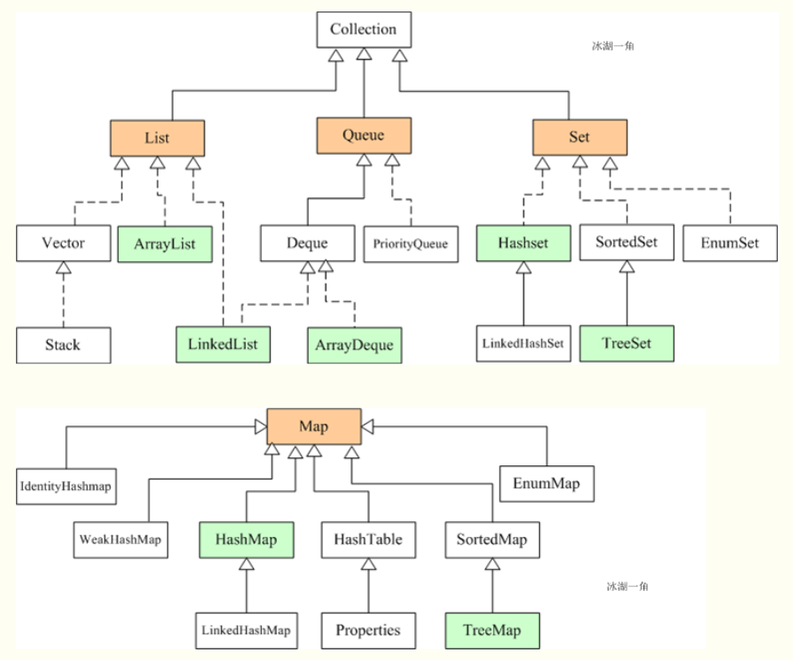
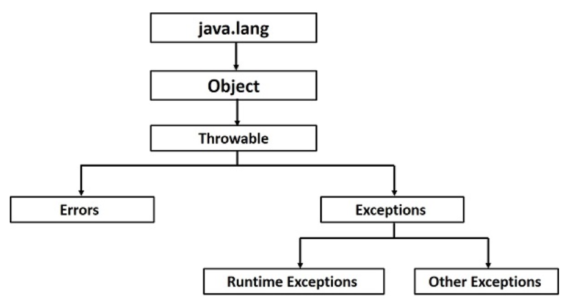

## Java 语法

### Part 1 —— 基础语法
* 核心概念
* 基本数据类型
* 语句
* 函数定义
* 代码组织

#### 1.1 提到 Java 源码时要牢记的概念
1. 大小写敏感
1. 类名 ClassName
1. 方法名 methodName
1. 源代码文件名 ClassName.java
1. 程序入口函数 public static void main(String[] args) {}

#### 1.2 修饰符
##### 1.2.1 访问权限修饰符
* default
* public
* protected
* private
##### 1.2.2 非访问相关的修饰符 （其他用途）
* static
* final ``修饰类和方法时，不可被继承不可覆盖重写，修饰变量时，相当于 const。``
* abstract
* synchronized
* volatile

#### 1.3 变量作用域
* 局部变量 （函数内）
* 类变量 （静态成员变量）
* 实例的成员变量 （非静态的成员变量）

#### 1.4 基本数据类型
##### 1.4.1 Primitive （基本数据类型）
* 整数
  ```
  byte - 8 位，有符号
  short - 16 位，有符号
  int - 32 位，有符号
  long - 64 位，有符号
  ```
* 十进制数 （浮点数）
  ```
  float - 32 位
  double - 64 位
  ```
* 布尔数
  ```
  true or false
  ```
* 字符
  ```
  char - 16 位 unicode 编码
  ```
###### 特别说明： 如何选基本数据类型？
```
# 字符/字符串的存储
  选择字符类型或者 String 类型，没有什么可疑虑。
# 十进制数的存储
  对于常规的数值的存储，是需要特别讲究的：
  ● 首先要有并区分 integar / floating / decimal / precise 的概念。
  ● integar - 对应整数基本类型 （4种选择）
  ● floating - 对应 float 类型，例如 AI 的参数 （1种选择）
  ● decimal - 对应一些比较简单的 10 进制算术，选 double 类型 （1种选择）
  ● precise - 对应的是账户金额、余额、交易额的概念，注意！ 是不能使用基本数据类型来表示的！！ 请使用 string 来标识并操作。
```
##### 1.4.2 Reference/Object （引用/对象类型）
创建一个对象实例的三步骤：
* Declaration 声明变量 - 作为实例的标识符
* Instantiation 实例化 - 创建一个实例
* Initialization 初始化 - 调用对象的构造函数
```java
public class Puppy {
    // 构造函数定义
    public Puppy (String name) {
        System.out.println ("Passed Name is :" + name);
    }
    
    public static void main (String[] args) {
        Puppy myPuppy = new Puppy ("tommy");   // 变量声明(Puppy myPuppy) - 实例化（new） - 初始化（Puppy（“tommy”））
    }
}
```
对象的作用域：
* Class-Local Inner Class
* Method-Local Inner Class
* Anonymous(匿名) Inner Class
* Static nested classes （一定是 Class-Local）

#### 1.5 语句
* while
* for
* do..while
* if..else if
* switch ``switch 语句使用的变量，可以是 integer 类型、String 类型，以及 enums 类型。 convertable integers(即：byte,short,char)会被自动类型转换为 integer。``
* ? :

#### 1.6 函数定义
编写 Java 函数，一定时刻牢记： 函数是一个类的函数！<br>（不要想着去编写全局函数，时刻牢记面向对象。）

#### 1.7 Java 代码编写请注意
##### 1.7.1 源代码编写注意
* 一个 java 源代码文件内，可以有多个 class 的定义，但是.. 只能有一个是 public 访问权限。
* java 源代码文件的名称，必须和内部的 public class 的名字一模一样！
##### 1.7.2 package 编写注意
* 如果使用 package 的概念来组织源代码的话，每一个 java 源码的文件格式一定是这样的：
  ```
  // 该源码属于哪个 package
  package animals;
  // 该源代码依赖哪个 package
  import java.io.File;
  import java.io.FileReader;
  import java.io.IOException;
  // 编写类的源码
  public class MammalInt {
  
  }
  ```

### Part 2 —— 面向对象 
* 继承与多态
* 标准库
* 异常编程和多线程编程
* 文件/IO/网络编程

#### 2.1 继承与多态
##### 2.1.1 继承
***extends*** —— abstract / non-abstract  ``注意，Java 语言是单继承的。``

```java
public class Animal {
}

public class Mammal extends Animal {
}

public class Reptile extends Animal {
}

public class Dog extends Mammal {
}
```
* 注意 Java 的 ***super*** 关键字，类似于 C++ 的 ***this*** 关键字，但是..引用的不是当前对象，而是指 SuperClass （父类）。
* abstract 的概念源自于 “不能实例化”。
##### 2.1.2 多态
***implements*** —— interface

```java
/* File name : Animal.java */
interface Animal {
   public void eat();
   public void travel();
}

/* File name : MammalInt.java */
public class MammalInt implements Animal {

   public void eat() {
      System.out.println("Mammal eats");
   }

   public void travel() {
      System.out.println("Mammal travels");
   }

   public int noOfLegs() {
      return 0;
   }

   public static void main(String args[]) {
      MammalInt m = new MammalInt();
      m.eat();
      m.travel();
   }
}
```
使用 interface 扩展 interface
```java
// Filename: Sports.java
public interface Sports {
   public void setHomeTeam(String name);
   public void setVisitingTeam(String name);
}

// Filename: Football.java
public interface Football extends Sports {
   public void homeTeamScored(int points);
   public void visitingTeamScored(int points);
   public void endOfQuarter(int quarter);
}

// Filename: Hockey.java
public interface Hockey extends Sports {
   public void homeGoalScored();
   public void visitingGoalScored();
   public void endOfPeriod(int period);
   public void overtimePeriod(int ot);
}
```
多态与继承混合示例
```java
public interface Vegetarian{}
public class Animal{}
public class Deer extends Animal implements Vegetarian{}

Deer d = new Deer();
Animal a = d;
Vegetarian v = d;
Object o = d;
```
* interface 的概念源自于 “只定义函数接口，拒绝函数体细节”。

#### 2.2 数组

###### 数组是一种引用数据类型。 （Java 中除了基本数据类型，其他都是引用类型！）
###### 数组在运行期间，长度不可改变。

##### 2.2.1 创建一个数组对象
```java
方式1： 基本数据类型[] 标识符;
方式2： 基本数据类型 标识符[];
# 强烈推荐第一种书写方法，坚决抵制第二种书写。
```

##### 2.2.2 访问数组的元素
```java
方式1： []
    double total = 0;
    for (int i = 0; i < myList.length; i++) {
        total += myList[i];
    }
方式2： for (:)
    double[] myList = {1.9, 2.9, 3.4, 3.5};
    for (double element: myList) {
        System.out.println(element);
    }
```

##### 2.2.3 Java 中的内存划分
Java 的内存需要划分成 5 个部分
* 栈内存 stack
* 堆内存 heap （凡是 new 出来的东西，都在堆中。）
* 方法区 Method Area
* 本地方法栈 Native Method Stack （与操作系统相关）
* 寄存器 pc Register （与 CPU 相关）

##### 2.2.4 一个数组的内存图
一个数组的内存空间是在 堆内存 heap 中。 为一大块连续的内存空间。

##### 2.2.5 一个对象的内存图
成员变量在 堆内存 heap 中，成员方法（其实是保存的地址）也在 堆内存 heap 中，成员方法的实现代码在 方法区 Method Area 中。

###### 补充知识： Java 的垃圾回收机制
```
Java 中没有 “析构” 的概念，也不存在析构函数，代之的是 Java 的垃圾回收机制。
# Java 如何来清理内存？
  对于 JVM 来说，只要没有面临内存耗尽，那么，与垃圾回收有关的任何行为（尤其是 void fanalize() 方法）
  都不会执行。 简言之，不是迫不得已 Java 是不会浪费任何时间执行垃圾回收的。
# 那么如何自己定制垃圾回收策略？
  没有绝对的强制垃圾回收的方法，不过可以这样去做：
    ● 对于不再引用的对象，及时把它的引用赋为 null。 obj = null;
    ● 如果内存确实很紧张，调用 System.gc() 方法来建议垃圾回收器开始回收垃圾。
# 你是什么垃圾！
    ○ StrongReference - 强引用，暂时不是垃圾，未来不确定。
    ○ SoftReference - 软引用，当内存不足，将它当成垃圾回收。
    ○ WeakReference - 弱引用，垃圾，由 JVM 中的垃圾回收器发现并回收。
    ○ PhantomReference - 虚引用，空指针，垃圾？？？ 在任何时候都可能被垃圾回收器回收。
```

#### 2.3 标准库
###### 好用、常用，又由 JDK 提供。 不需要程序员自己去安装配置，是标准库与其他库的关键区别。

##### 2.3.1 Scanner 类
```java
import java.util.Scanner;  // 导包

Scanner sc = new Scanner(System.in);

# 遍历
While(sc.hasNext()) {
    ...
}

# 读取
获取键盘输入的一个 int 数字： int num = sc.nextInit();
获取键盘输入的一个字符串： String str = sc.next();
请查看 Scanner API 文档。 https://docs.oracle.com/javase/7/docs/api/java/util/Scanner.html
```

Java 标准库 API 查询手册： https://docs.oracle.com/javase/7/docs/api/allclasses-noframe.html

##### 2.3.2 Random 类
```java
import java.util.Random;

Random r = new Random();

# 生成一个随机数
获取一个随机的 int 数字： int num = r.nextInt();  // 范围是 int 所有范围，并有正负两种。
获取一个指定范围的 int 数字： int num = r.nextInt(3);
```

##### 2.3.3 ArrayList 类
###### 为什么有数组还要有 ArrayList? 因为数组一旦创建，程序运行期间长度不可变。
```java
import java.util.ArrayList;

ArrayList<String> list = new ArrayList<String>();
# ArrayList<String> list = new ArrayList<>();  // JDK 1.6 以后支持的新写法
# 注意，泛型只能是引用类型，不能是基本类型。
# 因此，基本数据类型的引用类型派上用场： Byte,Short,Integer,Long,Charactor,Float,Double,Boolean.

# 访问
方式1： .get()
    for (int i = 0; i < list.size(); i++) {
        String str = list.get(i);
    }
方式2： for (:)
    for (String str: list) {
        System.out.println(str);
    }
方式3： iterator
    for (Iterator<String> iter = list.iterator(); iter.hasNext(); ) {
        System.out.println(iter.next());
    }
```

##### 2.3.4 String 类
###### 注意，String 类代表字符串，字符串是常量！ 意思是，它们的值在创建之后不能更改(永不可变更)。
```java
# 创建
1. 从字符串常量创建 String。
2. 从 char[] 创建 String。
3. 从 byte[] 创建 String。

# 字符串比较
1. str1 == str2;
2. str1.equals(str2);

# 字符获取
public int String.length() 方法 —— 获取字符个数
public char String.charAt(int index) 方法 —— 获取指定索引位置的单个字符
public int String.indexOf(String str) 方法 —— 返回字符串模式首次出现的位置，没有返回 -1.

# 截取
public String String.substring(int index);
public String String.substring(int begin, int end);
# 拼接
public String String.concat(String str) 方法 —— 拼接两个字符串，返回一个新的字符串。（牢记字符串的不可变更特性）

# 转换
public char[] String.toCharArray();
public byte[] String.getBytes();
public String String.replace(CharSequence oldstr, CharSequence newstr);  // 使用 newstr 替换掉所有的 oldstr 并返回一个新字符串

# 分割
public String[] String.split(String regex);  // 具体案例请查文档。
```

##### 2.3.5 Arrays 类
###### Arrays 类是一个静态类，不是用于创建 Arrays 对象，而是用于提供一些数组操作方法的集合。
```java
/*
 *  public static String Arrays.toString(数组)；
 *  public static void Arrays.sort(数组)；  // 默认为升序，（排序后从小到大排列）。
 */

import java.util.Arrays;

int[] intArray = {10, 20, 30};
String intStr = Arrays.toString(intArray);
```

###### 补充知识： Java 中的 -s 类
```
Java 中的 -s 类，普遍表示该类是原始类的工具类。 是一个 static 类，提供一些操作方法的集合。
例如：
    数组 -> Arrays
    Object -> Objects
```

##### 2.3.6 Math 类
###### Math 类也是一个静态类，不是用于创建 Math 对象。
```java
import java.lang.Math;

public static double Math.abs(double num);  // 取绝对值
public static double Math.ceil(double num); // 向上取整
public static double Math.floor(double num); // 向下取整
public static long round(double num); // 四舍五入
```

##### 2.3.7 Date 类
* Date 类
* SimpleDateFormat 类
```java
import java.util.Date;
import java.text.SimpleDateFormat;

# String to Date
String birthdayString = "1991-01-01"
SimpleDateFormat sdf = new SimpleDateFormat("yyyy-MM-dd");
Date birthdayDate = sdf.parse(birthdayString);

# Date to String
Date todayDate = new Date();
String todayString = sdf.format(todayDate.getTime());

# 计算时间差
long birthdayDateTime = birthdayDate.getTime();
long todayDateTime = todayDate.getTime();
# 求时间差，请先使用 .getTime() 获得毫秒值，然后做差！
```

##### 2.3.8 Calender 类
###### Data 类的增强、库充版
```java
import java.util.Calender;

Calender c = Calender.getInstance();
```

##### 2.3.9 System 类
###### 静态类，不是用于创建 System 对象，而是提供了大量的静态方法，获取与系统相关的信息或进行系统级操作。

#### 2.4 数据结构 （集合）
集合的概念是 “容器”，用来存储多个数据。 根据存储结构共分为 2 大类：
* 单列集合 ``Collection``
* 双列集合 ``Map``

##### Java 集合的架构
<div align="center"></div>

##### 学集合是学什么？
* 会使用集合存储数据
* 会遍历集合
* 掌握每种集合的特性

##### 2.4.1 Collection 类
###### List、Queue、Set 的概念都属于 Collection 的范畴。 
注意，Set 不允许存储重复元素，并且无法通过索引的方法获取/访问元素。

##### 2.4.2 Map 类
###### Map 的概念是 key-value 对。

###### 补充知识： 泛型
```
# 定义和使用含有泛型的类
public class Aclass<E> {
    private E name;
    
    public E getName() {
        return name;
    }
    
    public void setName(E name) {
        this.name = name;
    }
}

# 定义和使用含有泛型的接口
public interface Ainterface<E> {
    public void method(E e);
}

public Aclass implements Ainterface<E> {
    ...
}

public Bclass implements Ainterface<String> {
    ...
}
```

##### Java 集合的使用练习，参考文档专项强化练习。

#### 2.5 异常编程和多线程编程
##### 2.5.1 异常编程
Java 异常的体系结构
<div align="center"></div>

```java
import java.io.File;
import java.io.FileReader;
import java.io.IOException;

public class ReadData_Demo {

   public static void main(String args[]) {
      FileReader fr = null;		
      try {
         File file = new File("file.txt");
         fr = new FileReader(file); char [] a = new char[50];
         fr.read(a);   // reads the content to the array
         for(char c : a)
         System.out.print(c);   // prints the characters one by one
      } catch (IOException e) {
         e.printStackTrace();
      }finally {
         try {
            fr.close();
         } catch (IOException ex) {		
            ex.printStackTrace();
         }
      }
   }
}
```
* 一般的，当使用或涉及资源的时候一定要去使用 ``try-catch-finally {try-catch}`` 结构！

##### 2.5.2 多线程编程
```java
# 方式1： Implements a Runnable Interface
class RunnableDemo implements Runnable {
   private Thread t;
   private String threadName;
   
   RunnableDemo( String name) {
      threadName = name;
      System.out.println("Creating " +  threadName );
   }
   
   public void run() {
      System.out.println("Running " +  threadName );
      try {
         for(int i = 4; i > 0; i--) {
            System.out.println("Thread: " + threadName + ", " + i);
            // Let the thread sleep for a while.
            Thread.sleep(50);
         }
      } catch (InterruptedException e) {
         System.out.println("Thread " +  threadName + " interrupted.");
      }
      System.out.println("Thread " +  threadName + " exiting.");
   }
   
   public void start () {
      System.out.println("Starting " +  threadName );
      if (t == null) {
         t = new Thread (this, threadName);
         t.start ();
      }
   }
}

public class TestThread {

   public static void main(String args[]) {
      RunnableDemo R1 = new RunnableDemo( "Thread-1");
      R1.start();
      
      RunnableDemo R2 = new RunnableDemo( "Thread-2");
      R2.start();
   }   
}

# 方式2： Extends a Thread Class
class ThreadDemo extends Thread {
   private Thread t;
   private String threadName;
   
   ThreadDemo( String name) {
      threadName = name;
      System.out.println("Creating " +  threadName );
   }
   
   public void run() {
      System.out.println("Running " +  threadName );
      try {
         for(int i = 4; i > 0; i--) {
            System.out.println("Thread: " + threadName + ", " + i);
            // Let the thread sleep for a while.
            Thread.sleep(50);
         }
      } catch (InterruptedException e) {
         System.out.println("Thread " +  threadName + " interrupted.");
      }
      System.out.println("Thread " +  threadName + " exiting.");
   }
   
   public void start () {
      System.out.println("Starting " +  threadName );
      if (t == null) {
         t = new Thread (this, threadName);
         t.start ();
      }
   }
}

public class TestThread {

   public static void main(String args[]) {
      ThreadDemo T1 = new ThreadDemo( "Thread-1");
      T1.start();
      
      ThreadDemo T2 = new ThreadDemo( "Thread-2");
      T2.start();
   }   
}
```

* JDK 1.5 以后提供的有线程池的功能支持。 ``Executors``

#### 2.6 文件/IO/网络编程
* File 类
* OutputStream / FileOutputStream 类
* InputStream / FileInputStream 类
* Socket / ServerSocket 类  # client 端用 Socket，Server 端用 ServerSocket

#### 2.6 Java 的配置文件
properties 文件是一种配置文件，主要用于表达配置信息，文件类型为 *.properties，格式为文本文件，文件的内容是格式是 "键=值" 的格式。

通过 ``Properties`` 类来访问管理。

###### 实际项目中，自己写一个 XML 工具类来做配置文件管理。
