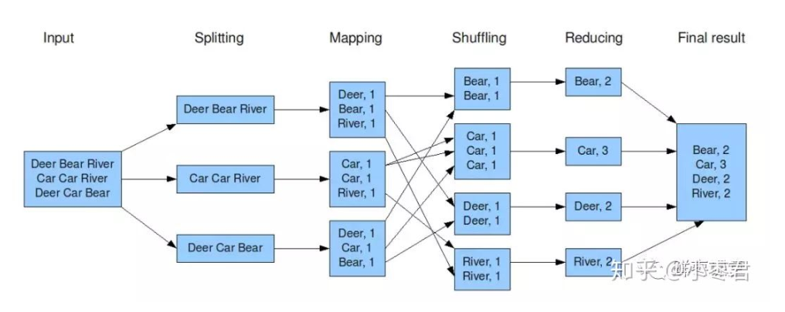

# 大数据

* Hadoop —— 离线分析
* Spark —— 在线分析


## 1 Hadoop 的由来

1998 年 9 月 4 日，Google 公司在美国硅谷成立。正如大家所知，它是一家做搜索引擎起家的公司。

无独有偶，一位名叫 Doug Cutting 的美国工程师，也迷上了搜索引擎。他做了一个用于文本搜索的函数库（姑且理解为软件的功能组件），命名为 **Lucene**。

Lucene 是用 Java 写的，目标是为各种中小型应用软件加入全文检索功能。

2004 年，Doug Cutting 再接再励，在 Lucene 的基础上，和 Apache 开源伙伴 Mike Cafarella 合作，开发了一款可以代替当时的主流搜索的开源搜索引擎，命名为 **Nutch**。

Nutch 是一个建立在 Lucene 核心之上的网页搜索应用程序，可以下载下来直接使用。它在 Lucene 的基础上加了网络爬虫和一些网页相关的功能。

```
- Nutch 是一个开源的网络爬虫，在搜索引擎中负责爬取网页，同时自动维护网页的 URL 信息，例如：相同网页去重、网页定时更新、网页重定向。
- 现在版本的 Nutch 本身并不具有搜索功能(V1.2之后，nutch专注于爬取数据)，但是可以自动向搜索服务器提交爬取的网页。
- Nutch 虽是优秀的分布式爬虫框架，但是它的所有设计，都是为了搜索引擎服务的。
- 因此，它并不是很适合做数据抽取的业务。如果你的业务是做数据抽取（精抽取），而不是搜索引擎。不一定要选用 Nutch。
```

随着时间的推移，无论是 Google 还是 Nutch，都面临搜索对象“体积”不断增大的问题。

在这个过程中，Google 确实找到了不少好办法，并且无私地分享了出来。

* 2003 年，Google 发表了一篇技术学术论文，公开介绍了自己的谷歌文件系统 **GFS（Google File System）**。这是 Google 公司为了存储海量搜索数据而设计的专用文件系统。
* 第二年，也就是 2004 年，Doug Cutting 基于 Google 的 GFS 论文，实现了分布式文件存储系统，并将它命名为 **NDFS（Nutch Distributed File System）**。
* 还是 2004 年，Google 又发表了一篇技术学术论文，介绍自己的 **MapReduce** 编程模型。这个编程模型，用于大规模数据集（大于1TB）的并行分析运算。
* 第二年（2005年），Doug Cutting 又基于 MapReduce，在 Nutch 搜索引擎实现了该功能。
* 2006 年，Yahoo（雅虎）公司，招安了 Doug Cutting。
* 加盟 Yahoo 之后，Doug Cutting 将 NDFS 和 MapReduce 进行了升级改造，并重新命名为 **Hadoop**（NDFS也改名为HDFS，Hadoop Distributed File System）。

这个，就是后来大名鼎鼎的大数据框架系统 —— Hadoop 的由来。

还是 2006 年，Google 又发论文了。这次，它们介绍了自己的 **BigTable**。这是一种分布式数据存储系统，一种用来处理海量数据的非关系型数据库。

Doug Cutting 当然没有放过，在自己的 hadoop 系统里面，引入了 BigTable，并命名为 **HBase**。

<div align="center">

</div>


## 2 Hadoop 的核心架构

Hadoop 的核心，说白了，就是 HDFS 和 MapReduce。HDFS 为海量数据提供了存储，而 MapReduce 为海量数据提供了计算框架。

<div align="center">

</div>

### 2.1 HDFS

参考 FastDFS 的使用，使用方法一样。底层的容错和存储逻辑不同，因此两者适用于不同的应用场景。 详略。

### 2.2 MapReduce

MapReduce 其实是一种编程模型。这个模型的核心步骤主要分两部分：Map（映射）和 Reduce（归约）。
- 当你向 MapReduce 框架提交一个计算作业时，它会首先把计算作业拆分成若干个 Map 任务，然后分配到不同的节点上去执行，每一个 Map 任务处理输入数据中的一部分。
- 当 Map 任务完成后，它会生成一些中间文件，这些中间文件将会作为 Reduce 任务的输入数据。
- 而 Reduce 任务的主要目标就是把前面若干个 Map 的输出汇总到一起并输出。


### 2.3 Hadoop 的自我演进

<div align="center">




</div>

#### Hadoop 中几个比较重要的组件

- HBase: 来源于 Google 的 BigTable。是一个高可靠性、高性能、面向列、可伸缩的分布式数据库。
- Hive: 是一个数据仓库工具，可以将结构化的数据文件映射为一张数据库表，通过类 SQL 语句快速实现简单的 MapReduce 统计。不必开发专门的 MapReduce 应用，十分适合数据仓库的统计分析。
- Pig: 是一个基于 Hadoop 的大规模数据分析工具，它提供的 SQL-LIKE 语言叫 Pig Latin，该语言的编译器会把类SQL的数据分析请求转换为一系列经过优化处理的 MapReduce 运算。
- ZooKeeper: 来源于 Google 的 Chubby。主要是用来解决分布式应用中经常遇到的一些数据管理问题，简化分布式应用协调及其管理的难度。
- Ambari: Hadoop 管理工具，可以快捷地监控、部署、管理集群。
- Sqoop: 用于在 Hadoop 与传统的数据库间进行数据的传递。
- Mahout: 一个可扩展的机器学习和数据挖掘库。


## 3 Spark

Spark 是加州大学伯克利分校 AMP 实验室所开源的 “类 Hadoop MapReduce” 的通用并行框架。相对比 Hadoop 的 MapReduce，它可以说是青出于蓝而胜于蓝。

- MapReduce 是面向磁盘的。受限于磁盘读写性能的约束，MapReduce 在处理迭代计算、实时计算、交互式数据查询等方面并不高效。
- Spark 是面向内存的。使得 Spark 能够为多个不同数据源的数据提供近乎实时的处理性能，适用于需要多次操作特定数据集的应用场景。


## 4 Storm 

Storm 是 Twitter 主推的分布式计算系统，它在 Hadoop 的基础上提供了实时运算的特性，但是，不同于 Hadoop 和 Spark，Storm 不进行数据的收集和存储工作。
它直接通过网络实时的接受数据并且实时的处理数据，然后直接通过网络实时的传回结果。


## 总结

Hadoop 和 Spark 是两种不同的大数据处理框架，他们的组件都非常多。所谓的 Hadoop 其实是一些生态系统组件，Spark 与 Hadoop 它们不是互斥的，它们的 MapReduce 是一种相互共生的关系。 

另外，Hadoop 提供了 Spark 许多没有的功能，比如分布式文件系统，而 Spark 提供了实时内存计算。需要注意的是，Spark 并不是一定要依附于 Hadoop 才能生存，但是，大家一致认为 Spark 与 Hadoop 配合默契最好摆了。
