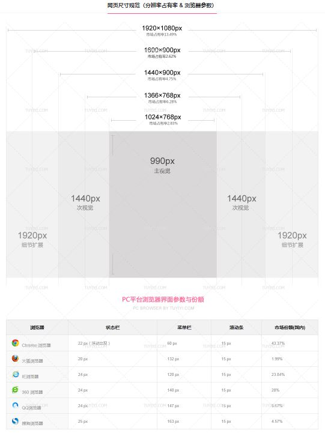
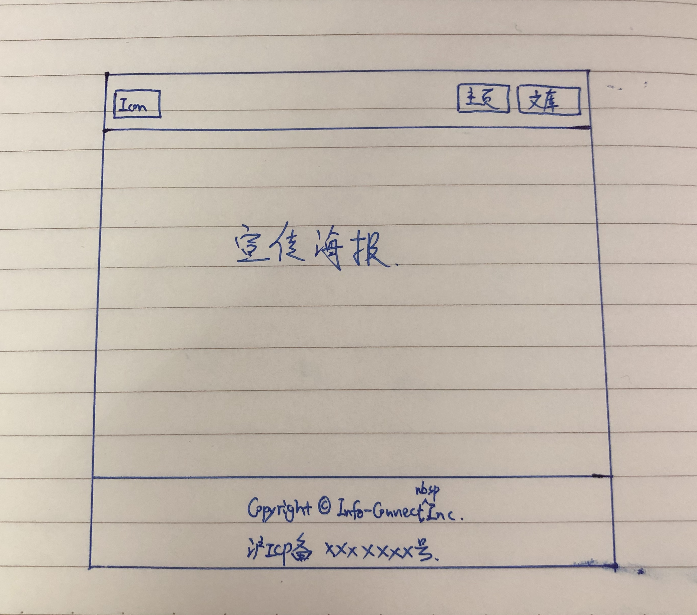

## Flask Home Page

##### 1. 安装
```bash
pip3 install --force-reinstall Flask==1.0.3
pip3 install --force-reinstall Flask-SQLAlchemy==2.4.0
pip3 install --force-reinstall PyMySQL==0.9.3
```

templates/index.html <br>
—— 所有 HTML 模板放置于 templates 目录 （Flask 默认检索路径）
```html
<!DOCTYPE html>
<html lang="zh">
<head>
    <meta charset="UTF-8">
    <title>Hello World</title>
</head>
<body>
Nice to meet you.
</body>
</html>
```

view.py
```python
# coding:utf8
import os
from flask import Flask, render_template, redirect, url_for
from datetime import datetime

app = Flask(__name__)

@app.route('/', methods=['GET'])
def index():
    return render_template('index.html')


if __name__ == '__main__':
    app.run()
```

flask 运行测试
```bash
python view.py
```

##### 2. 主页布局
###### 显示器及浏览器普及情况
<div align="center"></div>

布局参考 
<div align="center"></div>

##### 3. HTML + CSS + JS
```html

```

CSS 式样表下载
* https://github.com/twbs/bootstrap/releases/download/v3.3.7/bootstrap-3.3.7-dist.zip

JS 依赖库下载
* https://code.jquery.com/jquery-3.4.1.min.js

<br>

#### Part 1 —— Bootstrap
—— https://v3.bootcss.com/

* 起步教程 https://v3.bootcss.com/getting-started/
* 全局布局 https://v3.bootcss.com/css/
* 组件手册 https://v3.bootcss.com/components/

##### 基本模板
—— 入门 demo
```html
<!DOCTYPE html>
<html lang="zh-CN">
  <head>
    <meta charset="utf-8">
    <meta http-equiv="X-UA-Compatible" content="IE=edge">
    <meta name="viewport" content="width=device-width, initial-scale=1">
    <!-- 上述3个meta标签*必须*放在最前面，任何其他内容都*必须*跟随其后！ -->
    <title>Bootstrap 101 Template</title>

    <!-- Bootstrap -->
    <link href="https://cdn.jsdelivr.net/npm/bootstrap@3.3.7/dist/css/bootstrap.min.css" rel="stylesheet">

    <!-- HTML5 shim 和 Respond.js 是为了让 IE8 支持 HTML5 元素和媒体查询（media queries）功能 -->
    <!-- 警告：通过 file:// 协议（就是直接将 html 页面拖拽到浏览器中）访问页面时 Respond.js 不起作用 -->
    <!--[if lt IE 9]>
      <script src="https://cdn.jsdelivr.net/npm/html5shiv@3.7.3/dist/html5shiv.min.js"></script>
      <script src="https://cdn.jsdelivr.net/npm/respond.js@1.4.2/dest/respond.min.js"></script>
    <![endif]-->
  </head>
  <body>
    <h1>你好，世界！</h1>

    <!-- jQuery (Bootstrap 的所有 JavaScript 插件都依赖 jQuery，所以必须放在前边) -->
    <script src="https://cdn.jsdelivr.net/npm/jquery@1.12.4/dist/jquery.min.js"></script>
    <!-- 加载 Bootstrap 的所有 JavaScript 插件。你也可以根据需要只加载单个插件。 -->
    <script src="https://cdn.jsdelivr.net/npm/bootstrap@3.3.7/dist/js/bootstrap.min.js"></script>
  </body>
</html>
```

<br>

#### Part 2 —— JQuery
—— https://jquery.com/

*All the power of jQuery is accessed via JavaScript.*
* 官方推荐 javascript 入门 <br>
  https://developer.mozilla.org/en-US/docs/Learn/Getting_started_with_the_web/JavaScript_basics


* 组件手册 http://jquery.cuishifeng.cn/
* 官方教程 https://learn.jquery.com/about-jquery/

##### 2.1 jQuery 语法
—— 通过 jQuery，就可以方便的选取(又称 查询/query) HTML 元素，并对它们执行 "操作(actions)"。

* 基础语法： ***$(selector).action()***
* jQuery 中所有选择器都以美元符号开头： $()。

##### 2.2 文档就绪
—— 防止文档在完全加载（就绪）之前运行 jQuery 代码

```html
$(document).ready(function(){
 
   // 开始写 jQuery 代码...
 
});
```

简写代码
```html
$(function(){
 
   // 开始写 jQuery 代码...
 
});
```

##### 2.3 jQuery 选择器
* 元素选择器 （**element**）
* \#id 选择器 (**id**)
* \.class 选择器 (**class**)

```html
$(document).ready(function(){
  $("button").click(function(){
    $("p").hide();
  });
});

$(document).ready(function(){
  $("button").click(function(){
    $("#test").hide();
  });
});

$(document).ready(function(){
  $("button").click(function(){
    $(".test").hide();
  });
});
```

##### 2.3 基本模板
—— 入门 demo
```html
<!doctype html>
<html>
<head>
    <meta charset="utf-8">
    <title>Demo</title>
</head>
<body>
    <a href="http://jquery.com/">jQuery</a>
    <script src="jquery.js"></script>
    <script>
 
    $( document ).ready(function() {
        $( "a" ).click(function( event ) {
            alert( "The link will no longer take you to jquery.com" );
            event.preventDefault();
        });
    });
 
    </script>
</body>
</html>
```
