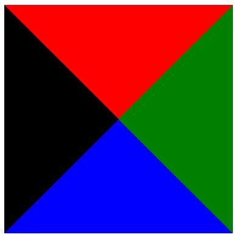
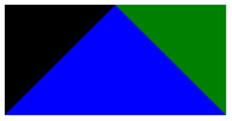
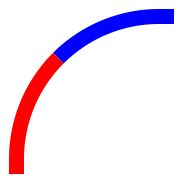

## CSS 深入

##### 除了对静态元素的式样添加，我们想到 CSS 的时候更多是为了以下功能：
* 绘制图标
* 2D/3D 动画

<br>

##### 1. 绘制图标/背景式样

* CSS3 矩形绘制 <br>
```html
<div class="rectangle"></div>

.rectangle {
 width: 150px;
 height: 100px;
 background-color: orangered;
}
```

* CSS3 三角形绘制 <br>
    —— 应用边框的神奇特性 <br>
    * 四条边属性不同的四边形 （空心矩形） <br>
    ```html
    <div class="hollow-rectangle"></div>
  
    .hollow-rectangle {
	    width: 100px;
	    height: 100px;
	    border-style: solid;
	    background-color: white;
	    border-top-color: red;
	    border-right-color: green;
	    border-bottom-color: blue;
	    border-left-color: bluevoilet;
	    border-top-width: 25px;
	    border-right-width: 25px;
	    border-bottom-width: 25px;
	    border-left-width: 25px;
    }
    ```
    <div align="center"></div>
    
    * 交叉线矩形 <br>
    ```html
    <div class="cross-line-rectangle"></div>
    
    .cross-line-rectangle {
	    width: 0px; // 矩形宽、高为 0px
	    height: 0px;
	    border-style: solid;
	    background-color: white;
	    border-top-color: red;
	    border-right-color: green;
	    border-bottom-color: blue;
	    border-left-color: bluevoilet;
	    border-top-width: 125px;
	    border-right-width: 125px;
	    border-bottom-width: 125px;
	    border-left-width: 125px;
    }
    ```
    <div align="center"></div>
    
    * 特殊情况，三角形的出现
    ```html
    <div class="triangle"></div>

    .triangle {
	    width: 0px; // 矩形宽、高为 0px
	    height: 0px;
	    border-style: solid;
	    background-color: white;
	    border-top-color: red;
	    border-right-color: green;
	    border-bottom-color: blue;
	    border-left-color: bluevoilet;
	    border-top-width: 0px; // 上边界宽度为 0px
	    border-right-width: 125px;
	    border-bottom-width: 125px;
	    border-left-width: 125px;
    }
    ```
    <div align="center"></div>
    
* CSS3 圆形绘制 <br>
```html
<div class='circle'></div>

.circle {
 width: 100px;
 height: 100px;
 background-color: orangered;
 border-radius: 50%;
}
```

* CSS3 椭圆绘制 <br>
```html
<div class='ellipse'></div>

.ellipse {
 width: 150px; // 矩形宽、高不等
 height: 100px;
 background-color: orangered;
 border-radius: 50%;
}
```

* CSS3 弧线绘制 <br>
```html
<div class='arc'></div>

.arc {
 width: 100px;
 height: 100px;
 border-style: solid;
 border-top-width: 10px; /* 上、左边界宽度 10px */
 border-bottom-width: 0px;
 border-left-width: 10px;
 border-right-width: 0px;
 border-top-color: blue;
 border-bottom-color: red;
 border-left-color: red;
 border-right-color: red;
 background-color: transparent; /* 注意背景色设置 */
 border-top-right-radius: 0px;
 border-top-left-radius: 100px; /* 上、左角内弧度 100px */
 border-bottom-right-radius: 0px;
 border-bottom-left-radius: 0px;
}
```
<div align="center"></div>

* CSS3 一个自定义图形 <br>
```html
<div class="custom-graph"></div>

.custom-graph {
 width: 100px;
 height: 100px;
 border-style: solid;
 background-color: white;
 border-top-color: red;
 border-right-color: green;
 border-bottom-color: blue;
 border-left-color: bluevoilet;
 border-top-width: 0px;
 border-right-width: 0px;
 border-bottom-width: 20px; // 左、下边界宽度 20px
 border-left-width: 20px;
 border-top-right-radius: 0px;
 border-top-left-radius: 100px; // 左上角内弧度 100px 
 border-bottom-right-radius: 0px;
 border-bottom-left-radius: 0px;
}
```
<div align="center"></div>

* CSS3 图像旋转 （transform） <br>
```html
<div class='transformed-graph'></div>

.transformed-graph {
 width: 100px;
 height: 20px;
 background-color: black;
 border-top-right-radius: 5px;
 border-top-right-radius: 5px;
 border-top-right-radius: 5px;
 border-top-right-radius: 5px;
 transform:rotate(45deg); /* 逆时针旋转 45 度 */
 -ms-transform:rotate(45deg); 	/* IE 9 */
 -moz-transform:rotate(45deg); 	/* Firefox */
 -webkit-transform:rotate(45deg); /* Safari 和 Chrome */
 -o-transform:rotate(45deg); 	/* Opera */
}
```
<div align="center"></div>

* CSS3 多边形 <br>
—— 应用 CSS 的伪元素特性
    * 六边形 （两个三角形叠加） <br>
    ```html
    .star-six {
      width: 0;
      height: 0;
      border-left: 50px solid transparent; /* 三角形 */
      border-right: 50px solid transparent;
      border-bottom: 100px solid red;
      position: relative;
    }
    .star-six:after {
      width: 0;
      height: 0;
      border-left: 50px solid transparent; /* 三角形 */
      border-right: 50px solid transparent;
      border-top: 100px solid red;
      position: absolute;
      content: "";
      top: 30px;
      left: -50px;
    }
    ```
    * 五角星 <br>
    ```html
    .star-five {
      margin: 50px 0;
      position: relative;
      display: block;
      color: red;
      width: 0px;
      height: 0px;
      border-right:  100px solid transparent;
      border-bottom: 70px  solid red;
      border-left:   100px solid transparent;
      -moz-transform:    rotate(35deg);
      -webkit-transform: rotate(35deg);
      -ms-transform:     rotate(35deg);
      -o-transform:      rotate(35deg);
    }
    .star-five:before {
      border-bottom: 80px solid red;
      border-left: 30px solid transparent;
      border-right: 30px solid transparent;
      position: absolute;
      height: 0;
      width: 0;
      top: -45px;
      left: -65px;
      display: block;
      content: '';
      -webkit-transform: rotate(-35deg);
      -moz-transform:    rotate(-35deg);
      -ms-transform:     rotate(-35deg);
      -o-transform:      rotate(-35deg);
    }
    .star-five:after {
      position: absolute;
      display: block;
      color: red;
      top: 3px;
      left: -105px;
      width: 0px;
      height: 0px;
      border-right: 100px solid transparent;
      border-bottom: 70px solid red;
      border-left: 100px solid transparent;
      -webkit-transform: rotate(-70deg);
      -moz-transform:    rotate(-70deg);
      -ms-transform:     rotate(-70deg);
      -o-transform:      rotate(-70deg);
      content: '';
    }
    ```

<br>

##### 2. CSS3 - 2D 动画
—— 图片的动态渲染 （幻灯片）

三个常用属性
* transition （过渡）
<div align="center"></div>

* animation （动画） <br>
如需在 CSS3 中创建动画，需要学习 @keyframes 规则。
<div align="center"></div>

* transform （变换）
<div align="center"></div>

##### 可以认为， Transition ＋ Transform ＝ 两个关键帧的 Animation。

##### 3. CSS3 - 3D 动画

三个常用属性
* transition
* perspective
* transform

示例： 转换 (transform)
<div align="center"></div>


<br>

##### 推荐书单
* 《CSS 权威指南》
* 《精通 CSS》
* **推荐：** <br>
《CSS SECRETS》 - Lea Verou
