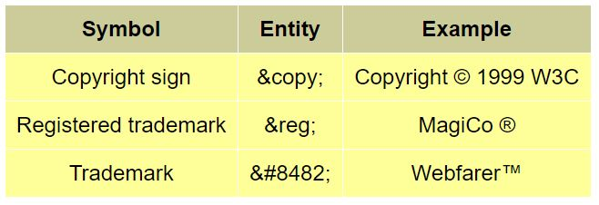
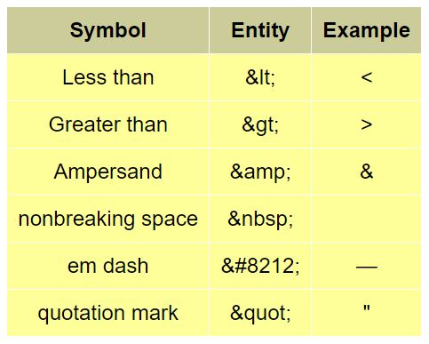
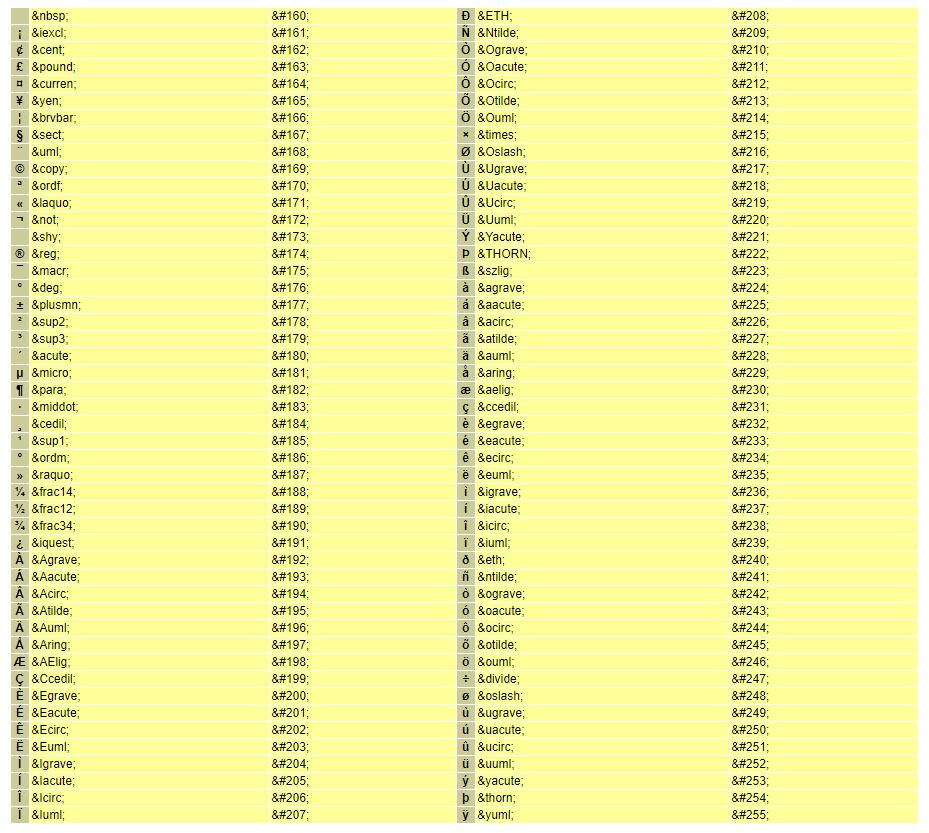
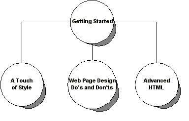

## HTML 深入
—— W3C 推荐深入教程 https://www.w3.org/MarkUp/Guide/Advanced.html

有些时候，我们会有一些定制需求，如：
* 强制换行
* 不可间断的空格
* 公司商标相关的特殊符号
* 类似于 word 目录跳转的功能
* 代码内容（代码块）的呈现
* 文字环绕在图片周围显示
* 一个图片的不同区域具有不同的单击跳转功能
* 图表
* 图片切换
* 音乐播放

<br>

##### 1. 强制换行 （break）
* \<br\>

##### 2. 不可间断的空格 （non-breaking spaces）
* \&nbsp;

##### 3. 公司商标相关的特殊符号 （entities）
示例：
* \&copy; - &copy;
* \&reg; - &reg;
* \&#8482; - &#8482;

<div align="center"></div>
<div align="center"></div>
<div align="center"></div>

##### 4. 类似于 word 目录跳转的功能 (*id* attribute)
* 首先，为可跳转到的内容位置添加标记。
    * 方式 1 <br>
    使用 \<a\> 标签。 \<a name=identifier\> ... \</a\> <br>
    示例： \<h2\>\<a name="night-spots"\>Local Night Spots\</a\>\</h2\>
    * 方式 2 <br>
    使用 *id* 属性。 <br>
    示例： \<h2 id="night-spots"\>Local Night Spots\</h2\>
* 然后， 跳转。
    * 功能 1 - 在当前文本中跳转。 <br>
    示例： \<a href="#night-spots"\>Go to Local Night Spots\</a\>
    * 功能 2 - 跳转到其他网页中的指定内容位置。 <br>
    示例： \<a href="http://www.bath.co.uk/#night-spots"\>Goto Local Night Spots\</a\>

##### 5. 代码内容（代码块）的呈现 （Preformatted Text）
* \<pre\>\</pre\>
```
<pre>
    void Node::Remove()
    {
        if (prev)
            prev->next = next;
        else if (parent)
            parent->SetContent(null);

        if (next)
            next->prev = prev;

        parent = null;
    }
</pre>
```

##### 6. 文字环绕在图片周围显示 （align）
* \
    * *left* or *right*
    * 此时的文字换行方式 \<br clear="all"\>

##### 7. 一个图片的不同区域具有不同的单击跳转功能 （map）
* \ 和 \<map\>\</map\>

<div align="center"></div>

```
<div align="center">
   
   <map name="sitemap">
      <area shape="circle" coords="186,44,45" 
         href="Overview.html" alt="Getting Started">
      <area shape="circle" coords="42,171,45" 
         href="Style.html" alt="A Touch of Style">
      <area shape="circle" coords="186,171,45"
         alt="Web Page Design">
      <area shape="circle" coords="318,173,45"
         href="Advanced.html" alt="Advanced HTML">
   </map>
</div>
```
* *shape* attribute / *coords* attribute
    * rect: left-x, top-y, right-x, bottom-y
    * circle: center-x, center-y, radius
    * poly: x1,y1, x2,y2, ... xn,yn

##### 8. 图表 （table）
* table \<table\>
    * caption（标题） \<caption\>
    * row \<tr\>
        * heading \<th\> or data \<td\>
* 其中一个表格占用多行和多列的情况。
    * *rowspan* attribute
    * *colspan* attribute
```
<table border="1" cellpadding="10" width="80%">
<tr align="center"><th rowspan="2">Year</th><th colspan="3">Sales</th></tr>
<tr align="center"><th>North</th><th>South</th><th>Total</th></tr>
<tr align="center"><td>2000</td><td>$10M</td><td>$8M</td><td>$18M</td></tr>
<tr align="center"><td>2001</td><td>$14M</td><td>$11M</td><td>$25M</td></tr>
</table>
```
* 防止页面缩小时，表头换行显示的情况。
    * *scope* attribute
```
<table border="1" cellpadding="10" width="80%">
<caption>Projected sales revenue by year</caption>
<tr align="center">
  <th scope="col">Year</th>
  <th scope="col">Sales</th>
</tr>
<tr align="center"><td>2000</td><td>$18M</td></tr>
<tr align="center"><td>2001</td><td>$25M</td></tr>
</table>
```

##### 9. 图片切换 （JavaScript 初探）
* 图片切换
```html
<script type="text/javascript">
if (document.images)
{
    image1 = new Image;
    image2 = new Image;
    image1.src = "enter1.gif";
    image2.src = "enter2.gif";
}

function chgImg(name, image)
{
    if (document.images)
    {
        document[name].src = eval(image+".src");
    }
}
</script>

<a href="/" 
   onMouseOver='chgImg("enter", "image2")'
   onMouseOut='chgImg("enter", "image1")'
>

</a>
```
* 轮询切换
```html
<script type="text/javascript">
if (document.images)
{
    adImages = new Array("hosts/csail.gif", "hosts/ercim.gif", "hosts/keio.gif");
    adURLs = new Array("www.csail.mit.edu", "www.ercim.org", "www.keio.ac.jp");
    thisAd = 0;
}

function cycleAds()
{
    if (document.images)
    {
        if (document.adBanner.complete)
        {
            if (++thisAd == adImages.length)
                thisAd = 0;
            document.adBanner.src = adImages[thisAd];
        }
    }

    // change to next sponsor every 3 seconds
    setTimeout("cycleAds()", 3000);
}

function gotoAd()
{
    document.location.href = "http://" + adURLs[thisAd];
}
</script>

<a href="javascript:gotoAd()">

</a>
```

##### 10. 音乐播放
* \<a href="http://example.com/music/myband.m3u" type="audio/x-mpegurl"\>播放音乐\</a\>
    * m3u extension（后缀） with audio/x-mpegurl
    * mp3 extension with audio/mpeg
