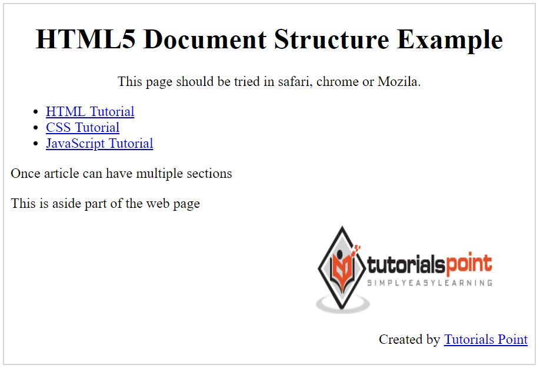

## HTML 5 (H5)
—— 动态内容的显示渲染

HTML 的静态内容显示功能请查看
* [start-html.md](start-html.md)
* [go-on-html.md](go-on-html.md)

一般的内容素材形式：
* 文字
* 图片
* 视频
* 音频
* 其他

文字、图片、音频属于静态内容，视频、动画播放、用户交互属于动态内容。

<br>

#### H5 的扩展内容
##### 1. 功能项 （减少对外部插件的需求）
* 嵌入音频、视频和图形的功能
* 客户端数据存储
* 交互式文档
* WebSocket
* Server-Sent Events (SSE)
* Canvas（画板）
* Geolocation（地理位置）
* Drag and drop（元素的拖拽移动）
##### 2. 标签项 （新的语义元素，表单功能增强）
* \<nav\>
* \<header\>
* \<footer\>
* \<section\>
* \<figure\>
* ...

###### 特别说明： 语义元素或称 “语义化标签” 是没有任何式样的，只是为了便于 HTML 开发时，编写的阅读友好性。 当然，多了个标签就可以使用 JS 控制它们的式样，但标签本身没有任何式样。

详细标签列表，请参考 https://www.tutorialspoint.com/html5/html5_tags.htm

<br>

#### H5 文件式样

##### H5 的四个基础部分
* ***DOCTYPE*** （文件类型指定）<br>
\<!DOCTYPE html\>
* ***meta*** （字符编码方式指定） <br>
\<meta charset = "UTF-8"\>
* ***script*** （引用 JS 脚本） <br>
\<script type = "text/javascript" src = "scriptfile.js"\>\</script\>
* ***link*** （引用 CSS 式样） <br>
\<link rel = "stylesheet" type = "text/css" href = "stylefile.css"\>

##### H5 标签的预定义属性与自定义属性
* 预定义属性 <br>
例如： \
* 自定义属性 <br>
例如： \<div id="newTest" *myAttr*="getAttr"\>\</div\> （直接用就好 ☺，没有用到的话也不影响渲染）

##### H5 以 Section（区段） 作为模板来划分内容
* section - 对 document 或 app section 的语义抽象。
* article - 一个文字区域。
* aside - 页面旁白区域。
* header - 头区域。
* footer - 脚区域，一般包含作者、版权信息等。
* nav - 导航区域。
* dialog - 对话框。
* figure - 图片或视频区域。

##### 注意！！ 这些都是语义化标签！！！

示例：
```html
<!DOCTYPE html>  

<html>  
   <head> 
      <meta charset = "utf-8"> 
      <title>...</title> 
   </head> 
  
   <body> 
      <header role = "banner"> 
         <h1>HTML5 Document Structure Example</h1> 
         <p>This page should be tried in safari, chrome or Mozila.</p> 
      </header> 
   
      <nav> 
         <ul> 
            <li><a href = "https://www.tutorialspoint.com/html">HTML Tutorial</a></li> 
            <li><a href = "https://www.tutorialspoint.com/css">CSS Tutorial</a></li> 
            <li><a href = "https://www.tutorialspoint.com/javascript">
            JavaScript Tutorial</a></li> 
         </ul> 
      </nav> 
   
      <article> 
         <section> 
            <p>Once article can have multiple sections</p>
         </section> 
      </article> 
   
      <aside> 
         <p>This is  aside part of the web page</p> 
      </aside> 
   
      <footer> 
         <p>Created by <a href = "https://tutorialspoint.com/">Tutorials Point</a></p> 
      </footer> 
   
   </body> 
</html> 
```
<div align="center"></div>

###### reference
* http://www.w3school.com.cn/html5/index.asp
* https://www.tutorialspoint.com/html5/index.htm
