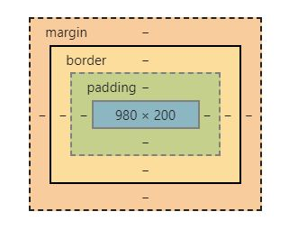
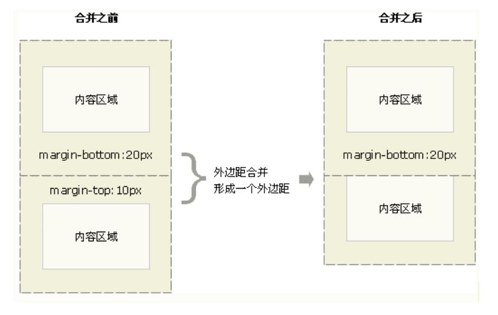
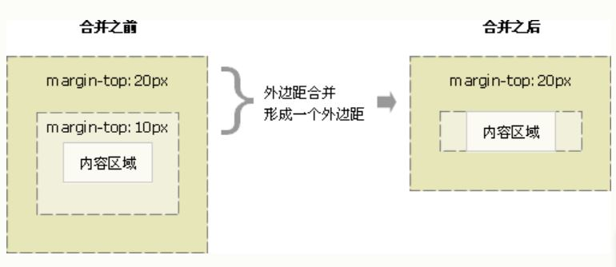
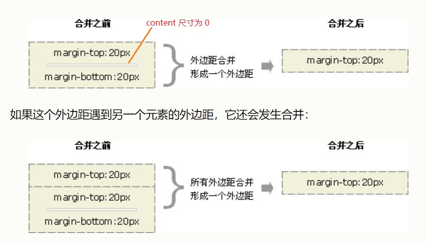
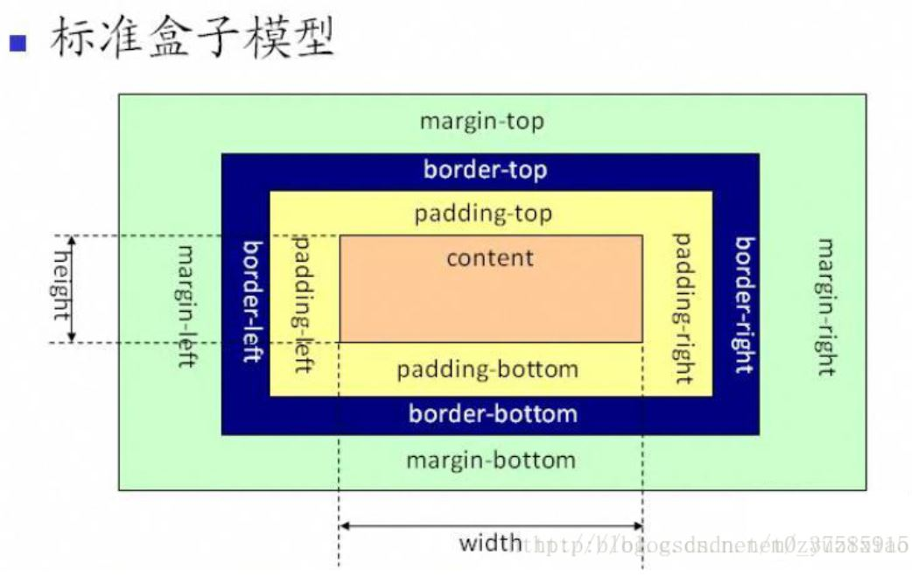
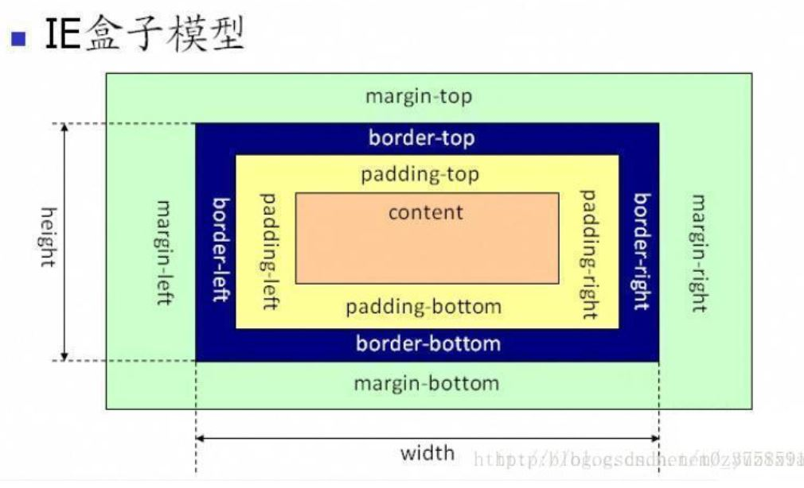
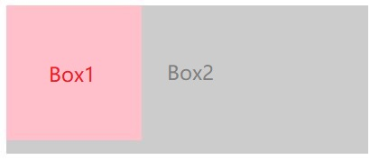
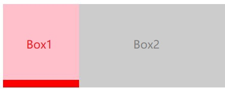

## H5-CSS-JavaScript
—— Client-Side Web Development

* H5 <br>
—— 管理内容素材
    * [start-html.md](start-html.md)
    * [go-on-html.md](go-on-html.md)
    * [html5.md](html5.md)

* CSS <br>
—— 定义渲染式样/幻灯片动画特效集合
    * [start-css.md](start-css.md)
    * [go-on-css.md](go-on-css.md)
    * [css3.md](css3.md)

* JavaScript <br>
—— Programming 实现业务逻辑
    * [start-javascript.md](start-javascript.md)
    * [go-on-javascript.md](go-on-javascript.md)
    * [es6.md](es6.md)

在 H5、 CSS 被编写之后，它们都是静态的（虽然有很多可选项，但是写出来之后就只能是一种确定选项了），JavaScript 的业务代码为选项间的切换提供可能，实现动态效果。

<br>

#### CSS - Box Model (盒子模型)
* Box Model(盒子模型)
    * HTML 中的每一个标签元素都是一个盒子模型，每一个标签都不一样，这是因为每一个标签对应的盒子中的属性不同。
    * Margin 一般被认为盒子与盒子之间的距离。Padding 是盒子与内部文本之间的距离。
    <div align="center"></div>

* Margin Overlap(外边距重叠)
    * 当两个垂直外边距相遇时，外边距发生合并，取值外边距高度中的较大者。
    <div align="center"></div>
    <div align="center"></div>
    <div align="center"></div>

* BFC(Block Formatting Context) —— 不发生 Margin Overlap 的场景
    * BFC 决定了元素如何对其内容进行定位，以及与其他元素的关系和相互作用。
    * BFC 的原理（渲染规则）
        * BFC 内的元素垂直方向的边距会发生重叠。整个 BFC 不与外部元素发生重叠。
        * BFC 的区域不会与浮动元素（float box）的布局重叠。 ？？
        * BFC 元素是一个独立的容器，外面的元素不会影响里面的元素。里面的元素也不会影响外面的元素。
        * 计算 BFC 高度的时候，浮动元素也会被计算在内。
    * 如何创建一个 BFC
        * overflow 不为 visible。 —— 即： overflow: auto / hidden。
        * float 的值不为 none。（设置元素为浮动） —— 即： float: left / right。
        * position 的值不为 static 或 relative。 —— 即： position: absolute / fixed。
        * display 属性为 inline-blocks, table, table-cell, table-caption, flex, inline-flex。

* IE模型与标准模型
    * 区别 <br>
      *width, height* 的意义不同
        * W3C 模型的宽高尺寸指代 content 的尺寸
        * IE 模型的宽高尺寸指代 content+padding+border 的总尺寸。
    * 模型选择的配置
    ```html
      box-sizing:content-box(W3C) or border-box(IE)
    ```
    * JS 怎么获取和设置 box 的宽高
        * window.getComputedStyle(dom).width/height
        * dom.getBoundingClientRect().width/height

###### W3C 模型
<div align="center"></div>

###### IE 模型
<div align="center"></div>

##### 特别说明：
通俗的讲，BFC 就是一个特殊的块，内部有自己的布局方式，不受外部元素的影响。（或者理解为 BFC 元素没有 Margin。）
常规的元素都是非 BFC 的块，即该元素最靠外的子元素与外部元素发生 Margin Overlap。
* BFC 的使用场景
    * 利用 BFC 不与 float 重叠，可以实现两栏布局，左边定宽，右边自适应。不会相互影响，哪怕高度不相等。
    * 可以清除浮动， BFC 子元素即使是 float 也会参与计算。
    * 强制不发生垂直边距重叠。

##### 案例说明： BFC 的区域不会与浮动元素（float box）的布局重叠
* 一个 float box 与一个常规 box 组合时，float 元素会覆盖(遮挡)常规元素。
```html
<section id="layout">
    <style media="screen">
        #layout {
            background: red; /* 红色 */
        }
        #layout .left {
            float: left; /* 浮动元素 */
            width: 100px;
            height: 100px;
            background: pink; /* 粉色 */
        }
        #layout .right {
            height: 110px;
            background: #ccc; /* 灰色 */
        }
    </style>
    <div class="left"></div>
    <div class="right"></div>
</section>
```
<div align="center"></div>
说明： 父元素内包含两个子元素（float box 和 normal box），float box 浮动在 normal box 图层之上，即 float box 与 normal box 存在重叠并且置顶。
本例子中，父元素的尺寸此刻与最大元素的尺寸相同，由此看不到父元素的背景色。

* 一个 float 元素与 BFC 元素组合时，两个元素间不允许有任何重叠。
```html
<section id="layout">
    <style media="screen">
        #layout {
            background: red; /* 红色 */
        }
        #layout .left {
            float: left; /* 浮动元素 */
            width: 100px;
            height: 100px;
            background: pink; /* 粉色 */
        }
        #layout .right {
            overflow:hidden; /* 此元素为 BFC */
            height: 110px;
            background: #ccc; /* 灰色 */
        }
    </style>
    <div class="left"></div>
    <div class="right"></div>
</section>
```
<div align="center"></div>
说明： float box 与 BFC 元素不允许出现重叠，同时两个 box 的尺寸不一无法完全覆盖父元素区域，因此有部分区域显示出背景颜色。

<br>

#### Libraries/Framework
* ***DOM-directed***
    * jQuery <br>
    使 HTML 文档遍历与操作、事件处理、Ajax 变得更加简单。

* ***BOM-directed***


* ***CSS-directed***
    * Animate.css <br>

* ***Integration-directed***
    * Bootstrap <br>
    Bootstrap 是全球最受欢迎的前端组件库，用于开发响应式布局、移动设备优先的 WEB 项目。 Bootstrap 是一套用于 HTML、CSS 和 JS 开发的开源工具集。 <br>
    Bootstrap 中的许多组件需要依赖 JavaScript 才能运行。具体来说，他们依赖的是 jQuery、Popper.js 以及自主开发的 JavaScript 插件。 <br>
    注意顺序，jQuery 必须放在最前面，然后是 Popper.js，最后是自主开发的 JavaScript 插件。
