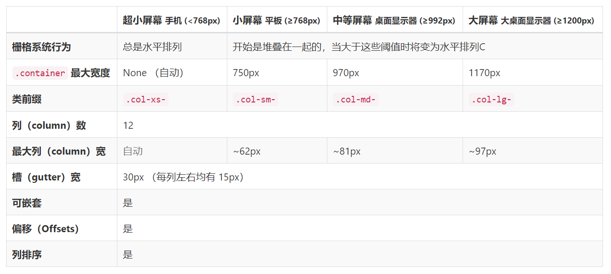

## 响应式布局
以 Bootstrap 为例来进行响应式布局。 （使用 Bootstrap 框架进行响应式布局。）

##### 为什么使用 Bootstrap 来做响应式布局，而不是自己手写？
* 进行响应式布局需要获取设备的详细信息，然后对全页面所有元素进行缩放调整。
* 自己手写太麻烦，bug 一定会很多。

#### Bootstrap 栅格系统

###### 响应式布局都是基于栅格系统来完成的。

* Bootstrap 的响应式布局的精髓是，将一行平均分为 12 个格子。
* 技术细节查询，使用实例，请参考文档 https://v3.bootcss.com/css/#grid

##### 如何使 PC 和 Mobile 端的布局不同？
答案： 定义页面元素在不同设备下所占栅格的数量，分别指定元素在 PC 和 Mobile 端所占用栅格的数量。

##### 如何进行响应式布局
* 第一步，定义容器。
* 第二步，定义行。
* 第三步，定义元素，即定义元素在不同设备占用的栅格数量。

注意，以上三个步骤都是通过 CSS 式样来定义的。

响应式布局的定义规则：
* 首先，必须定义容器，类型为 container 或 container-fluid 类型。
* 其次，一定是定义行（row），定义行是为了定义列（column），因为元素是放置于某行的某些列中的。
* 注意，你的内容应当放置于列（column）内，并且，只有列（column）可以作为行（row）的直接子元素。

如何定义元素在不同设备上占用的栅格数量？
* 语法格式： ``col-设备代号-栅格数目``

栅格系统中的列是通过指定 1 到 12 的值来表示其跨越的范围。

Bootstrap 栅格系统的栅格参数 —— Bootstrap 的栅格系统是如何在多种屏幕设备上工作的？
<div align="center"></div>

示例1： 定义移动设备和桌面屏幕不同的显示布局
```html
<!-- Stack the columns on mobile by making one full-width and the other half-width -->
<div class="row">
  <div class="col-xs-12 col-md-8">.col-xs-12 .col-md-8</div>
  <div class="col-xs-6 col-md-4">.col-xs-6 .col-md-4</div>
</div>

<!-- Columns start at 50% wide on mobile and bump up to 33.3% wide on desktop -->
<div class="row">
  <div class="col-xs-6 col-md-4">.col-xs-6 .col-md-4</div>
  <div class="col-xs-6 col-md-4">.col-xs-6 .col-md-4</div>
  <div class="col-xs-6 col-md-4">.col-xs-6 .col-md-4</div>
</div>

<!-- Columns are always 50% wide, on mobile and desktop -->
<div class="row">
  <div class="col-xs-6">.col-xs-6</div>
  <div class="col-xs-6">.col-xs-6</div>
</div>
```

示例2： 设置手机、平板、桌面不同的显示布局
```html
<div class="row">
  <div class="col-xs-12 col-sm-6 col-md-8">.col-xs-12 .col-sm-6 .col-md-8</div>
  <div class="col-xs-6 col-md-4">.col-xs-6 .col-md-4</div>
</div>
<div class="row">
  <div class="col-xs-6 col-sm-4">.col-xs-6 .col-sm-4</div>
  <div class="col-xs-6 col-sm-4">.col-xs-6 .col-sm-4</div>
  <!-- Optional: clear the XS cols if their content doesn't match in height -->
  <div class="clearfix visible-xs-block"></div>
  <div class="col-xs-6 col-sm-4">.col-xs-6 .col-sm-4</div>
</div>
```

注意，随着设备的变小，多余的列（小设备上会占12列以上）将换行显示。。。。因此，使用以上的低级方法会让界面很畸形。

#### 更友好美观的响应式布局
* Bootstrap 的重要提示： ``栅格类适用于与屏幕宽度大于或等于分界点大小的设备 ， 并且针对小屏幕设备覆盖栅格类。``
* 如果真实设备宽度小于设备栅格属性中的设备代号的最小值，默认的处理方式是一个元素占满一整行。

因此，进行响应式布局的时候，优先考虑小设备的布局。 这样在大设备上不会有问题，反之一定会出现布局错乱的现象。
