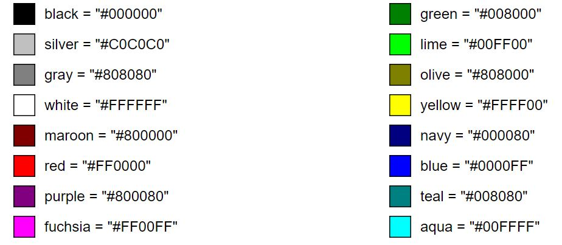

## CSS （Cascading Style Sheets） 入门
——  W3C 推荐入门教程 https://www.w3.org/MarkUp/Guide/Style.html

##### CSS 的本质
* CSS 的本质是定义很多的 “名称 - 格式” 对照表，依照此表来渲染 HTML 的风格。
* 渲染 HTML 的时候，CSS 并不是必须的。使用 HTML 本身提供的一些 attribute 也可以指定渲染风格。

“请思考当你写文档的时候通常如何考虑排版？”

一个展示页的基本排版思考点：
* 页边距
* 左右和第一行缩进
* 上方和下方的空白量
* 字体类型、风格和大小
* 边界和背景
* 颜色的设置

<br>

##### 1. 页边距
* 左边距 <br>
*margin-left*
* 右边距 <br>
*margin-right*

示例：
```html
<style type="text/css">
  body { margin-left: 10%; margin-right: 10%; }
</style>
```

##### 2. 左右和第一行缩进
* 左缩进 <br>
*margin-left*
* 右缩进 <br>
*margin-right*

示例：
```html
<style type="text/css">
  body { margin-left: 10%; margin-right: 10%; }
  h1 { margin-left: -8%;}
  h2,h3,h4,h5,h6 { margin-left: -4%; }
</style>
```

* 第一行缩进 <br>
*text-indent*

示例：
```html
p { text-indent: 2em; margin-top: 0; margin-bottom: 0; }
```

##### 3. 上方和下方的空白量
* 上方空白量 <br>
*margin-top*
* 下方空白量 <br>
*margin-bottom*

示例：
```html
h2 { margin-top: 8em; margin-bottom: 3em; }
```
注意，上下空白量是取设置值最大一方的配置。

##### 4. 字体类型、风格和大小
* 字体风格
    * 斜体 italic <br>
    *font-style: italic;*
    * 加粗 bold <br>
    *font-weight: bold;*
    * 大小写变换 lowercase/uppercase <br>
    *text-transform: uppercase;*

示例：
```html
em { font-style: italic; font-weight: bold; }
strong { text-transform: uppercase;  font-weight: bold; }
h2 { text-transform: lowercase; } // 设置 h2 小标题为全小写
```

* 字体大小 <br>
*font-size*

示例：
```html
h1 { font-size: 200%; }
h2 { font-size: 150%; }
```
* 字体类型 <br>
*font-family*

示例：
```html
body { font-family: Verdana, sans-serif; }
h1,h2 { font-family: Garamond, "Times New Roman", serif; }
```

##### 5. 边界和背景
* 边界设置普遍借住 div 元素的包裹特性 <br>
    * 边界类型 <br>
    *border* - 可选项 dotted, dashed, solid, double, groove, ridge, inset, outset.
    * 边界宽度 <br>
    *border-width* - 可选项 thin, medium, thick, 具体值如 0.1em.
    * 边界颜色 <br>
    *border-color* 

示例：
```html
div.box { border: solid; border-width: thin; width: 100%; }

<div class="box">
The content within this DIV element will be enclosed
in a box with a thin line around it.
</div>
```

* 背景 <br>
*background*

示例：
```html
  div.color {
    background: rgb(204,204,255);
    padding: 0.5em;
    border: none;
  }
```
注意， 可以设置 padding-left, padding-top, padding-right, padding-bottom 来控制背景不渲染到内容边界，例如 1em。

##### 6. 颜色的设置
*color*

示例：
```html
  body {
    color: black;
    background: white;
  }
  strong { color: red; }
  
  :link { color: rgb(0, 0, 153); }  /* for unvisited links */
  :visited { color: rgb(153, 0, 153); } /* for visited links */
  a:active { color: rgb(255, 0, 102); } /* when link is clicked */
  a:hover { color: rgb(0, 96, 255); } /* when mouse is over link */
```

###### 一些常用的颜色
<div align="center"></div>

##### 7. 取消链接的下划线
*text-decoration*

示例：
```html
a.plain { text-decoration: none; }
```

其他信息，可浏览网页 https://www.w3.org/Style/CSS/
