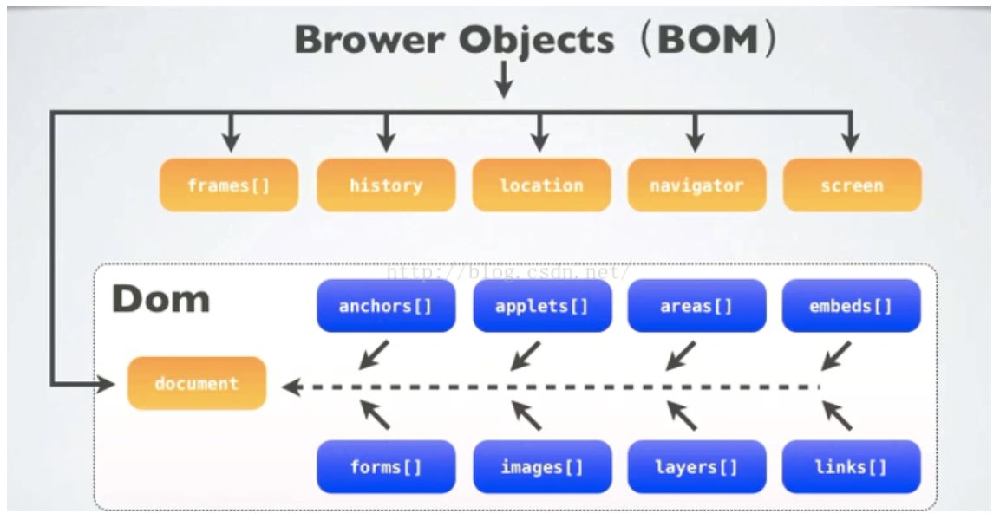

## JavaScript 入门
—— Client-Side JavaScript

##### 一个完整的 ***JavaScript*** 实现包含了以下三个部分
* ***ECMAScript***
    * ECMAScript 是一个标准，JS只是它的一个实现，其他实现包括 ActionScript。
    * ECMAScript 可以为不同种类的宿主环境提供核心的脚本编程能力，即 ECMAScript 不与具体的宿主环境相绑定，而 JS 的宿主环境是浏览器，AS 的宿主环境是 Flash。
    * ECMAScript 描述了以下内容： 语法、类型、语句、关键字、保留字、运算符、对象。
* ***DOM*** (Document Object Model)
* ***BOM*** (Browser Object Model)

###### BOM-DOM
<div align="center"></div>

##### ***ajax***
—— Asynchronous JavaScript and XML

ajax 是一种在无需重新加载整个网页（document）的情况下，能够更新部分网页的技术。
* XMLHttpRequest 对象，与服务器异步交互数据
* JavaScript + DOM，进行内容更新
* CSS，一个内容式样的集合
* XML，数据传输的格式

<br>

#### JavaScript 基础语法 — 即 ECMAScript（ES） 部分

##### 1. 语句结束符、大小写敏感、注释方式
* 语句结束符
    * 以分号（semicolon ）表示一条简单语句的结束。
    * 也以换行作为语句结束，同 python 语法。
* 区分大小写
* 注释方式
    * 单行注释 //
    * 多行注释 /* */

##### 2. 变量定义 与 基本数据类型
* 变量定义
    * *var* 关键字
    * javascript 是无类型（untyped）语言，即任何类型的变量定义都用 var.
* 基本数据类型
    * *Number* 不区分整型与浮点
    * *String* 不区分字符与字符串
    * *Boolean* 布尔类型
    * *null*
    * *undefined*
* 高级类型
    * *Function*
    * *Object*
    * 注意，*Function* 与 *Object* 的组合，类似于 C++ 的语言特性（C特性/面向对象特性）。 

##### 3. 数据的操作
* 操作符（Operator）
    * 算数操作符
    * 比较操作符
    * 逻辑操作符
    * 赋值操作符
    * 条件操作符（? :）

##### 4. 分支控制
* 分支控制语句
    * *if-else*
    ```html
      if (expression 1) {
          // todo
      } else if (expression 2) {
          // todo
      } else {
          // todo
      }
    ```
    * *switch*
    ```html
       var grade = 'A';
       switch (grade) {
          case 'A': // Plan A;
          break;
          case 'B': // Plan B;
          break;
          default:  // default
       }
    ```
    * *while / do-while*
    ```html
      var count = 0;
      do {
          // todo
          count++;
      } while (count < 5);
    ```
    * *for / for-in*
    ```html
      var count;
      for(count = 0; count < 10; count++) {
          // todo
      }
    ```
    ```html
      var aProperty;
      for (aProperty in navigator) {
          // 遍历 BOM navigator 对象的成员
      }
    ```
    * *continue* or *break*

* 异常处理分支
    * *try-catch*
    ```html
      try {
          // todo
      }
      catch ( e ) {
          alert(e.description);
      }
      finally {
          // todo
      }
    ```

##### 5. 函数
* 函数定义
    * 常规函数 *function*
    ```html
      function concatenate(first, last) {
          var full;
          full = first + last;
          return full;
      }
    ```
    * 匿名函数 *=>*
    ```html
      // 一个参数
          x => x * x
      // 两个参数
          (x, y) => x * x + y * y
      // 无参数
          () => 3.14
      // 复杂函数逻辑
          x => {
              if (x > 0) {
                  return x * x;
              }
              else {
                  return - x * x;
              }
          }
    ```
* 显示要求无返回值 *void*
    * 使函数的返回值强制消失
    ```html
      void func();
      void(func());
      <a href = "javascript:void(alert('Warning!!!'))">Click me!</a>
    ```
    * 使表达式的返回值强制消失
    ```html
      a = void ( b = 5, c = 7 );
      <a href = "javascript:void(0)">Click me!</a>
    ```

##### 6. 对象
* 对象定义
    * 方式 1 *var - new Object()*<br>
    *var* inst = *new Object()*
    ```html
      // 注意，所有的自定义对象类型其实都是 Object 内置对象类型的后代
      // 该方式并没有定义新的对象类型标签
      var book = new Object();
      book.subject = "Perl";  /* 创建一个 Object 类型的实例，为 book 实例添加成员 */
      book.author  = "Mohtashim";
    ```
    * 方式 2 *function - this* <br>
    *function* customObjType(param1, param2) *{* *this.prop1* = param1; *this.prop2* = param2; *}*
    ```html
      // 注意，该方式是定义了一个 Object 内置对象的子类 customObjType，
      // 该 function 即为它的构造函数，由此获得一个新的对象类型标签
      function book(title, author) {
          this.title = title; 
          this.author  = author;
      }
      var myBook = new book("Perl", "Mohtashim");
    ```
* 对象的成员函数
    * 通过 *function*-*this* 的对象创建方式，在 *function* 内将函数名赋值给成员即可
    ```html
      function addPrice(amount){ /* 定义一个函数 */
          this.price = amount; 
      }
      // 定义一个 book 对象类型
      function book(title, author){
          this.title = title;
          this.author  = author;
          this.addPrice = addPrice; /* 将函数赋予对象成员 */
      }
    ```
