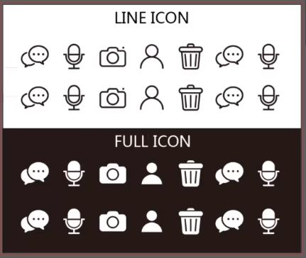

## ICON 制作入门

##### 工具
* Adobe Illustrator

##### 注意事项
* AI 中新建画布，单位设置为 **像素 px**。
* 在高级选项中，将颜色模式设置为 **RGB**。
* 栅格效果，设置为 **72 ppi**。

##### 特别说明
* 常用的 icon 图标在设计时，最大的尺寸为 256x256。 因此，设计时以 256x256 设计，使用时依据比例缩小。
* 所有 icon 制作的前提是铅笔手绘草图 or 画板手绘草图。

 

#### 1. 线性 icon 制作
* 第一步  
定一套图标的大小，默认 256x256。
* 第二步  
创建一个 1200x1000 的画布和与画布同大小的矩形对象，位置对齐。
* 第三步  
将矩形对象分割为网格，格子的宽高为 256x256。将参考线锁定。
* 第四步  
新建图层，在每个格子内制作 icon。
##### 说明
* 创建大的矩形然后分割为网格，是为了尽量保证一套图标的大小一致性。
* 一共创建三个图层：
    * 矩形对象所在图层用于尺寸参照；
    * 草图图层进行草图绘制与拖拽；
    * ICON 图层保存绘制的图标。

#### 2. 线性 icon 转 剪影 icon
##### 2.1 线性 icon 的特点
有描边没有填充
##### 2.2 剪影 icon 的特点
有填充没有描边
##### 2.3 线性转剪影
* 第一步  
上部工具栏 -> 对象 -> 路径 -> 轮廓化描边。
* 第二步  
左侧工具栏 -> 白色的箭头 -> 直接选择工具 -> 选择待填充物体的内框（内轮廓） -> 按下 del，删除即内部填充。
* 第三步  
选择图形内部对象，使在其上层显示（右键，排列，置于顶层），框选外部对象和内部对象，路径查找器内点击“减去顶层”。

#### 3. 一套 icon 的美化
* 第一步  
上部工具栏 -> 窗口 -> 勾选“画板” -> 右下角画板栏 -> 新建画板。
* 第二步  
尺寸缩放， 选中所有 icon 和底部参考框，Ctrl+C,Ctrl+V，右上角变换栏 -> 宽高/2 -> 注意勾选“缩放和描边效果”。
* 第三步  
将缩小的 icon 全选，Ctrl+X 剪切，创建一个新图层，Ctrl+V 复制到新图层。
* 第四步  
与底部参考框一起进行排版，位置确定之后删除参考框。剪影 icon 添加底层矩形对象并颜色反转，添加标题完成作品美化展示。

说明：
* 线性/剪影 icon 的尺寸金字塔  
    * 256x256
    * 128x128
    * 64x64
    * 42x42 or 44x44
    * 32x32

#### 4. icon 导出
选中当前画板 -> 上部工具栏 -> 文件 -> 存储为 web 所用格式。

 

###### reference
慕课网 — 基础线性和剪影化 icon 的制作方法
