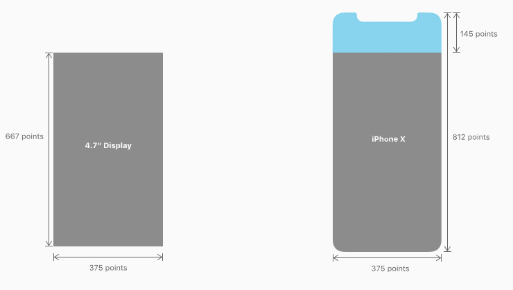
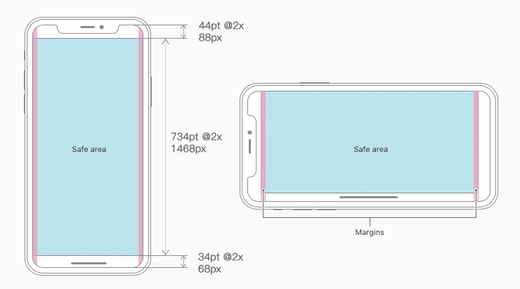
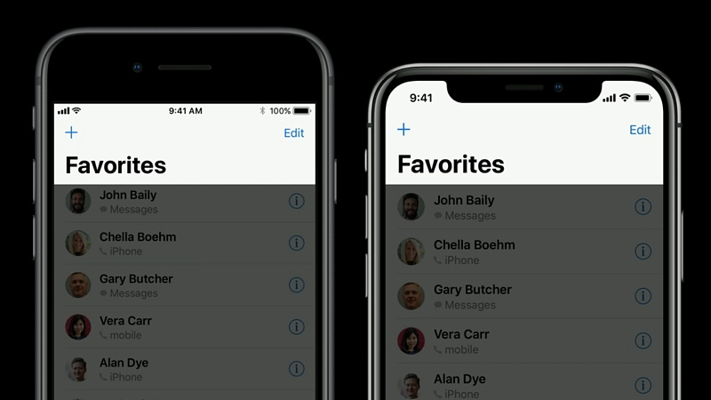
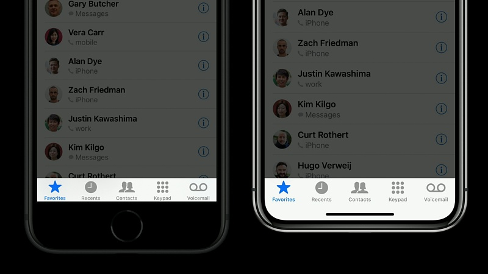
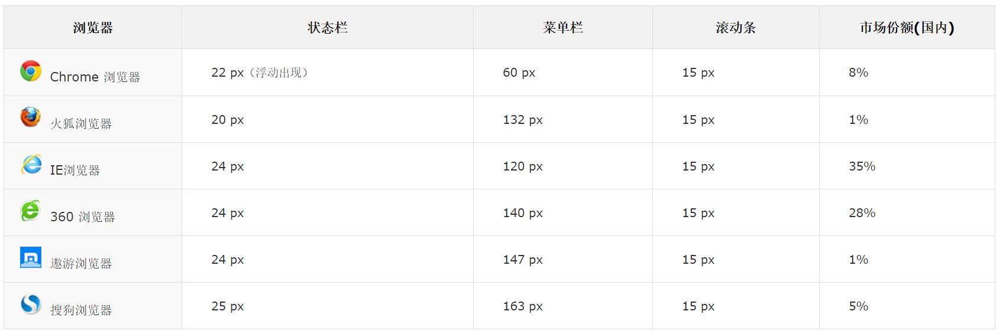
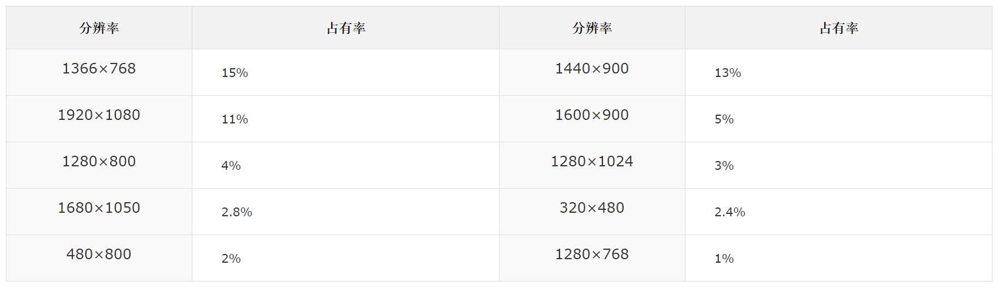
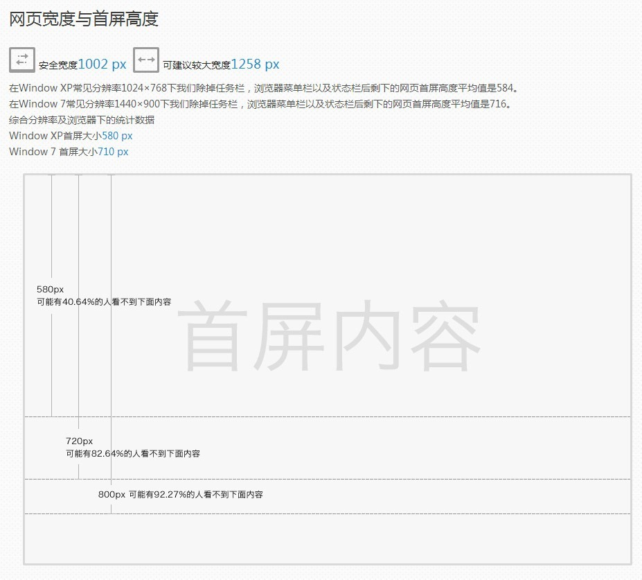
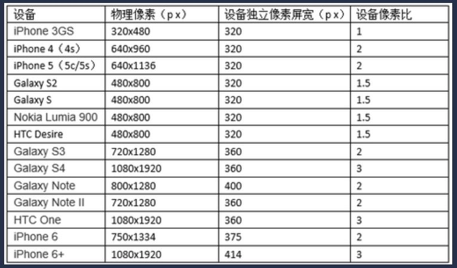
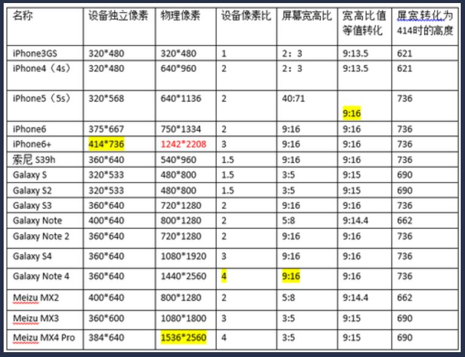
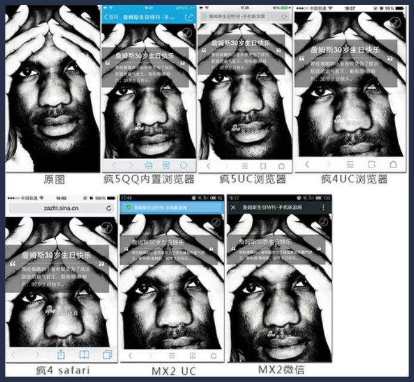

## 视觉稿制作入门
对于视觉设计师、交互设计师来说，他们需要做的不仅仅是设计一张张静态的页面和独立的 icon，他们需要将这些元素整体组合在一起，根据整体画面感和视觉体验来做出修改。

##### 预备素材
* 交互图标（icon）
* 背景图片
* 内容素材
    * 文字
    * 图片
    * 视频
    * 音频
    * 其他

##### 视觉稿设计什么？
* 预备素材的布局
    * step 1 - 手绘草稿
    * step 2 - 软件细化

<br>

##### 案例： 电商平台 WEB 设计视觉稿
* 1.主页布局
    * 上端，产品分类。
    * 主展示区域，产品展示。
    * 页脚部分
* 2.字体规范
    * 中文字体 - 微软雅黑
    * 英文字体 - San Francisco Display
* 3.登陆/注册页
* 4.付款页
* 5.个人中心
* 6.二级页

refer 站酷网：[pics/visual-draft-production.jpg](pics/visual-draft-production.jpg)

<br>

##### 工具
* Adobe Illustrator - 优秀的插画设计工具
* Adobe PhotoShop - 80% 的工作由 PS 完成
* Adobe After Effects - 特效合成
* Sketch（Mac）/Axure RP - Rapid Prototyping（快速原型）
* SketchUP - 建筑、园林、室内设计 3D 建模

##### 设计稿作品参考网站
* dribbble.com
* Behance

<br>

#### 了解如何在iPhone X和所有iOS设备上设计视觉稿

##### 1. 关于设计尺寸及适配
<div align="center"></div>
<div align="center"></div>

##### 2. 视觉稿尺寸 
之前设计的页面是基于 iPhone6 的 2X 倍率进行设计，以 2X 的基准做设计稿，也就是 750×1334。
然后切图输出 2X、 3X 的图片资源给开发。而新的 iPhoneX 分辨率是 1125px × 2436px (375pt × 812pt @3x)， 比之前的 750px × 1334px（375pt x 667pt @2x） 高出了一部分。
分析发现，可以沿用原来的办法，以 @2x iPhone6 为基准做设计稿，只是页面在细节方面会有一些变化。iPhoneX 和 plus 一样使用 3 倍图，而 iPhone8 和 iPhone5/6/7 同样使用 2 倍图。

##### 3. 导航栏变化
<div align="center"></div>

##### 4. 标签栏变化
<div align="center"></div>
iOS 11 之前是选中状态的图标为剪影风格，其他图标为线性风格，我们需要做两套图标，一套剪影，一套线性。而现在则统一为剪影，选中状态的图标则依靠颜色的变化来进行区分。但这个不是必要的，你也可以不遵循苹果的设计准则。

##### 5. 安全区域及合理的留白间距
下面是关于横竖屏安全内容区域及留白间距的展示，蓝色为安全区域，粉色为留白间距。
<div align="center"></div>

##### 6. 关于交互设计
按钮的合理布局。交互元素不要靠近角落，屏幕边缘的视觉元素要注意。

##### 总结
具体视觉稿可参考他人的 PSD 模板。

<br>

#### 了解如何在desktop设备上设计视觉稿

网页的尺寸受限于两个因素： 一个是显示器屏幕。 另一个是浏览器软件。

特别说明：
* 高度是可以向下延展的，所以一般对高度不限制。
* 对于一屏来说，一般没有一个固定值，因为每个人的浏览器的工具栏不同，有的浏览器工具栏被插件占了半个屏幕。
* 宽度上的布局是视觉稿设计时考虑的重要点。

##### 1. 关于设计尺寸及适配
###### 主流浏览器的界面参数与份额
<div align="center"></div>

###### 系统分辨率统计
<div align="center"></div>

###### 网页宽度与首屏高度
<div align="center"></div>

##### 更多 app/web 网络访问信息， please refer http://tongji.baidu.com/data/screen

##### 2. 视觉稿尺寸

##### 3. 导航栏/页脚栏的考虑

##### 4. 安全区域及合理的留白间距

##### 5. 关于交互设计

<br>

#### 移动端 H5 设计稿注意项
—— 注意移动端 H5 网页区别于 APP，APP 的设计稿直接按照手机分辨率来设计。

##### 1. 基本概念
* 像素（px）<br>
像素描述的是图像在某一点的颜色值。

* PPI <br>
代指的屏幕的像素密度（Pixel Per Inch），衡量显示器单位物理面积内拥有像素点的数量。

* 分辨率 <br>
屏幕分辨率是指显示器所能显示的图像像素点（虚拟像素）有多少个。

* Retina 显示屏 <br>
不同于普通的电脑显示器那样为了显示更多的内容，而是提升显示相同内容时的画面精细程度。
    * 案例 <br>
    以第三代 MacBook Pro with Retina Display 为例， 工作时显卡渲染出的 2880x1880 个像素每四个一组，输出原来屏幕的一个像素显示的大小区域内的图像。这样一来，用户所看到的图标与文字的大小与原来的 1440x900 分辨率显示屏相同，但精细度是原来的 4 倍。

* **设备独立像素** <br>
—— 为什么是 “每四个一组”？ 而且要让这四个一组来显示 “原来屏幕的一个像素”？ 这大概就是 Retina 显示技术的一种表现。
    * 这 “每四个一组” 的 “大像素”，可以被称作 “设备独立像素”。
    * 这个点代表一个可以由程序使用的虚拟像素。 
    * “设备独立像素” 也有人称为 “CSS像素”，更倾向于表明与 CSS 中尺寸的对应。

* **设备像素比**（DevicePixelRatio） <br>
将 viewport 设置为 content=”width=device-width”，设备独立像素也就等于 CSS 像素。

##### 2. 历史问题屏宽 320px
* 经常在做移动端网站时，我们会听到一些人说原型稿屏宽做成 320px，设计稿做 2 倍 640px。 这里提到的屏宽，更确切的说，是将 viewport 设置为 width=device-width 时的设备独立像素宽度。
* 到了后来的 iPhone4 的屏幕是 640x960px，几乎所有人都知道 Retina 显示屏，所有方向上的像素都成了原来的 2 倍。而设备独立像素的屏宽还是保持着 320px。其它智能手机早期的分辨率基本上也使用了大致相同的屏幕尺寸与分辨率，因此才有了 320px 这个不约而同的约定。
* 当然，如果把 viewport 的 width 属性设置为一个定值，比如 320、 480、 700 等等，那 viewport 的宽度即为设定的宽度。此时，设备独立像素宽度，也即所设定的宽度。

###### viewport 设置为 content=”width=device-width” 时， 设备独立像素宽度表
<div align="center"></div>

##### 3. 设计稿尺寸标准确定
—— 以下所有讨论均将 viewport 设定为 content=”width=device-width” 的情况下。

##### 根据目前市场流行的手机移动终端，统计他们的设备独立像素。
<div align="center"></div>

由以上表格分析，
* 手机设备独立像素最大宽度 414px，屏幕最大高宽比为 9:16。
* 因此，将设计稿做成 414x736（9:16），就可以在所有手机浏览器上显示完全，不会出现底部空白的情况。

特别说明
```
1. 屏宽 414px 是为了图片在手机浏览器中显示时，能够向下兼容，在独立像素低于 414px 的设备上，图片是被压缩的肯定能显示清楚，
   但是，如果图片宽度为 320px，那么在 iPhone6+ 上，图片便会被拉伸，肯定会模糊。
2. 高度用 736px，是因为 9:16 的屏幕在相同宽度下，能够显示更多的内容，如果使用 480px，只能铺满 iPhone4 这种 2:3 的手机，在 9:16 的屏幕底部，必定出现空白。
```

进一步分析，
* 虚拟分辨率 414x736px， 物理分辨率 640x1136px、 1080x1920px、 1440x2560px， 414px 的宽度如何映射到 1080px 的宽度？ 计算机只有猜测了，通过线性插值算法，所以图片便会出现模糊。
* 当 640x1136px 的图被拉伸时，对于 Retina 屏，系统会给图片进行像素补充，边缘出现了一些亚像素，在 401 的 ppi 下人的肉眼无法分辨边缘模糊的图。
* 综上所述，设计稿一般设计为 640x1136px（9:16） 即可。既满足了显示需求，又能降低用户加载图片需要的带宽。

##### 4. 显示内容被遮挡的情况
—— 在用各种分辨率的智能手机查看 H5 页面时，会出现如下的情况，内容显示不全，甚至一些重要内容和按钮都会被遮挡。
<div align="center"></div>

移动端网页一般都是在手机浏览器或者有内置浏览器功能的应用中打开，如： <br>
* UC（百度、QQ）浏览器、安卓原生浏览器、Safari
* QQ 内置浏览器、微信内置浏览器、支付宝内置浏览器
* 还有人会令人发指的使用浏览器的全屏模式(微笑)

结论：
* 所以我们在页面内容规划布局时，不能把重要内容放在太偏下的位置。
* 除去将浏览器全屏显示的情况，几乎所有情况均会有顶部的状态栏和导航栏，那么就会把网页内容往下挤，进入盲区。
* 设计稿要尽量保证单页面应用下面没有重要内容。
* 一般情况下，以现有市场上流行的移动智能手机，单页翻转（非延伸向下的长页面）设计稿尺寸为 640x1136，在高度为 812 处设置一条安全线（参考线），将重要的内容布局在这条安全线之上。

<br>

##### 设计稿尺寸/配色/安全区域等等
请参考网站 http://www.tuyiyi.com/cc/
* iPhone / iPad / Android 尺寸规范
* IOS 字体 / Android 字体
* 界面命名规范
* 平面设计尺寸规范（名片/纸张/证件照/画册/手提袋）
* 流行配色
