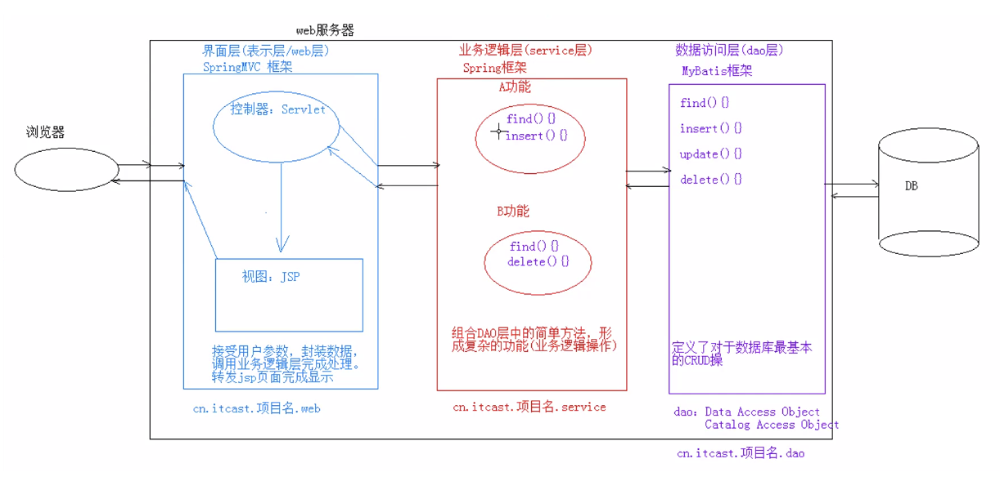

## JSP
JSP(Java Server Pages) 是 Java **服务器端页面**。 可以理解为，一个特殊的页面，其中既可以直接定义 html 标签，又可以写 Java 代码。

#### 为什么会有服务器端页面？

考虑以下场景： 现在你看到的一个页面，其中一部分内容是静态 HTML 元素渲染后的效果，而有一部分内容是动态代码生成的 HTML 元素。 那么，如何来做开发呢？

* 一种可能的方法是，首先执行代码生成对应的内容，然后将它和静态 HTML 元素组合，保存在一个长字符串或文件中，发送给客户端。 完成任务。
  ```
  你可以想象，代码写起来有多长。。 天天这么写，是否很爽？
  ```

“服务器端页面” 的概念，就是针对这种情况而诞生的一种技术解决方案。 ``让程序员简化代码量，也提高可读性。``

当然，每种服务器端页面技术都有对应的规范和技术文档，跟学一门语言一样，有语法，有环境配置。


#### JSP 入门
##### JSP 的实现原理
* JSP 本质上就是一个 Servlet。

##### JSP 脚本
所谓 JSP 脚本，即定义 Java 代码的方式。
1. \<% 代码 %>： 定义的 Java 代码，在 service 方法中。 service 方法中可以定义什么，该脚本中就可以定义什么。
2. \<%!  代码 %>: 定义的 Java 代码，在 jsp 转化后的 Java 类的成员位置。 （谨慎使用）
3. <%=  代码 %>: 定义的 Java 代码，会输出到页面上。 输出语句中可以定义什么，该脚本中就可以定义什么。

##### JSP 的内置对象
* 在 jsp 页面中不需要获取和创建，就可以直接使用的对象。
* jsp 一共有 9 个内置对象。


#### JSP 学习内容
##### 1. 指令
作用： 用于配置 JSP 页面，导入资源文件。

格式：
```
<%@ 指令名称 属性名1=属性值1 属性名2=属性值2 ... %>
```

分类：
```
1. page      -- 用于配置 JSP 页面。
2. include   -- 页面包含。 导入页面的资源文件。
3. taglib    -- 导入资源，一般用于导入标签库。
# 每种类别下常用的属性，查询文档使用。
```

##### 2. 注释
1. html 注释 ``<!--  -->`` 只能注释 html 代码片段。
2. jsp 注释 ``<%--  --%>`` 可以注释所有。

在 jsp 文件中，强烈推荐使用 jsp 注释格式。

##### 3. 内置对象 (9个)
```
1. pageContext                PageContext               当前页面共享数据，还可以获取其他八个内置对象。
2. request                    HttpServletRequest        一次请求访问的多个资源（转发）
3. session                    HttpSession               一次会话的多个请求间
4. application                ServletContext            所有用户共享数据
5. response                   HttpServletResponse       响应对象
6. page                                                 当前页面（Servlet）的对象 this
7. out                                                  数据输出到页面上
8. config                     ServletConfig             Servlet 的配置对象
9. exception                                            异常对象
```

#### JSP 教程推荐 http://www.runoob.com/jsp/eclipse-jsp.html
##### 注意，编写 jsp 页面的时候，特别注意书写规范。 ``<%@ page language="java" contentType="text/html; charset=UTF-8" pageEncoding="UTF-8"%>``，注意后面的 % 的前面不能有空格。 特别注意！！ 否则导致界面无法显示。

<br>

## MVC 模式下的服务器端页面技术 JSP 的演进， EL 和 JSTL 进一步提升 JSP 语法糖
##### MVC 模式
```
1. M: Model，模型。 JavaBean
    * 完成具体的业务操作，如：查询数据库，封装对象等。
2. V: View，视图。 JSP
    * 展示数据。
3. C: Controller，控制器。 Servlet
    * 获取用户的输入（交互事件）。
    * 调用模型。
    * 将数据交给视图进行展示。
```

#### EL 表达式
1. 概念： Expression Language 表达式语言
2. 作用： 替换和简化 JSP 页面中 Java 代码的缩写
3. 语法： ``${表达式}``
4. 注意：
    * jsp 默认支持 el 表达式的。 如果要忽略 el 表达式
      ```
      1. 设置 jsp 中 page 指令中： isELIgnored="true"，则忽略当前 jsp 页面中所有的 el 表达式。
      2. \${表达式} 由于 $ 被转义了，忽略当前这个 el 表达式。
      ```
5. 使用：
    1. 运算：
       ```
       * 运算符：
            1. 算术运算符： + - * /(div) %(mod)
            2. 比较运算符： > < >= <= == !=
            3. 逻辑运算符： &&(and) ||(or) !(not)
            4. 空运算符： empty
                * 功能： 用于判断字符串、集合、数组对象是否为 null 并且长度是否为 0。
                * ${empty list}
                * ${not empty str}: 表示判断字符串、集合、数组对象是否不为 null 并且长度 > 0。
       ```
    2. 获取值：
        1. el 表达式只能从域对象中获取值。
        2. 语法：
           ```
           1. ${域名称.键名}： 从指定域中获取指定键的值。
               * 域名称：
                   1. pageScope         -->  pageContext
                   2. requestScope      -->  request
                   3. sessionScope      -->  response
                   4. applicationScope  -->  application (ServletContext)
               * 举例： 在 request 域中存储了 name=张三
               * 获取： ${requestScope.name}
           2. ${键名}： 表示依次从最小的域中查找是否有该键对应的值，直到找到为止。
           3. 获取对象、List 集合、Map 集合的值
               1. 对象： ${域名称.键名.属性名}
                    * 本质上会去调用对象的 getter 方法
               2. List 集合： ${域名称.键名[索引]}
               3. Map 集合：
                    * ${域名称.键名.Key名称}
                    * ${域名称.键名["Key名称"]}
           ```
    3. 隐式对象：
       ```
       * el 表达式中有 11 个隐式对象
       * pageContext:
            * 获取 jsp 其他八个内置对象。
            * ${pageContext.request.contextPath}： 动态获取虚拟目录
       ```

#### JSTL 标签
1. 概念： JavaServer Pages Tag Library JSP标准标签库
   ```
   * 由 Apache 组织提供的开源的免费的 jsp 标签   <标签>
   ```
2. 作用： 用于简化和替换 jsp 页面上的 java 代码
3. 使用步骤：
    1. 导入 jstl 相关 jar 包；
    2. 引入标签库： taglib 指令 ``<%@ taglib %>``；
    3. 使用标签。
4. 常用的 JSTL 标签：
   ```
   1. if       相当于 java 代码的 if 语句
   2. choose   相当于 java 代码的 switch 语句
   3. foreach  相当于 java 代码的 for 语句
   ```
5. 练习： 在 request 域中有一个存有 user 对象的 List 集合。 需要使用 jstl + el 将 List 集合数据展示到 jsp 页面的表格 table 中。

##### JSP 以及 MVC 模式下的服务器端页面技术 JSTL + EL 和 Flask 架构的模板引擎一样。``请对比学习和理解。``

<br>

## 三层架构

* 界面层（表示层/web层）
* 业务逻辑层（servlet层）
* 数据访问层（dao层） Data Access Object

三层架构与 MVC 模式是兼容的，只是表达的思想或者说关注点不同而已。

Java 的三大核心框架 SpringMVC、Spring、MyBatis 就是从三层架构的思路而设计开发的。
<div align="center"></div>

务必牢记以上架构图。
