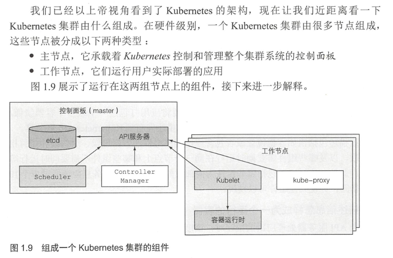

# Kubernetes and Docker


## Kubernetes

#### 1 Kubernetes 诞生的因素

今天，大型单体应用正被逐渐分解为小的、可独立运行的组件，我们称之为**微服务**。微服务彼此之间解耦，所以它们可以被独立开发、部署、升级、伸缩。这使得我们可以对每一个微服务实现快速迭代，并且迭代的速度可以和市场需求的变化的速度保持一致。

随着部署组件的增多和数据中心的增长，配置、管理并保持系统的正常运行变得越来越困难。如今我们需要一些自动化的措施，包括自动调度、配置、监管和故障处理。这正是 Kubernetes 的用武之地。

系统管理员的运维工作重心，从监管应用转移到了监管 Kubernetes，以及剩余的系统资源，因为 Kubernetes 会帮助监管所有的应用。

#### 2 Kubernetes 的抽象层

Kubernetes 抽象了数据中心的硬件基础设施，使得对外暴露的只是一个巨大的资源池。使用 Kubernetes 部署多组件应用时，它能够保证每个组件可以轻易地发现其他组件，并彼此之间实现通信。

微服务以团队形式完成工作，所以需要找到彼此进行交流。同时，部署微服务时，部署者需要正确地配置所有服务来使其作为一个单一系统能正确工作。

不管你同时开发和部署多少个独立组件，开发和运维团队总是需要解决的一个最大的问题是程序运行环境的差异性，这种巨大差异不仅存在于开发环境与生产环境之间，甚至存在于各个生产机器之间。

一个生产系统必须给所有它需要承载的应用提供合适的环境，尽管这些应用可能需要不同的，甚至带有冲突的版本库。

#### 3 迈向持续交付：DevOps 和无运维

在过去，开发团队的任务是创建应用并交付给运维团队，然后运维团队部署应用并使它运行。现在，公司都意识到，让同一个团队参与应用的开发、部署、运维的整个生命周期更好。

这意味着开发者、 QA 和运维团队彼此之间的合作需要贯穿整个流程。这种实践被称为 DevOps。

- 应用程序开发者现在更趋向于将应用尽快地发布上线，通过收集用户的反馈对应用做进一步开发。（理想的状态是开发人员能够自己部署应用上线，而不需要交付给运维人员操作。）
- 理想情况是，开发者是部署程序本身，不需要知道硬件基础设施的任何情况，也不需要和运维团队交涉，这被叫作 NoOps。

Kubernetes 能让我们实现所有这些想法。通过对实际硬件做抽象，然后将自身暴露成一个平台，用于部署和运行应用程序。它允许开发者自己配置和部署应用程序，而不需要系统管理员的任何帮助。

#### 4 容器技术

Kubernetes 使用 Linux 容器技术来提供应用的隔离，所以在钻研 Kubernetes 之前，需要通过熟悉容器的基本知识来更加深入地理解 Kubernetes，包括认识存在的容器技术分支，诸如 docker 或者 rkt。

当一个应用程序的组件开始变小且数量开始增长时，如果你不想浪费硬件资源，又想持续压低硬件成本，那就不能给每个组件配置一个**虚拟机**了。这不仅仅浪费硬件资源，每个虚拟机都需要被单独配置和管理，这增加了系统管理员的工作负担。

一个**容器**里运行的进程实际上运行在宿主机的操作系统上，就像所有其他进程一样。（不像虚拟机，进程是运行在不同的操作系统上的） 但在容器里的进程仍然 是和其他进程隔离的。容器类似虚拟机，但开销小很多。

和虚拟机比较，容器更加轻量级，主要是因为每个虚拟机需要运行自己的一组系统进程。

```
- 虚拟机的主要好处是它们提供完全隔离的环境，因为每个虚拟机运行在它自己的Linux内核上，而容器都是调用同一个内核，这自然会有安全隐患。
- 记住，每个虚拟机运行它自己的一组系统服务，而容器则不会，因为它们都运行在同一个操作系统上。那也就意味着运行一个容器不用像虚拟机那样要开机，
  容器的进程可以很快被启动。
```

##### 容器隔离机制

如果多个进程运行在同一个操作系统上，那容器到底是怎样隔离它们的。有两个机制可用：

- **Linux 命名空间**，它使每个进程只看到它自己的系统视图（文件、进程、网络接口、主机名等）。
- **Linux 控制组（cgroups）**，它限制了进程能使用的资源量（CPU、内存、 网络带宽等）。

```
存在以下类型的命名空间：
• Mount (mnt)
• Process ID (pid)
• Network (net)
• Inter-process communicaion (ipd)
• UTS
• User ID (user)
每种命名空间被用来隔离一组特定的资源。例如，UTS 命名空间决定了运行在命名空间里的进程能看见哪些主机名和域名。
通过分派两个不同的 UTS 命名空间给一对进程，能使它们看见不同的本地主机名。换句话说，这两个进程就好像正在两个
不同的机器上运行一样（至少就主机名而言是这样的）。
```

```
cgroups 是一个 Linux 内核功能，它被用来限制一个进程或者一组进程的资源使用。
一个进程的资源（CPU、 内存、 网络带宽等）使用量不能超出被分配的量。
```

Docker 是第一个使容器能在不同机器之间移植的系统。它不仅简化了打包应用的流程，也简化了打包应用的库和依赖，甚至整个操作系统的文件系统能被打包成一个简单的可移植的包，这个包可以被用来在任何其他运行 docker 的机器上使用。

```
例如，如果你用整个红帽企业版 Linux(RHEL) 的文件打包了你的应用程序，不管在装有 Fedora 的开发机上运行它，
还是在装有 Debian 或者其他 Linux 发行版的服务器上运行它，应用程序都认为它运行在 RHEL 中。只是内核可能不同。
```

#### 5 Kubernetes 的核心功能

整个 Kubernetes 系统由一个主节点和若干个工作节点组成。开发者把一个应用列表提交到主节点，Kubernetes 会将它们部署到集群的工作节点。组件被部署在哪个节点对于开发者和系统管理员来说都不用关心。

开发者能指定一些应用必须一起运行，Kubernetes 将会在一个工作节点上部署它们。其他的则将被分散部署到集群中，但是不管部署在哪儿，它们都能以相同的方式互相通信。

**Kubernetes 可以被当作集群的一个操作系统来看待。它降低了开发者不得不在他们的应用里实现的一些和基础设施相关的服务的心智负担。**包括服务发现、扩容、负载均衡、自恢复，甚至集群领导者的选举。


<div align="center">

</div>

#### 6 在 Kubernetes 中运行应用

为了在 Kubernetes 中运行应用，首先需要将应用打包进一个或多个容器镜像，再将那些镜像推送到镜像仓库，然后将应用的描述发布到 Kubernetes API 服务器。

一旦应用程序运行起来，Kubernetes 就会不断地确认应用程序的部署状态始终与你提供的描述相匹配。

#### 7 使用 Kubernetes 的好处

如果在所有服务器上部署了 Kubernetes，那么运维团队就不需要再部署应用程序。因为容器化的应用程序已经包含了运行所需的所有内容，系统管理员不需要安装任何东西来部署和运行应用程序。


# Docker

Docker 是一个开源的应用容器引擎，基于 Go 语言 并遵从 Apache2.0 协议开源。

Docker 可以让开发者打包他们的应用以及依赖包到一个轻量级、可移植的容器中，然后发布到任何流行的 Linux 机器上，也可以实现虚拟化。

### 1 Docker 架构

Docker 包括三个基本概念
- **镜像（Image）**：Docker 镜像（Image），就相当于是一个 root 文件系统。比如官方镜像 ubuntu:16.04 就包含了完整的一套 Ubuntu16.04 最小系统的 root 文件系统。
- **容器（Container）**：镜像（Image）和容器（Container）的关系，就像是面向对象程序设计中的类和实例一样，镜像是静态的定义，容器是镜像运行时的实体。容器可以被创建、启动、停止、删除、暂停等。
- **仓库（Repository）**：仓库可看着一个代码控制中心，用来保存镜像。

Docker 使用客户端-服务器 (C/S) 架构模式，使用远程 API 来管理和创建 Docker 容器。

```
- Docker 镜像是用于创建 Docker 容器的模板，比如 Ubuntu 系统。
- Docker 客户端通过命令行或者其他工具使用 Docker SDK 与 Docker 的守护进程通信。
- Docker Machine 是一个简化 Docker 安装的命令行工具，通过一个简单的命令行即可在相应的平台上安装 Docker，
  比如 VirtualBox、 Digital Ocean、Microsoft Azure。
```

### 2 Docker 安装

Docker 的旧版本被称为 docker，docker.io 或 docker-engine 。如果已安装，请卸载它们：
``` bash
$ sudo yum remove docker \
                  docker-client \
                  docker-client-latest \
                  docker-common \
                  docker-latest \
                  docker-latest-logrotate \
                  docker-logrotate \
                  docker-engine
```

使用 Docker 仓库安装 Docker Engine-Community
``` bash
$ sudo yum install -y yum-utils \
  device-mapper-persistent-data \
  lvm2
```
``` bash
$ sudo yum-config-manager \
    --add-repo \
    https://download.docker.com/linux/centos/docker-ce.repo
```
``` bash
$ sudo yum install docker-ce docker-ce-cli containerd.io
```

要安装特定版本的 Docker Engine-Community，请在存储库中列出可用版本，然后选择并安装：
``` bash
$ yum list docker-ce --showduplicates | sort -r
$ sudo yum install docker-ce-<VERSION_STRING> docker-ce-cli-<VERSION_STRING> containerd.io
```

### 3 启动 Docker

``` bash
$ sudo systemctl start docker
```

通过运行 hello-world 映像来验证是否正确安装了 Docker Engine-Community 。
``` bash
$ sudo docker run hello-world
```

### 4 Docker — Hello World

Docker 允许你在容器内运行应用程序， 使用 docker run 命令来在容器内运行一个应用程序。
``` bash
runoob@runoob:~$ docker run ubuntu:15.10 /bin/echo "Hello world"
Hello world
```

- docker: Docker 的二进制执行文件。
- run: 与前面的 docker 组合来运行一个容器。
- ubuntu:15.10 指定要运行的镜像，Docker 首先从本地主机上查找镜像是否存在，如果不存在，Docker 就会从镜像仓库 Docker Hub 下载公共镜像。
- /bin/echo "Hello world": 在启动的容器里执行的命令

以上命令可以解释为：Docker 以 ubuntu15.10 镜像创建一个新容器，然后在容器里执行 bin/echo "Hello world"。

##### 运行交互式的容器

``` bash
runoob@runoob:~$ docker run -i -t ubuntu:15.10 /bin/bash
root@0123ce188bd8:/#
```

- -t: 在新容器内指定一个伪终端或终端。
- -i: 允许你对容器内的标准输入 (STDIN) 进行交互。

通过 docker 的两个参数 ``-i`` ``-t``，我们让 docker 运行的容器实现"对话"的能力。注意第二行 root@0123ce188bd8:/#，此时我们已进入一个 ubuntu15.10 系统的容器。

我们可以通过运行 ``exit`` 命令或者使用 ``CTRL+D`` 来退出容器。

##### 启动容器（后台模式）

``` bash
runoob@runoob:~$ docker run -d ubuntu:15.10 /bin/sh -c "while true; do echo hello world; sleep 1; done"
2b1b7a428627c51ab8810d541d759f072b4fc75487eed05812646b8534a2fe63
```

在输出中，我们没有看到期望的 "hello world"，而是一串长字符，这个长字符串叫做容器 ID，对每个容器来说都是唯一的。

我们可以通过容器 ID 来查看对应的容器发生了什么。首先，我们需要确认容器有在运行，可以通过 docker ps 来查看：
``` bash
runoob@runoob:~$ docker ps
```

在宿主主机内使用 docker logs 命令，查看容器内的标准输出：
``` bash
runoob@runoob:~$ docker logs 2b1b7a428627
runoob@runoob:~$ docker logs amazing_cori
```

##### 停止容器

使用 docker stop 命令来停止容器：
``` bash
runoob@runoob:~$ docker stop 2b1b7a428627
runoob@runoob:~$ docker stop amazing_cori
```

### 5 Docker 客户端命令

直接输入 docker 命令来查看到 Docker 客户端的所有命令选项。
``` bash
runoob@runoob:~# docker
```

可以通过命令 docker command --help 更深入的了解指定的 Docker 命令使用方法。
``` bash
runoob@runoob:~# docker stats --help
```

##### 容器使用

获取镜像
``` bash
$ docker pull ubuntu
```

启动容器
``` bash
$ docker run -it ubuntu /bin/bash
```

退出终端
``` bash
$ exit
```

启动已停止运行的容器
``` bash
$ docker ps -a
$ docker start b750bbbcfd88
```

后台运行
``` bash
$ docker run -itd --name ubuntu-test ubuntu /bin/bash
```
``注：加了 -d 参数默认不会进入容器，想要进入容器需要使用指令 docker exec。``

停止一个容器
``` bash
$ docker stop <容器 ID>
$ docker restart <容器 ID>
```

进入容器（在使用 ``-d`` 参数时，容器启动后会进入后台。此时想要进入容器，可以通过以下指令进入：）
``` bash
# docker attach
$ docker attach 1e560fca3906
# docker exec：推荐大家使用 docker exec 命令，因为此退出容器终端，不会导致容器的停止。
$ docker exec -it 243c32535da7 /bin/bash
```

导出和导入容器
``` bash
$ docker export 1e560fca3906 > ubuntu.tar
$ cat docker/ubuntu.tar | docker import - test/ubuntu:v1
```
此外，也可以通过指定 URL 或者某个目录来导入，例如：``$ docker import http://example.com/exampleimage.tgz example/imagerepo``

删除容器
``` bash
$ docker rm -f 1e560fca3906
# 下面的命令可以清理掉所有处于终止状态的容器
$ docker container prune
```

### 6 docker 运行一个 web 应用

以上运行的容器并没有一些什么特别的用处。现在尝试使用 docker 构建一个 web 应用程序。
``` bash
runoob@runoob:~# docker pull training/webapp                               #载入镜像
runoob@runoob:~# docker run -d -P training/webapp python app.py            #运行一个Python Flask应用来运行一个web应用
```

- -d:让容器在后台运行。
- -P:将容器内部使用的网络端口映射到我们使用的主机上。

查看 WEB 应用容器
``` bash
runoob@runoob:~#  docker ps
CONTAINER ID        IMAGE               COMMAND             ...        PORTS
d3d5e39ed9d3        training/webapp     "python app.py"     ...        0.0.0.0:32769->5000/tcp
```

这里多了端口信息，Docker 开放了 5000 端口（默认 Python Flask 端口）映射到主机端口 32769 上。

可以通过浏览器访问 WEB 应用：``192.168.239.130:32769``。

注意，也可以通过 -p 参数来设置不一样的端口：
``` bash
runoob@runoob:~$ docker run -d -p 5000:5000 training/webapp python app.py
```

此时，docker ps 查看正在运行的容器
``` bash
runoob@runoob:~#  docker ps
CONTAINER ID        IMAGE                             PORTS                     NAMES
bf08b7f2cd89        training/webapp     ...        0.0.0.0:5000->5000/tcp    wizardly_chandrasekhar
d3d5e39ed9d3        training/webapp     ...        0.0.0.0:32769->5000/tcp   xenodochial_hoov
```

- 查看网络端口映射：``docker port bf08b7f2cd89``
- 查看 WEB 应用程序日志：``docker logs -f bf08b7f2cd89``
- 查看 WEB 应用程序容器的进程：``docker top wizardly_chandrasekhar``
- 检查 WEB 应用程序（使用 docker inspect 来查看 Docker 的底层信息）

``` bash
runoob@runoob:~$ docker inspect wizardly_chandrasekhar
[
    {
        "Id": "bf08b7f2cd897b5964943134aa6d373e355c286db9b9885b1f60b6e8f82b2b85",
        "Created": "2018-09-17T01:41:26.174228707Z",
        "Path": "python",
        "Args": [
            "app.py"
        ],
        "State": {
            "Status": "running",
            "Running": true,
            "Paused": false,
            "Restarting": false,
            "OOMKilled": false,
            "Dead": false,
            "Pid": 23245,
            "ExitCode": 0,
            "Error": "",
            "StartedAt": "2018-09-17T01:41:26.494185806Z",
            "FinishedAt": "0001-01-01T00:00:00Z"
        },
......
```
它会返回一个 JSON 文件记录着 Docker 容器的配置和状态信息。

停止 WEB 应用容器
``` bash
runoob@runoob:~$ docker stop wizardly_chandrasekhar
wizardly_chandrasekhar
```

重启 WEB 应用容器
``` bash
runoob@runoob:~$ docker start wizardly_chandrasekhar
wizardly_chandrasekhar
```

**已经停止的容器，我们可以使用命令 docker start 来启动。**

``docker ps -l`` 查询最后一次创建的容器：
``` bash
$ docker ps -l
CONTAINER ID        IMAGE                             PORTS                     NAMES
bf08b7f2cd89        training/webapp     ...        0.0.0.0:5000->5000/tcp    wizardly_chandrasekhar
```

移除 WEB 应用容器
``` bash
runoob@runoob:~$ docker rm wizardly_chandrasekhar
wizardly_chandrasekhar
```

删除容器时，容器必须是停止状态，否则会报错误。


# Docker 管理

- Docker 镜像 https://www.runoob.com/docker/docker-image-usage.html
- Docker 容器连接/互联 https://www.runoob.com/docker/docker-container-connection.html
- Docker 仓库管理 https://www.runoob.com/docker/docker-repository.html
- Docker Dockerfile 定制一个镜像。
- Docker Compose 定义和运行多容器。
- Docker Machine 集中管理所有的 docker 主机，比如快速的给 100 台服务器安装上 docker。
- Docker Swarm 是 Docker 的集群管理工具。它将 Docker 主机池转变为单个虚拟 Docker 主机。 Docker Swarm 提供了标准的 Docker API，所有任何已经与 Docker 守护程序通信的工具都可以使用 Swarm 轻松地扩展到多个主机。
