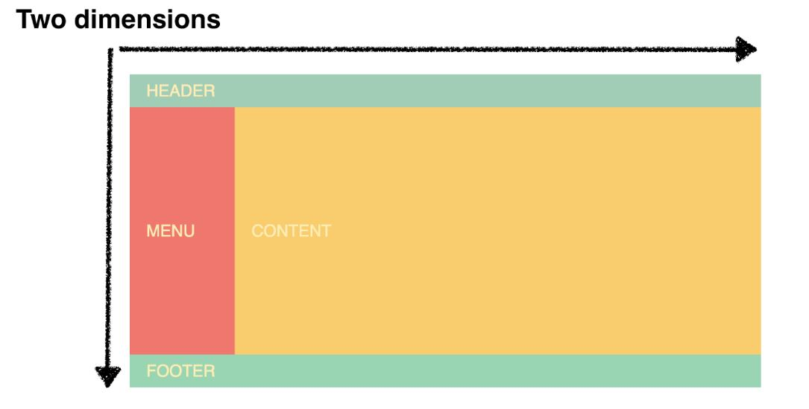
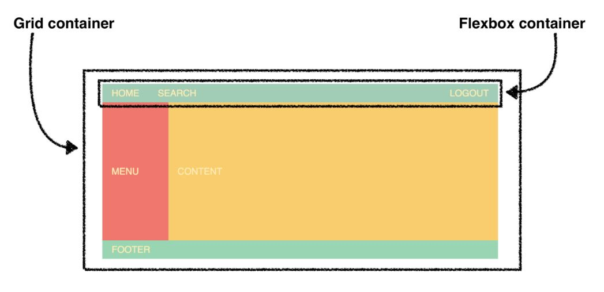

## Flexbox vs Grid (一维 vs 二维)
* 如果你只在一个方向上布局，FlexBox 可以用更少的代码去实现并且更加容易维护。
* 如果你打算在两个维度上创建一个完整的布局，同时使用行和列，那么你应该使用 Grid。

###### 网页实例
<div align="center"></div>

分析，
* 从整体上看，Grid 会更加灵活，并且会使你的标签更简单，代码更容易维护。
* 最完美的做法是使用 Grid 来布局页面，使用 Flexbox 去对齐 header 里面的内容。

#### 1. 区别 - 内容优先 vs 布局优先
Flexbox 以内容为基础，Grid 以布局为基础。

以 header 的创建为例
```html
<header>
  <div>Home</div>
  <div>Search</div>
  <div>Logout</div>
</header>
```

###### FlexBox 布局
```html
header {
  display:flex;
}
header > div:nth-child(3) {
  margin-left: auto;  /* 让 logout button 在最右边 */
}
```
* 在使用 Flexbox 之前，里面的 div 会堆叠在彼此之上。
* 当我们加了 display:flex 之后，他们会漂亮的在一条线上。 <br>
—— 让元素本身决定他放在哪里，我们除了 display: flex 之外不添加任何东西。

###### Grid 布局
```html
header {
  display: grid;
  grid-template-columns: repeat(10, 1fr);
}
header > div:nth-child(3) {
  grid-column: 10;  /* 让 logout button 在最右边 */
}
```
* 这种方式必须先定义布局的列。从定义列的宽度开始，然后我们才能将元素放在可用的单元格中。 （这种方式强迫我们去分割我们的 header 有多少列。）
* 除非我们改变 Grid，否则我们会被困死在 10 列中。
* 我们不能简单的添加一个例如 margin-left: auto 的属性设置，所有项目都基于单元格的配置来布局。

#### 2. 结合

以前文的网页视觉稿为例
```html
<div class="container">
  <header>HEADER</header>
  <aside>MENU</aside>
  <main>CONTENT</main>
  <footer>FOOTER</footer>
</div>

/* Grid 布置大局 */
.container {
  display: grid;
  grid-template-columns: repeat(12, 1fr);
  grid-template-rows: 50px 350px 50px;
}
header {
  grid-column: span 12;
}
aside {
  grid-column: span 2;
}
main {
  grid-column: span 10;
}
footer {
  grid-column: span 12;
}

/* FlexBox 布置小局 */
header {
  display: flex;
}
header > div:nth-child(3) {
  margin-left: auto;  /* 让 logout button 在最右边 */
}
```

效果图
<div align="center"></div>

