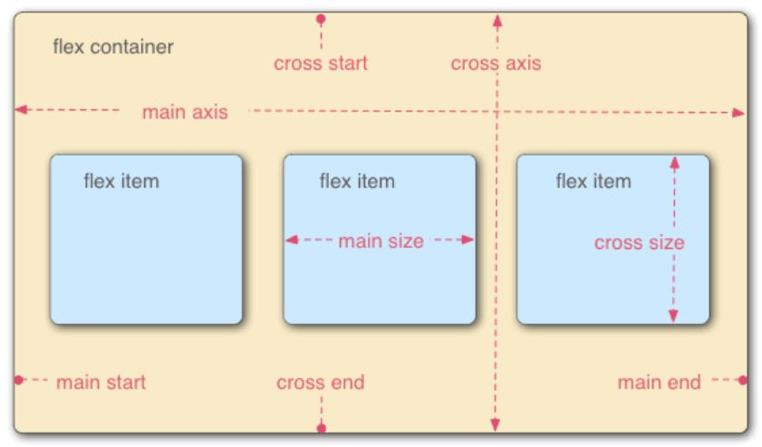
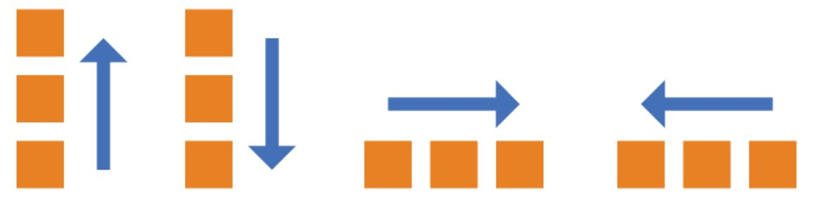
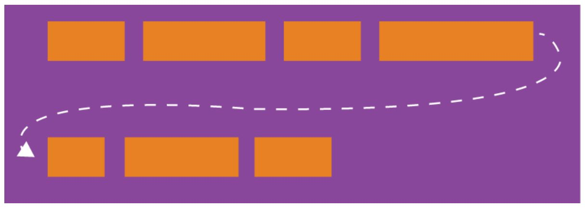
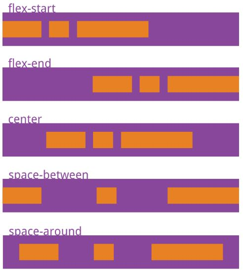
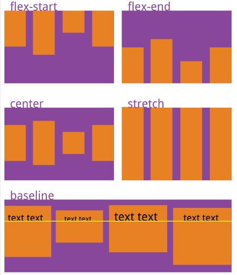
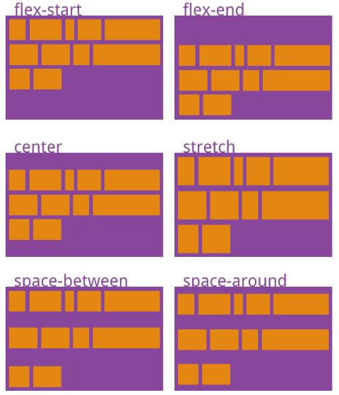
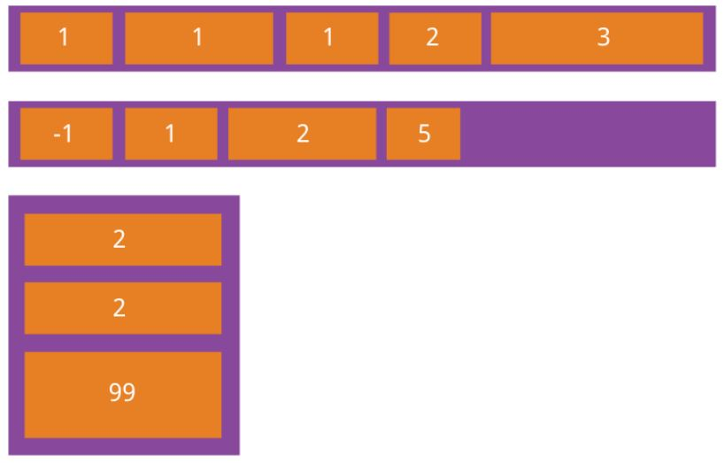
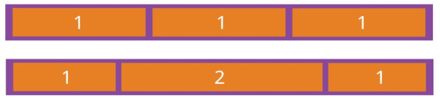
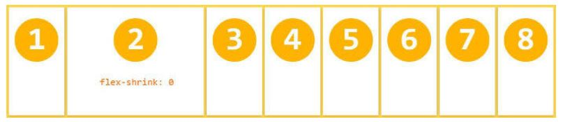

## Flex 布局
—— Flex 是 Flexible Box 的缩写。

说明
* 任何一个容器都可以指定为 Flex 布局，只需将 display 属性设置为 flex。
* 行内元素也可以使用 Flex 布局，只需将 display 属性设置为 inline-flex。
* Webkit 内核的浏览器，必须加上 -webkit 前缀。
* 注意，设为 Flex 布局后，子元素的 float、 clear 和 vertical-align 属性将失效。
```html
.box{
  display: -webkit-flex; /* Safari */
  display: flex;
}
```

HTML 元素的原始布局模型 <br>
—— 纯文本的元素的布局划分类仅 2 类
* inline 以文本段落为代表的行顺序排布并自动换行。
* block 以代码块为代表的块区域。


#### 基本概念
采用 Flex 布局的元素，称为 Flex 容器（Container），它的所有子元素自动成为容器成员，称为 Flex 项目(Item)。

###### Flex 坐标系模型
<div align="center"></div>

Flex 容器默认存在两根轴
* 水平的主轴（main axis）
* 垂直的交叉轴（cross axis）

引申出的名词
* main start / main end
* cross start / cross end
* main size
* cross size

##### 1. Container 的属性 （6个）
* flex-direction <br>
可选项 row、 row-reverse、 column、 column-reverse。
<div align="center"></div>

* flex-wrap <br>
可选项 nowrap、 wrap、 wrap-reverse。
<div align="center"></div>

* flex-flow <br>
flex-flow 属性是 flex-direction 属性和 flex-wrap 属性的简写形式。
```html
  flex-flow: <flex-direction> <flex-wrap>;
```
 
* justify-content <br>
可选项 flex-start、 flex-end、 center、 space-between、 space-around。
<div align="center"></div>

* align-items <br>
可选项 flex-start、 flex-end、 center、 baseline、 stretch。
<div align="center"></div>

* align-content <br>
可选项 flex-start、 flex-end、 center、 space-between、 space-around、 stretch。
<div align="center"></div>

##### 2. Item 的属性 （6个）
* order <br>
可选项 任意的整数。（数值越小，排列越靠前，默认为 0。）
<div align="center"></div>

* flex-grow <br>
可选项 任意正整数。（默认为 0 表示不放大，大家根据自己的值按比例分配余量。）
<div align="center"></div>

* flex-shrink <br>
可选项 任意正整数。（默认为 0 表示不缩小，大家根据自己的值按比例分配缩小需求。）
<div align="center"></div>

* flex-basis <br>
—— 指定 Main Size 的值。 <br>
可选项 一个指定的尺寸（px/em）。(默认为 auto。)

* flex <br>
flex 属性是 flex-grow, flex-shrink 和 flex-basis 的简写，默认值为 0 1 auto。 后两个属性可选。
```html
  flex: none | [ <'flex-grow'> <'flex-shrink'>? || <'flex-basis'> ]
```
注意： 该属性有两个快捷值：auto (1 1 auto) 和 none (0 0 auto)。

* align-self <br>
align-self 属性允许单个项目有与其他项目不一样的对齐方式，可覆盖 Container 的 align-items 属性。 <br>
默认值为 auto，表示继承父元素的 align-items 属性，如果没有父元素，则等同于 stretch。

