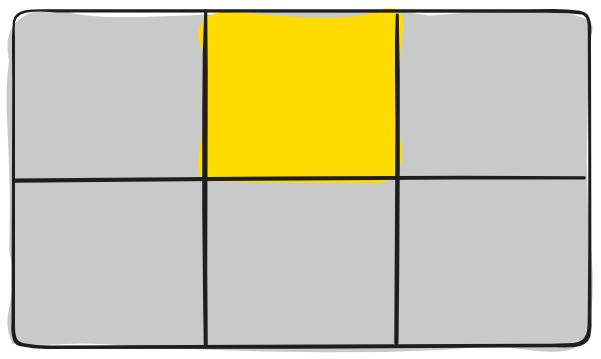
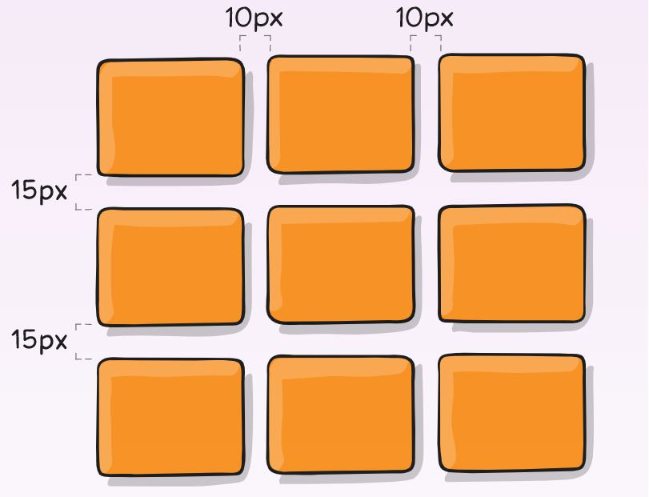

## Grid 布局
—— ***It is a 2-dimensional system, meaning it can handle both columns and rows, unlike flexbox which is largely a 1-dimensional system.***

说明
* 任何一个容器都可以指定为 Grid 布局，只需将 display 属性设置为 grid。 
* 行内元素也可以使用 Grid 布局，只需将 display 属性设置为 inline-grid。
* float， display: inline-block， display: table-cell， vertical-align 和 column-* 特性在一个 Item 上无效。

#### 基本概念
采用 Grid 布局的元素，称为 Grid 容器（Container），它的所有子元素自动成为容器成员，称为 Grid 项目(Item)。

##### 栅格划分引出的名词
* Grid Line 栅格线
<div align="center"></div>

* Grid Track 两条栅格线之间的区域
<div align="center"></div>

* Grid Cell 栅格
<div align="center"></div>

* Grid Area 四条网格线包围的区域
<div align="center"></div>

<br>

#### 1. Container 的属性
* grid-template-columns / grid-template-rows <br>
```html
模板：
  grid-template-columns: <track-size> ... | <line-name> <track-size> ...;
  grid-template-rows: <track-size> ... | <line-name> <track-size> ...;
示例：
  grid-template-columns: 40px 50px auto 50px 40px;
  grid-template-rows: 25% 100px auto;
```
track-size 的一种取值是 *fr* (fraction of free space)。
<div align="center"></div>

* grid-template-areas <br>
```html
模板：
  grid-template-areas: 
    "<grid-area-name> | . | none | ..."
    "...";
示例：
  .item-a {
    grid-area: header;
  }
  .item-b {
    grid-area: main;
  }
  .item-c {
    grid-area: sidebar;
  }
  .item-d {
    grid-area: footer;
  }

  .container {
    display: grid;
    grid-template-columns: 50px 50px 50px 50px;
    grid-template-rows: auto;
    grid-template-areas: 
        "header header header header"
        "main main . sidebar"
        "footer footer footer footer";
  }
```
<div align="center"></div>

* grid-template <br>
grid-template 属性是 grid-template-rows 属性、 grid-template-columns 属性和 grid-template-areas 属性的简写形式。
```html
  grid-template: none | <grid-template-rows> / <grid-template-columns>;
```

* grid-column-gap / grid-row-gap <br>
```html
模板：
  grid-column-gap: <line-size>;
  grid-row-gap: <line-size>;
示例：
  grid-template-columns: 100px 50px 100px;
  grid-template-rows: 80px auto 80px; 
  grid-column-gap: 10px;
  grid-row-gap: 15px;
```
<div align="center"></div>

* grid-gap <br>
grid-gap 属性是 grid-row-gap 属性和 grid-column-gap 属性的简写形式。
```html
  grid-gap: <grid-row-gap> <grid-column-gap>;
```

* justify-items <br>
可选项 start、 end、 center、 stretch。
<div align="center"></div>

* align-items <br>
可选项 start、 end、 center、 stretch。
<div align="center"></div>

* place-items <br>
place-items 属性是 align-items 属性和 justify-items 属性的简写形式。
```html
  place-items: <align-items> <justify-items>;
```

* justify-content <br>
可选项 start、 end、 center、 stretch、 space-around、 space-between、 space-evenly。
<div align="center"></div>

* align-content <br>
可选项 start、 end、 center、 stretch、 space-around、 space-between、 space-evenly。
<div align="center"></div>

* place-content <br>
place-content 属性是 align-content 属性和 justify-content 属性的简写形式。
```html
  place-content: <align-content> <justify-content>;
```

* grid-auto-columns / grid-auto-rows <br>
指定默认生成的 Grid Tracks 的值。
—— 当实际项目数多于 Container 的 Cells 数量，或项目被强制放置于 Container 之外时，将有默认的新的 Track 创建。
```html
模板：
  grid-auto-columns: <track-size> ...;
  grid-auto-rows: <track-size> ...;
示例：
  .container {
    grid-template-columns: 60px 60px;
    grid-template-rows: 90px 90px
  }
  .item-a {
    grid-column: 1 / 2;
    grid-row: 2 / 3;
  }
  .item-b {
    grid-column: 5 / 6;
    grid-row: 2 / 3;
  }
```
<div align="center"></div>

* grid-auto-flow <br>
可选项 row、 column、 row dense、 column dense。
###### row
<div align="center"></div>

##### column
<div align="center"></div>

* grid <br>
A shorthand for setting all of the following properties in a single declaration: *grid-template-rows, grid-template-columns*, *grid-template-areas*, *grid-auto-rows, grid-auto-columns*, and *grid-auto-flow*.

#### 2. Item 的属性
* grid-column-start / grid-column-end / grid-row-start / grid-row-end <br>
```html
模板：
  grid-column-start: <number> | <name> | span <number> | span <name> | auto;
  grid-column-end: <number> | <name> | span <number> | span <name> | auto;
  grid-row-start: <number> | <name> | span <number> | span <name> | auto;
  grid-row-end: <number> | <name> | span <number> | span <name> | auto;
示例：
  .item-b {
    grid-column-start: 1;
    grid-column-end: span col4-start;
    grid-row-start: 2
    grid-row-end: span 2
  }
```
<div align="center"></div>

* grid-column / grid-row <br>
grid-column 属性是 grid-column-start 属性和 grid-column-end 属性的简写，grid-row 属性是 grid-row-start 属性和 grid-row-end 属性的简写。
```html
  grid-column: <start-line> / <end-line> | <start-line> / span <value>;
  grid-row: <start-line> / <end-line> | <start-line> / span <value>;
```

* grid-area <br>
```html
模板：
  grid-area: <name> | <row-start> / <column-start> / <row-end> / <column-end>;
示例：
  .item-d {
    grid-area: header;
  }
  .item-d {
    grid-area: 1 / col4-start / last-line / 6;
  }
```
<div align="center"></div>

* justify-self <br>
可选项 start、 end、 center、 stretch。
<div align="center"></div>

* align-self <br>
可选项 start、 end、 center、 stretch。
<div align="center"></div>

* place-self <br>
place-self 属性是 align-self 属性和 justify-self 属性的简写形式。
```html
place-self: <align-self> / <justify-self>;
```

