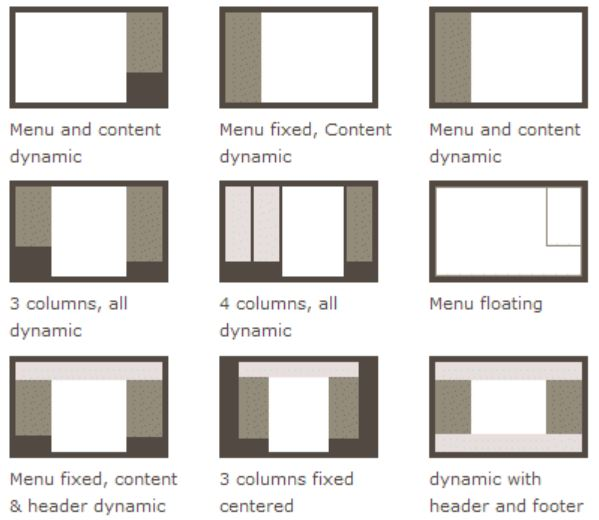
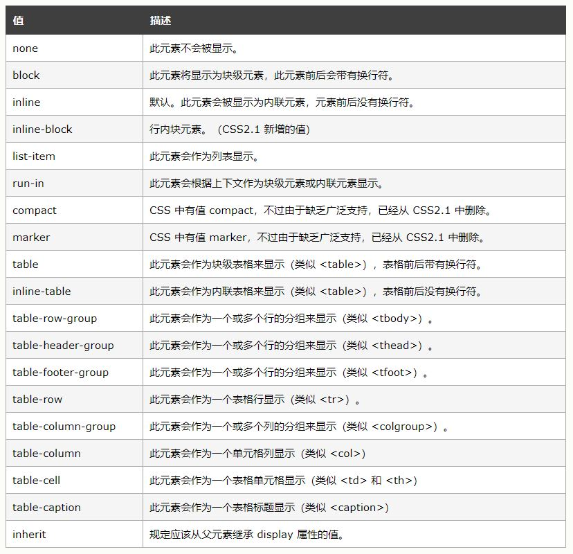
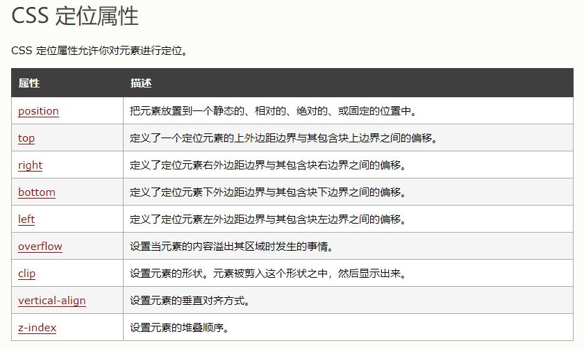
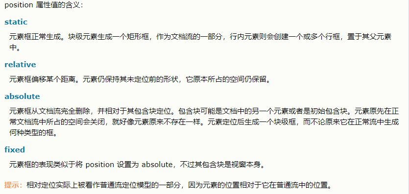
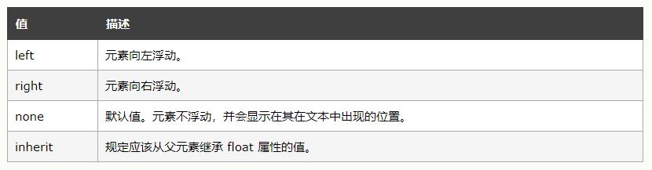

## 网页布局（layout）
—— 网页布局（layout）是 CSS 的一个重点应用。

###### 网页布局方案
<div align="center"></div>

<br>

#### 布局的传统解决方案
—— 基于盒状模型，依赖 display 属性 + position 属性 + float 属性。

###### Display 属性 （ —— 框的类型，布局的前提）
<div align="center"></div>

###### 定位属性 （ —— display + position + float 的组合）
<div align="center"></div>

###### Position 属性
<div align="center"></div>

###### Float 属性
<div align="center"></div>

<br>

#### 新解决方案
—— FlexBox 和 Grid Layout 方案的结合

* W3C Flex 布局 <br>
Go: [flex.md](./flex.md)
* W3C Grid 布局 <br>
Go: [grid.md](./grid.md)

##### FlexBox vs Grid Layout
Go: [flex-vs-grid.md](flex-vs-grid.md)

<br>

refer: 
* \[CSS终极之战：Grid vs Flexbox\] https://blog.catwen.cn/2017/12/12/the-ultimate-css-battle-grid-vs-flexbox/
* \[Flex 布局语法教程\] https://www.runoob.com/w3cnote/flex-grammar.html
* \[Learn CSS Grid in 5 Minutes\] https://www.freecodecamp.org/news/learn-css-grid-in-5-minutes-f582e87b1228/
* \[Learn CSS Flexbox in 5 Minutes\] https://www.freecodecamp.org/news/learn-css-flexbox-in-5-minutes-b941f0affc34/

教程
* A Complete Guide to Grid <br>
https://css-tricks.com/snippets/css/complete-guide-grid/
* A Complete Guide to Flexbox <br>
https://css-tricks.com/snippets/css/a-guide-to-flexbox/
* A Visual Guide to CSS3 Flexbox Properties <br>
https://scotch.io/tutorials/a-visual-guide-to-css3-flexbox-properties

<br>

#### 浏览器兼容性
* 最新的 ie 浏览器支持 Grid 和 Flex。

FlexBox 兼容性
* https://css-tricks.com/using-flexbox/
* https://dev.opera.com/articles/advanced-cross-browser-flexbox/#fallbacks

Grid 兼容性
* https://css-tricks.com/snippets/css/complete-guide-grid/

示例
```html
.container {
	display: grid;
	grid-template-columns: repeat(10, 1fr);
	grid-template-rows: 50px, 350px, 50px;
}
header {
	grid-column: 1 / span 10; /* 从第 1 列开始， 合并后面的 10 列 */
	grid-row: 1 / span 1;     /* 注意，合并的时候 row 和 column 都要用 span 表示 */
}
.container > .content {
	grid-column: 1 / span 10;
	grid-row: 2 / span 1;
}
footer {
	grid-column: 1 / span 10;
	grid-row: 3 / span 1;
}
footer {
	display: grid;           /* subgrid */
	grid-template-columns: auto;
	grid-template-rows: 4px, 20px, 20px, 6px;
}
footer > .copyright {
	grid-column: 1 / span 1;
	grid-row: 2 / span 1;
}
footer > .public-record-id {
	grid-column: 1 / span 1;
	grid-row: 3 / span 1;
}

header {
	display: -webkit-box;      /* OLD - iOS 6-, Safari 3.1-6 */
	display: -moz-box;         /* OLD - Firefox 19- (buggy but mostly works) */
	display: -ms-flexbox;      /* TWEENER - IE 10 */
	display: -webkit-flex;     /* NEW - Chrome */
	display: flex;             /* NEW, Spec - Opera 12.1, Firefox 20+ */
}
header > a:nth-child(2) {
	margin-left: auto;
	margin-right: 5px;
}

footer > .copyright {
	display: -webkit-box;      /* OLD - iOS 6-, Safari 3.1-6 */
	display: -moz-box;         /* OLD - Firefox 19- (buggy but mostly works) */
	display: -ms-flexbox;      /* TWEENER - IE 10 */
	display: -webkit-flex;     /* NEW - Chrome */
	display: flex;             /* NEW, Spec - Opera 12.1, Firefox 20+ */
	-webkit-justify-content: center;
	-moz-justify-content: center;
	-ms-justify-content: center;
	justify-content: center;
}

footer > .public-record-id {
	display: -webkit-box;      /* OLD - iOS 6-, Safari 3.1-6 */
	display: -moz-box;         /* OLD - Firefox 19- (buggy but mostly works) */
	display: -ms-flexbox;      /* TWEENER - IE 10 */
	display: -webkit-flex;     /* NEW - Chrome */
	display: flex;             /* NEW, Spec - Opera 12.1, Firefox 20+ */
	-webkit-justify-content: center;
	-moz-justify-content: center;
	-ms-justify-content: center;
	justify-content: center;
}

header a {
	color: black;
}

/* for browser support: please refer https://dev.opera.com/articles/advanced-cross-browser-flexbox/#fallbacks */
```
