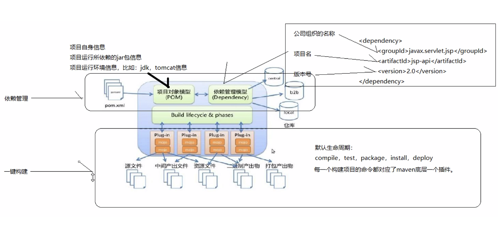

## Maven

用于解决或者简化的任务：
1. jar 引用管理和防冲突。 ``#依赖管理``
2. 项目编译。 ``#build``
3. 单元测试自动化。 ``#``
4. 管理维护繁多的配置文件。 ``#``
5. 打包。 ``#``

Maven 官网： https://maven.apache.org/ ，Maven 还有自己的仓库网站 https://mvnrepository.com/ ，因此，它像 Git 一样是一个管理工具/软件。 （Maven 是一个应用软件。）

#### Maven 下载安装
下载网站 https://archive.apache.org/dist/maven/maven-3/

* 下载 binaries 目录下 apache-maven-3.5.3-bin.zip 文件
* 安装： 解压缩即可使用。
* 配置： 设置环境变量 ``MAVEN_HOME`` 为 maven 目录路径。
  ```
  # 可以在 windows 下的 linux bash (GitBash) 终端中创建一个脚本 maven.sh 如下：
  export MAVEN_HOME=/c/Users/zhihengw/PycharmProjects/apache-maven-3.5.3/${MAVEN_HOME:+:${MAVEN_HOME}}
  export PATH=/c/Users/zhihengw/PycharmProjects/apache-maven-3.5.3/bin/${PATH:+:${PATH}}
  # 每次使用前，source maven.sh 然后使用即可。
  ```

#### Maven 快速入门
* 打开命令行窗口，进入 maven 目录下的 bin 目录；
* 执行 ``mvn -v``，查看 maven 版本信息。
###### Maven 就是个控制台工具，-h 或者 -v 就是控制台工具的第一入门。


## Maven 使用
帮助文档 http://maven.apache.org/guides/index.html

#### Maven 环境测试
##### 1. 使用 maven 创建一个 Java 项目
```bash
mvn archetype:generate -DgroupId=com.mycompany.app -DartifactId=my-app -DarchetypeArtifactId=maven-archetype-quickstart -DarchetypeVersion=1.4 -DinteractiveMode=false
```

##### 2. Build the Project
```bash
cd my-app
mvn package
```

##### 3. Test the newly compiled and packaged JAR
```bash
java -cp target/my-app-1.0-SNAPSHOT.jar com.mycompany.app.App
```
* 备注： maven 指定代理： 形如 mvn compile ``-Dhttps.proxyHost=192.168.163.118 -Dhttps.proxyPort=3128``

以上三步成功完成，表示 maven 环境成功。 可以开始使用了。

创建 Java 项目模板成功后，打印信息如下：
```
[INFO] -----------------------------------------------------------------------------
[INFO] Using following parameters for creating project from Archetype: maven-archetype-quickstart:1.4
[INFO] ----------------------------------------------------------------------------
[INFO] Parameter: groupId, Value: com.mycompany.app
[INFO] Parameter: artifactId, Value: my-app
[INFO] Parameter: version, Value: 1.0-SNAPSHOT
[INFO] Parameter: package, Value: com.mycompany.app
[INFO] Parameter: packageInPathFormat, Value: com/mycompany/app
[INFO] Parameter: package, Value: com.mycompany.app
[INFO] Parameter: groupId, Value: com.mycompany.app
[INFO] Parameter: artifactId, Value: my-app
[INFO] Parameter: version, Value: 1.0-SNAPSHOT
[INFO] Project created from Archetype in dir: C:\Users\zhihengw\PycharmProjects\my-app
[INFO] ------------------------------------------------------------------------
[INFO] BUILD SUCCESS
[INFO] ------------------------------------------------------------------------
```

#### Maven 的 Java 项目模板
* 核心代码部分。 （Java 代码）
* 配置文件部分。 （配置文件）
* 测试代码部分。 （单元测试代码）
* 测试配置文件。 （测试环境配置文件）

##### maven 从以上四个方面考虑，定义了一个标准的目录规范：
* src/main/java 目录  -->  Java 核心代码
* src/main/resources 目录  --> 配置文件
* src/test/java 目录  --> 测试人员代码
* src/test/resources 目录  --> 测试环境配置文件
* src/main/webapp 目录  --> 页面资源（css、js、html、图片等等） // 针对 web 开发

#### Maven 常用命令
1. compile
   ```
   编译命令，将 src/main/java 目录下的代码编译为 class 文件，并输出到 target 目录下。
   $ mvn compile
   ```
2. clean
   ```
   清除命令，清除的是 target 目录以及内部所有内容和文件。
   $ mvn clean
   ```
3. test
   ```
   测试命令，将 src/test/java 目录下的代码编译为 class 文件，并输出到 target 目录下。
   # 默认会执行 mvn compile，进行 Java 核心代码的编译工作。 （如果之前没编译的话）
   $ mvn test
   ```
4. package
   ```
   打包命令，将 src/main/java 目录下的代码编译为 jar/war 包，并输出到 target 目录下。
   # 默认会执行 mvn compile 和 mvn test， 进行编译工作。 （如果之前没编译的话）
   $ mvn package
   ```
5. install
   ```
   安装命令，将 src/main/java 代码打包，并上传至仓库中。
   # 默认会执行 mvn pakcage，进行编译工作。
   $ mvn install
   ```


## Maven 的 "Lifecycle" 概念
生命周期（lifecycle） 就是将 ``编译Java代码、编译test代码、打包、安装、部署`` 这五步流程用一个名词来说明/替代。

拿到一个别人的 maven 工程，首先要确认的是当前处于的状态：
* 还在开发阶段 main or test；
* 已生成完整的 target 目录内容（mvn package）；
* 已安装（mvn install），将包上传至仓库中；
* 还是，已部署（mvn deploy）。

此时，谈论的就是，当前处于 maven （默认）生命周期的哪个阶段。
###### maven 还有另外两个生命周期的概念： 清理生命周期(Clean Lifecycle)、 站点管理生命周期(Site Lifecycle)。 


## Maven 的理念/概念模型图
pom.xml 文件包含了一个 maven 构建的 Java 项目包含的所有信息，主要是：
1. 依赖环境的说明和记录；  --> pom.xml 文件中 dependencies 标签对应的内容。
2. 编译的流程。 （maven 中称作一键构建）  --> pom.xml 文件中 build 标签对应的内容。

以图的形式展示 pom.xml 文件的内容组成，如下：
<div align="center"></div>
