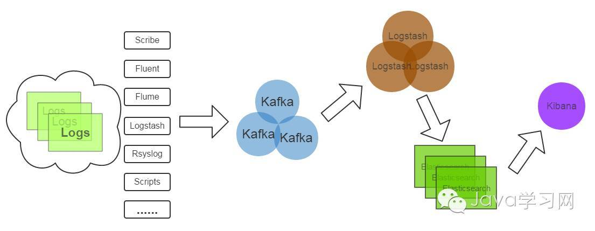

## 分布式消息队列
###### reference https://www.cnblogs.com/wanglijun/p/10896730.html

什么是消息队列？ 消息队列是软件/服务治理的一种手段，操作系统就是通过消息队列来向各软件发送消息（输入设备的触发消息），进行软件/服务治理。

<br>

> **消息队列（MQ）是一种应用程序对应用程序的通信方法。应用程序通过读写出入队列的消息来通信。无需专用连接来链接彼此。``消息队列是典型的：生产者、消费者模型。``**

> **MQ是消息通信的模型，并不是具体实现。现在实现MQ的有两种主流方式：AMQP、JMS。** <br>
> 而所谓的主流实现方式，即指定明确规范的通信协议。如：

<br>

```
▪ AMQP
  - 即Advanced Message Queuing Protocol，一个提供统一消息服务的应用层标准高级消息队列协议，
    是应用层协议的一个开放标准，为面向消息的中间件设计。
  - 基于此协议的客户端与消息中间件可传递消息，并不受客户端/中间件不同产品，不同的开发语言等条件的限制！！！
  - Erlang中的实现有RabbitMQ等。
▪ JMS
  - 即Java Message Service，是Java平台中关于面向消息中间件（MOM）的API，由Sun公司提出的消息标准，
    是一个与具体平台无关的API，绝大多数消息中间件供应商都对JMS提供支持。
▪ 两者的区别和联系：
  - JMS是定义了统一的接口，是对消息操作（OP）进行统一；
  - AMQP是通过规定协议，是对数据交互的格式（Protocol）进行统一；
  - 语言方面，JMS限定了必须使用Java语言；
  - AMQP只是协议，不规定实现方式，因此是跨语言的；
  - 通信模型方面，JMS规定了两种消息模型；
  - 而AMQP的消息模型更加丰富。
```

<br>

#### 1. 消息队列概述

消息队列中间件是分布式系统中重要的组件。 ``是所有大型分布式系统不可缺少的中间件。``

主要为了解决的问题：
* 异步消息
* 应用耦合
* 流量削峰
* 日志处理
* 消息通讯等。

以实现高性能，高可用，可伸缩和最终一致性的架构。

<br>

##### 目前，消息服务器的同类软件有：
* ActiveMQ - JMS消息服务器
* RabbitMQ - AMQP消息服务器
* ZeroMQ   -
* Kafka    - 分布式发布订阅消息系统，高吞吐量
* Jafka    - 分布式消息系统
* MetaMQ   -
* RocketMQ - 基于JMS，阿里巴巴产品
* beanstalkd - 轻量级消息队列
* DotNetMQ   - .Net消息中间件
* Metamorphosis - 分布式消息中间件
* NSQ - 开源消息系统

思考，为什么会有这么多种消息队列？

<br>

#### 2. 消息队列的应用场景
异步处理，应用解耦，流量削峰，日志处理和消息通讯五个场景。 （五大场景）

##### I. 异步处理
例如： 当用户注册后，需要发注册邮件和注册短信。

传统的做法是：
* 串行的方式；
  ```
  将注册信息写入数据库成功后，发送注册邮件，再发送注册短信。
  以上三个任务全部完成后，返回给客户端。 （思考弊端是什么？）
  ```
* 并行方式。
  ```
  将注册信息写入数据库成功后，发送注册邮件的同时，发送注册短信。
  以上三个任务完成后，返回给客户端。 （此种还有弊端么？）
  ```

###### 现在，计算请求的最大吞吐量
```
假设，注册和发送，每个都是需要 50 毫秒，则串行方式需要 150 毫秒，并行方式需要 100 毫秒。
串行方式的最大吞吐量 = 1000/150 = 7 次/秒。
并行方式的最大吞吐量 = 1000/100 = 10 次/秒。
```
结论： 使用传统的方式，系统的性能（并发量，吞吐量，响应时间）会有瓶颈。

使用消息队列的方式
<div align="center"></div>
此时，最大吞吐量 = 1000/（50+5） = 18 次/秒。

##### II. 应用解耦
例如： 当用户下单后，订单系统需要通知库存系统。

传统的做法是：
* 服务接口调用
  ```
  订单系统调用库存系统的接口。
  ```

###### 传统模式的缺点：
```
1） 假如库存系统无法访问，则订单减库存将失败，从而导致订单失败；
2） 订单系统与库存系统耦合； API 耦合在代码内。
```

使用消息队列的方式
<div align="center"></div>
```
# 订单系统： 当用户下单后，订单系统完成持久化处理，将消息写入消息队列，返回用户订单下单成功。
# 库存系统： 订阅下单的消息，采用拉/推的方式，获取下单信息，库存系统根据下单信息，进行库存操作。 
```
假如，在下单时库存系统不能正常使用。 该方案下也不影响正常下单业务，因为下单后，订单系统写入消息队列就不再关心其他的后续操作了。

##### III. 流量削锋
例如： 电商的秒杀或团抢活动。

传统的做法是：
* 短时流量过大，导致流量暴增，应用挂掉。 那就重启服务，一直看着。

使用消息队列的方式
<div align="center"></div>
```
一般需要在应用前端（业务处理的前端）加入消息队列。
1. 可以控制活动的人数；
2. 可以缓解短时间内高流量压垮应用；
用户的请求，服务器接收后，首先写入消息队列。 假如消息队列长度超过最大数量，直接抛弃用户请求或跳转到错误页面。
秒杀业务是根据消息队列中的请求信息，来做后续处理。
```

##### IV. 日志处理
例如： 进行大数据分析的时候，分析程序需要去读取访问日志文件，就出现了大量日志需要传输的问题

传统的做法是：
* 需要访问的时候就去访问，等传输结束做分析。

使用消息队列的方式
<div align="center"></div>
```
日志采集客户端，负责日志数据采集，定时写受写入 Kafka 队列；
Kafka 消息队列，负责日志数据的接收，存储和转发；
日志处理应用： 订阅并消费 Kafka 队列中的日志数据。
```

##### V. 消息通讯
例如： 聊天室类软件的消息通讯，以及实现点对点通讯。

消息队列一般都内置了高效的通信机制，在纯的消息通讯方面很高效。

使用消息队列进行通讯：
* 点对点通讯
<div align="center"></div>

* 聊天室通讯
<div align="center"></div>

使用消息队列进行通讯，比直接通讯有更好的鲁棒性和用户体验。（例如对方下线的情形，不影响在线方发消息。）


<br>

## RabbitMQ 


<br>

## 消息中间件的生产环境使用示例

#### 3.1 电商系统
<div align="center"></div>
电商系统的消息队列，一般采用高可用、可持久化的消息中间件。 比如 ActiveMQ，RabbitMQ，RocketMQ。
```
1) 应用将主干逻辑处理完成后，写入消息队列。 关于消息发送是否成功，可以开启消息的确认模式。
   （消息队列返回消息接收成功状态后，应用再返回，这样保障消息的完整性。）
2) 扩展流程（即：发短信，配送处理等） 订阅队列消息。 采用推或拉的方式获取消息并处理。
3) 消息将应用解耦的同时，带来了数据一致性问题，可以采用最终一致性方式解决。
   比如: 主数据写入数据库，扩展应用则根据消息队列，并结合数据库实现基于消息队列的后续处理。
```

#### 3.2 日志收集系统（大数据）
<div align="center"></div>
一个日志收集系统分为： Zookeeper 注册中心、日志收集客户端、Kafka 集群、Storm 集群（OtherApp），共四部分组成。
```
1) Zookeeper 注册中心，提出负载均衡和地址查找服务。
2) 日志收集客户端，用于采集应用系统的日志，并将数据推送到 Kafka 队列。
```

<br>

## JMS 消息服务
###### 讲消息队列就不得不提 JMS（JAVA Message Service, JAVA 消息服务）。

JMS API 是一个消息服务的标准/规范，允许应用程序组件基于 JavaEE 平台创建、发送、接收和读取消息。
```
它使分布式通信耦合度更低，消息服务更加可靠以及异步性。
在 EJB(Enterprise JavaBean) 架构中，消息 bean 可以无缝的与 JM 消息服务集成。
在 J2EE 架构模式中，有消息服务者模式，用于实现消息与应用直接的解耦。
```

##### JMS 的消息模型
在 JMS 标准中，有两种消息模型:
* P2P (Point to Point)
* Publish/Subscribe (Pub/Sub)

##### 4.1 P2P 模式
<div align="center"></div>
P2P 模式包含三个角色：
* 消息队列（Queue）
* 发送者(Sender)
* 接收者(Receiver)。

每个消息都被发送到一个特定的队列，接收者从队列中获取消息。 队列保留着消息，直到它们被消费或超时。

P2P 模式的特点：
```
1. 每个消息只有一个消费者（Consumer）。 (因此，消息一旦被消费，消息就不再在消息队列中。)
2. 发送者和接收者之间在时间上没有依赖性。 （也就是说当发送者发送了消息之后，不管接收者有没有正在运行，它不会影响到消息被发送到队列。）
3. 接收者在成功接收消息之后需向队列应答成功。
```

如果希望发送的每个消息都会被成功处理的话，那么需要 P2P 模式。

##### 4.2 Pub/Sub 模式
<div align="center"></div>
Pub/Sub 模式也包含三个角色：
* 主题（Topic）
* 发布者（Publisher）
* 订阅者（Subscriber）。

多个发布者将消息发送到 Topic，系统将这些消息传递给多个订阅者。

Pub/Sub 模式的特点：
```
1. 每个消息可以有多个消费者。
2. 发布者和订阅者之间有时间上的依赖性。 （针对某个主题（Topic）的订阅者，它必须在创建一个订阅者之后，才能消费发布者的消息。）
3. 为了消费消息，订阅者必须保持运行的状态。
```

为了缓和标准 Pub/sub 模式下的严格时间相关性，JMS 允许订阅者创建一个可持久化的订阅。
（即：订阅者没有被激活（运行），它也能接收到发布者的消息。）

如果希望发送的消息： 可以不被做任何处理、只被一个消费者处理、被多个消费者处理，需要多种选择的话，请采用 Pub/Sub 模式。

<br>

## 消息如何消费
###### 在 JMS 中，消息的产生和消费都是异步的。

但是对于消费者来说，JMS 的消费者可以通过两种方式来消费：
* 同步
  ```
  订阅者(接收者) 通过 receive 方法来接收消息，receive 方法在接收到消息之前（或超时之前）将一直阻塞。
  ```
* 异步
  ```
  订阅者(接收者) 注册为一个消息监听器，当消息到达后，系统自动调用监听器的 onMessage 方法。
  ```

<br>

## JMS 编程模型
* ConnectionFactory
  ```
  创建 Connection 对象的工厂，针对两种不同的 JMS 消息模型，分别有：
  QueueConnectionFactory 和 TopicConnectionFactory 两种。
  ```
* Destination
  ```
  Destination 指消息生产者的消息发送目标或说消息消费者的消息来源。
  Destination 实际上就是两种类型的对象： Queue、Topic。
  ```
* Connection
  ```
  Connection 是指在客户端和 JMS 系统之间建立的连接（是对 TCP/IP socket 的包装）。
  Connection 可以产生一个或多个 Session。
  Connection 也有两种类型： QueueConnection、TopicConnection。
  ```
* Session
  ```
  Session 是操作消息的接口。 可以通过 Session 来创建生产者、消费者、消息等。
  Session 提供了事务的功能。 当需要使用 Session 发送/接收多个消息时，可以将这些发送/接收动作放到一个事务中。
  Session 也有两种类型： QueueSession、TopicSession。
  ```
* 消息的生产者
  ```
  消息的生产者由 Session 创建，并用于将消息发送到 Destination。
  消息生产者分两种类型： QueueSender、TopicPublisher。
  消息生产者通过调用自己的 send 或 publish 方法发送消息。
  ```
* 消息的消费者
  ```
  消息的消费者由 Session 创建，并用于接收被发送到 Destination 的消息。
  消息消费者分两种类型： QueueReceiver、TopicSubscriber。
  ```
* MessageListener（消息监听器）
  ```
  如果注册了消息监听器，一旦消息到达，将自动调用监听器的 onMessage 方法。
  EJB 中的 MDB（Message-Driven Bean） 就是一种 MessageListener。
  ```

深入学习 JMS 对掌握 JAVA 架构，EJB 架构有很好的帮助，消息中间件也是大型分布式系统必须的组件。

<br>
<br>

# 常用的消息队列 （对比分析）

一般的商用容器，比如 WebLogic，JBoss，都支持 JMS 标准，开发上就会很方便。 免费的比如 Tomcat，Jetty 等，则需要使用第三方的消息中间件。

常用的消息中间件：
* ActiveMQ
* RabbitMQ
* ZeroMQ
* Kafka 等。

#### 5.1 ActiveMQ
###### Apache 出品，最流行的，能力强劲的开源消息总线。

ActiveMQ 是一个完全支持 JMS1.1 和 J2EE 1.4 规范的 JMS Provider 实现，尽管 JMS 规范出台时间已经很久，但是 JMS 在当今的 J2EE 应用中间仍然扮演着特殊的地位。

ActiveMQ 的特性：
```
1. 多种语言和协议编写客户端。 (语言: Java,C,C++,C#,Ruby,Perl,Python,PHP。 协议： OpenWire,Stomp REST,WS Notification,XMPP,AMQP)
2. 完全支持 JMS1.1 和 J2EE 1.4 规范。 （持久化，XA消息，事务)
3. 对 Spring 的支持，使 ActiveMQ 很容易内嵌到使用 Spring 的系统里面去，且也支持 Spring2.0 的特性。
4. 通过了常见 J2EE 服务器（如 Geronimo,JBoss 4,GlassFish,WebLogic)的测试，
   通过 JCA 1.5 resource adaptors 的配置，可以让 ActiveMQ 自动的部署到任何兼容 J2EE 1.4 商业服务器上。
5. 支持多种传送协议：in-VM,TCP,SSL,NIO,UDP,JGroups,JXTA。
6. 支持通过 JDBC 和 journal 提供高速的消息持久化。
7. 从设计上保证了高性能的集群，客户端-服务器，点对点。
8. 支持 Ajax。
9. 支持与 Axis 的整合。
10. 可以很容易得调用内嵌 JMS provider，进行测试。
```

#### 5.2 RabbitMQ
###### RabbitMQ 是流行的开源消息队列系统，用 erlang 语言开发。

RabbitMQ 是 AMQP（高级消息队列协议）的标准实现。

RabbitMQ 的特性：
```
1. 多种语言和协议编写客户端。
2. 支持 AJAX，持久化。
3. 用于在分布式系统中存储转发消息，在易用性、扩展性、高可用性等方面表现不俗。
```

#### 5.3 ZeroMQ
###### 号称史上最快的消息队列，它实际是类似于 Socket 的一系列接口。

ZeroMQ 与 Socket 的区别： ``普通的 Socket 是端到端的（1:1的关系），而 ZMQ 却是可以 N：M 的关系。``

点对点连接需要显式地建立连接、销毁连接、选择协议（TCP/UDP）和处理错误等，而 ZMQ 屏蔽了这些细节。

官方宣言：
```
ZMQ 是一个简单好用的传输层，像框架中的一个 socket library，它使得 Socket 编程更加简单、简洁和性能更高。
ZMQ 是一个消息处理队列库，可在多个线程、内核和主机盒之间弹性伸缩。
ZMQ 的明确目标是 “成为标准网络协议栈的一部分，之后进入 Linux 内核”。
```

ZMQ 让编写高性能网络应用程序极为简单和有趣，特点是：
```
1. 高性能，非持久化。 （注意，是非持久化。）
2. 跨平台：支持 Linux、Windows、OS X 等。
3. 多语言支持： C、C++、Java、.NET、Python 等 30 多种开发语言。
4. 可单独部署或集成到应用中使用。
5. 可作为 Socket 通信库使用。
```

与 RabbitMQ 相比，ZMQ 并不像是一个传统意义上的**消息队列服务器**，事实上，它也确实不是一个服务器，更像一个底层的网络通讯库。
```
ZMQ 是在 Socket API 之上做了一层封装，将网络通讯、进程通讯和线程通讯抽象为统一的 API 接口。
支持 “Request-Reply” “Publisher-Subscriber” “Parallel Pipeline” 三种基本模型和扩展模型。
```

ZeroMQ 高性能设计的要点：
```
1. 无锁的队列模型。 采用无锁的队列算法 CAS。
2. 批量处理的算法。 ZeroMQ 对于批量的消息，进行了适应性的优化，可以批量的接收和发送消息。
3. 多核下的线程绑定，ZeroMQ 充分利用多核的优势，每个核绑定运行一个工作者线程，避免多线程之间的 CPU 切换开销。
```

#### 5.4 Kafka
###### Kafka 是一种高吞吐量的分布式发布订阅（Pub/Sub）消息系统。

Kafka 是针对已达到消费规模的网站，处理网站中的所有动作流数据。 而这些动作（即：网页浏览，搜索和其他用户的行动）是现代网络上的许多社会功能的一个关键因素。
``这些数据通常由于吞吐量的要求，需要通过处理日志和日志聚合来解决。``

对于像 Hadoop 一样的日志数据和离线分析系统，对于其要求实时处理的限制，这是一个可行的解决方案。
Kafka 通过 Hadoop 的并行加载机制来统一线上和离线的消息处理，通过集群机来提供实时的消费。

Kafka 的高吞吐量特性：
```
1. 通过 O(1) 的磁盘数据结构提供消息的持久化，这种结构对于即使数以 TB 的消息存储也能够保持长时间的稳定性能。
   （文件追加的方式写入数据，过期的数据定期删除。）
2. 高吞吐量： 即使是非常普通的硬件 Kafka 也可以支持每秒数百万的消息。
3. 支持通过 Kafka 服务器和消费机集群来分区消息。
4. 支持 Hadoop 并行数据加载。
```

##### Kafka 相关概念
* **Broker**
  ```
  Kafka 集群包含一个或多个服务器，这种服务器被称为 broker。
  ```
* **Topic**
  ```
  每条发布到 Kafka 集群的消息都有一个类别，这个类别被称为 Topic。
  (物理上不同 Topic 的消息分开存储，逻辑上一个 Topic 的消息虽然保存于一个或多个 broker 上，
  但用户只需指定消息的 Topic 即可生产或消费数据，而不必关心数据存于何处。)
  ```
* Partition
  ```
  Parition 是物理上的概念，每个 Topic 包含一个或多个 Partition。
  ```
* **Producer**
  ```
  负责发布消息到 Kafka broker。
  ```
* **Consumer**
  ```
  消息消费者，向 Kafka broker 读取消息的客户端。
  ```
* Consumer Group
  ```
  每个 Consumer 属于一个特定的 Consumer Group。
  （可为每个 Consumer 指定 group name，若不指定 group name 则属于默认的 Group。）
  ```

一般应用在大数据日志处理，或对实时性（少量延迟）、可靠性（少量丢数据）要求稍低的场景使用。

<br>
<br>

**附录：**
### 案例： 大数据分析
新浪 Kafka 日志处理应用案例
<div align="center"></div>
```
1) Kafka： 接收用户日志的消息队列。
2) Logstash： 做日志解析，统一成 JSON 输出给 Elasticsearch。 （注意！！）
3) Elasticsearch： 实时日志分析服务的核心技术，一个 schemaless，实时的数据存储服务，通过 index 组织数据，兼具强大的搜索和统计功能。
4) Kibana： 基于 Elasticsearch 的数据可视化组件，超强的数据可视化能力是众多公司选择 ELK stack 的重要原因。
```
