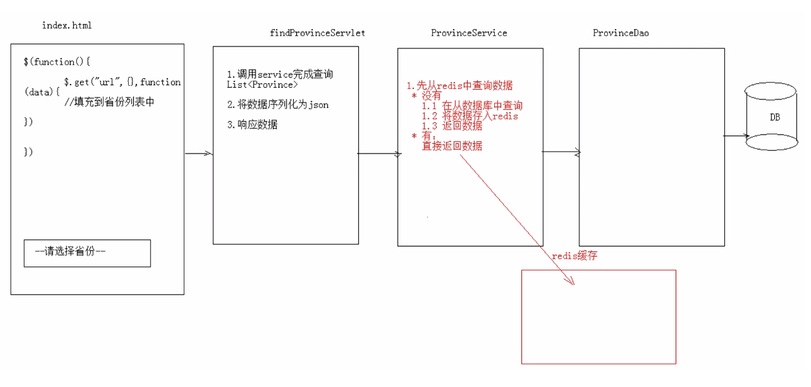

## Redis

redis 是一款高性能的 NoSQL 系列的非关系型数据库。

### 什么是 NoSQL
NoSQL (Not Only SQL) 意即 “不仅仅是SQL”，泛指非关系型的数据库。

###### NoSQL 出现的原因
```
互联网 web2.0 网站兴起后，传统的关系数据库难以应付以下场景：
* 超大规模和高并发的 SNS(Social Networking Services) 类型的 web2.0 纯动态网站。
此时，非关系型的数据库由于其本身的特点，得到了非常迅速的发展。
```

#### NoSQL 和关系型数据库比较
* 优点
  ```
  1) 成本： nosql 数据库简单易部署，基本上都是开源软件。
  2) 查询速度： nosql 数据库将数据存储于内存之中，关系型数据库将数据存储在硬盘中。
  3) 存储数据的格式： 
     * nosql 的存储格式是： key,value形式、文档形式、图片形式等等，可以存储基础类型以及对象类型
       或者是集合等等各种格式；
     * 关系型数据库只支持基础类型。
  4) 扩展性： 关系型数据库有类似 join 这样的多表查询机制，限制了它的扩展性。 难扩展。
  ```
* 缺点
  ```
  1) 维护的工具和资料有限： nosql 属于新的技术，不能和关系型数据库十几年的技术同日而语。
  2) 不提供对 sql 的支持： 如果不支持 sql 这样的工业标准，将产生一定用户的学习和使用成本。
  3) 不提供关系型数据库对事务的处理。
  ```

#### NoSQL 的优势
1. **性能**： NoSQL 是基于键值对的，性能非常高。 不需要经过 SQL 层的解析。
2. **可扩展性**： 同样是因为基于键值对，数据之间没有耦合性，非常容易水平扩展。

#### SQL 的优势
1. **复杂查询**： 使用 SQL 可以方便的在一个表以及多个表之间做非常复杂的数据查询。
2. **事务支持**： 对于安全性要求很高的数据访问，SQL 的事务支持为其提供了保障。

###### NoSQL 与 SQL 之间，对方的优势就是自己的弱势，反之亦然。 （通常情况下，还是使用 SQL，适当考虑使用 NoSQL 对 SQL 进行补足。）
注意，一般会将数据存储在关系型数据库中，在 nosql 数据库中备份存储关系型数据库的数据。

### 主流的 NoSQL 产品
* 键值（Key-Value）存储数据库
  ```
   相关产品： Tokyo Cabinet/Tyrant、 Redis、 Voldemort、 Berkely DB。
   典型应用： 内容缓存，主要用于处理大量数据的高访问负载。
   数据模型： 一系列键值对。
   优势： 快速查询。
   劣势： 存储的数据缺少结构化。
  ```
* 列存储数据库
  ```
   相关产品： Cassandra、 HBase、 Riak。
   典型应用： 分布式的文件系统。
   数据模型： 以列簇式存储，将同一列数据存在一起。
   优势： 查询速度快，可扩展性强，更容易进行分布式扩展。
   劣势： 功能相对局限。
  ```
* 文档型数据库
  ```
   相关产品： CouchDB、 MongoDB。
   典型应用： Web 应用。 （与 Key-Value 类似，Value 是结构化的）
   数据模型： 一系列键值对。
   优势： 数据结构要求不严格。
   劣势： 查询性能不高，并且缺乏统一的查询语法。
  ```
* 图形（Graph）数据库
  ```
   相关产品： Neo4J、 InfoGrid、 Infinite Graph。
   典型应用： 社交网络。
   数据模型： 图结构。
   优势： 利用图结构相关算法。
   劣势： 需要对整个图做计算才能得出结果，不容易做分布式的集群方案。
  ```

## Redis 学习
Redis 是用 C 语言开发的一个开源的高性能键值对（Key-Value）数据库。 官方提供的性能数据为，50 个并发执行 100000 个请求，读的速度是 110000 次/s，
写的速度是 81000 次/s。

### Redis 介绍
Redis 提供多种键值数据类型来适应不同场景下的存储需求，目前为止 Redis 支持的键值数据类型如下： （5 种）
1. 字符串类型 string
2. 哈希类型 hash
3. 列表类型 list
4. 集合类型 set
5. 有序集合类型 sortedset

#### redis 的应用场景
* 缓存 （数据查询、短连接、新闻内容、商品内容等等）
* 聊天室的在线好友列表
* 任务队列。 （秒杀、抢购、12306等等）
* 应用排行榜
* 网站访问统计
* 数据过期处理 （可以精确到毫秒）
* 分布式集群架构中的 session 分离。

### Redis 下载安装
1. 官网： https://redis.io （访问缓慢，不推荐访问）
2. 中文网： http://www.redis.net.cn/ (推荐)
3. 解压直接可以使用：
    * redis.windows.conf: 配置文件
    * redis-cli.exe: redis 的客户端
    * redis-server.exe: redis 服务器端

### Redis 命令操作
1. redis 的数据结构：
   ```
   * redis 存储的是： key-value 格式的数据。 
     其中，key 都是字符串。 value 有 5 种不同的数据结构。
   * value 的数据结构：
       1) 字符串类型 string
       2) 哈希类型 hash : 即 map 格式。
       3) 列表类型 list : linkedlist 格式。 支持重复元素。
       4) 集合类型 set  : 不允许重复元素。
       5) 有序集合类型 sortedset : 不允许重复元素，且元素有顺序。
   ```
2. 命令操作
   ```
   1. 字符串类型 string
       1. 存储： set key value
       2. 获取： get key
       3. 删除： del key
   2. 哈希类型 hash
       1. 存储： hset key field value
       2. 获取：
           * hget key field: 获取指定的 field 对应的值。
           * hgetall key： 获取所有的 field 和 value。
       3. 删除： hdel key field
   3. 列表类型 list： 可以添加一个元素到列表的头部（左边）或者尾部（右边）。
       1. 添加：
           * lpush key value： 将元素加入列表左边。
           * rpush key value： 将元素加入列表右边。
       2. 获取：
           * lrange key start end： 范围获取。 （0 -1 表示取所有值）
       3. 删除：
           * lpop key： 删除列表最左边的元素，并将元素返回。
           * rpop key： 删除列表最右边的元素，并将元素返回。
   4. 集合类型 set： 不允许重复元素
       1. 存储： sadd key value
       2. 获取： smembers key: 获取 set 集合中所有元素。
       3. 删除： srem key value: 删除 set 集合中的某个元素。
   5. 有序集合类型 sortedset： 不允许重复元素，且元素有顺序
       1. 存储： zadd key score value
       2. 获取： zrange key start end： 范围获取。 （0 -1 表示取所有值）
       3. 删除： zrem key value
       注意， sortedset 的分数是可以查看的： 如 zrange mysort 0 -1 withscores。
   ```
3. 通用命令 （很常用）
    * keys * ： 查询所有的键。
    * type key ： 获取键对应的 value 的类型。
    * del key ： 删除指定的 key value。

### Redis 持久化
1. redis 是一个内存数据库，当 redis 服务器重启，或者电脑重启，数据会丢失。 ``因此要考虑 redis 的数据持久化问题。``
2. redis 持久化机制：
   ```
   1. RDB： 默认方式，不需要进行配置。 默认即该模式。 （推荐）
       * 在一定的间隔时间，检测 key 的变化情况，然后持久化数据。
         1. 编辑 redis.window.conf 文件
            # after 900 sec (15 min) if at least 1 key changed
            save 900 1
            # after 300 sec (5 min) if at least 10 keys changed
            save 300 10
            # after 60 sec (1 min) if at least 10000 keys changed
            save 60 10000
         2. 重启 redis 服务器，并指定配置文件：
            windows 控制台> redis-server.exe redis.windows.conf
   2. AOF： 日志记录的方式。 可以记录每一条命令的操作。 （不推荐）
         可以每一次命令操作后，持久化数据。
         1. 编辑 redis.window.conf 文件
            appendonly no （关闭aof）  -->  appendonly yes （开启aof）
            配置（可选项）：
            # appendfsync always : 每一次操作都进行持久化
            appendfsync everysec : 每隔一秒进行一次持久化
            # appendfsync no : 不进行持久化
   ```

### Java 客户端 Jedis
Jedis 是一款 Java 操作 redis 数据库的工具。

##### 使用步骤：
1. 下载 jedis 的 jar 包；
2. 使用
   ```
   //1. 获取连接
   Jedis jedis = new Jedis("localhost", 6379);
   //2. 操作
   jedis.set("username","zhangsan");
   //3.关闭连接
   jedis.close();
   ```

#### Jedis 操作各种 redis 中的数据结构
1. 字符串类型 string
   ```
   set
   get
   
   //1. 获取连接
   Jedis jedis = new Jedis();   //空参构造，默认值 "localhost",6379端口
   //2. 操作
   // 存储
   jedis.set("username","zhangsan");
   // 获取
   String username = jedis.get("username");
   //3. 关闭连接
   jedis.close();
   
   注意，可以使用 setex() 方法存储指定过期时间的 key value！！
   jedis.setex("activecode",20,"hehe");  //20秒后自动删除该键值对
   ```
2. 哈希类型 hash : map 格式
   ```
   hset
   hget
   ```
3. 列表类型 list ： linkedlist 格式，支持重复元素。
   ```
   lpush / rpush
   lpop / rpop
   lrange start end : 范围获取
   ```
4. 集合类型 set ： 不允许重复元素
   ```
   sadd
   smembers : 获取所有元素
   ```
5. 有序集合 sortedset ： 不允许重复元素，且元素有顺序。
   ```
   zadd
   ```

### Jedis 连接池
JedisPool 可以认为是 Jedis 对象的工厂类。 （所谓连接池，不要去考虑多线程，而是将其看作一个工厂类。）

案例
```java
//使用 Junit 单元测试，进行简单的使用测试练习。
@Test
public void test1() {
    //1. 创建 Jedis 连接池对象
    JedisPool jedisPool = new JedisPool();
    
    //2. 获取连接 （获取 jedis 对象）
    Jedis jedis = jedisPool.getResource();
    //3. 使用
    jedis.set("hehe","haha");
    
    //4. 关闭。 归还到连接池中。
    jedis.close();
}
```

#### 自己写个 JedisPool 工具类，便于以后的使用
##### JedisPoolUtils 工具类
```java
/**
 * JedisPool 工具类：
 *   加载配置文件，配置连接池的参数；
 *   提供获取连接的方法。
 */
public class JedisPoolUtils {
    private static JedisPool jedisPool;

    // 静态代码块，单例（工具类）模式的完美初始化方式！！
    static {
        // 读取配置文件
        InputStream is = JedisPoolUtils.class.getClassLoader().getResourceAsStream("jedis.properties");
        // 创建 Properties 对象
        Properties pro = new Properties();
        // 关联文件
        try {
            pro.load(is);
        } catch (IOException e) {
            e.printStackTrace();
        }
        // 获取数据，设置到 JedisPoolConfig 中
        JedisPoolConfig config = new JedisPoolConfig();
        config.setMaxTotal(Integer.parseInt(pro.getProperty("maxTotal")));
        config.setMaxIdle(Integer.parseInt(pro.getProperty("maxIdle")));
        
        //初始化 JedisPool
        jedisPool = new JedisPool(config.getProperty("host"),Integer.parseInt(pro.getProperty("port")));
    }

    /**
     * 获取连接方法
     */
    public static Jedis getJedis() {
        return jedisPool.getResource();
    }
}
```

测试：
```java
@Test
public void test2() {
    // 通过连接池工具类获取连接
    Jedis jedis = JedisPoolUtils.getJedis();
    
    // 使用
    jedis.set("hello","world");
    
    // 关闭。 归还到连接池中。
    jedis.close();
}
```

### 实现 Redis 缓存优化
案例需求：
1. 提供 index.html 页面，页面中有一个省份下拉菜单；
2. 当页面加载完成后，发送 ajax 请求，加载所有的省份。

<div align="center"></div>

##### 注意：
1. 使用 redis 缓存一些不经常发生变化的数据。 （**即，以读为主，写任务不是主要的场景！！**）
2. 数据库（SQL）的数据一旦发生改变，则需要更新缓存（redis数据）。
   ```
   * SQL 的表执行 “增删改” 相关操作，需要将 redis 缓存的数据清空，再次存入。
   * 在 service 对应的 增删改 方法中，将 redis 数据删除。
   ```

## ORM (Object Relational Mapping)
ORM (Object Relational Mapping) 对象关系映射。

###### ORM 模型就是数据库的表和简单 Java 对象 （Plain Ordinary Java Object, 简称 POJO） 的映射关系模型。
ORM 模型提供了统一的规则，使得数据库的数据通过配置便可轻易的映射到 POJO 上。

##### 常见的 ORM 框架
* Hibernate
* TopLink
* Castor JDO
* MyBatis （半自动框架）
* Apache OJB等。
