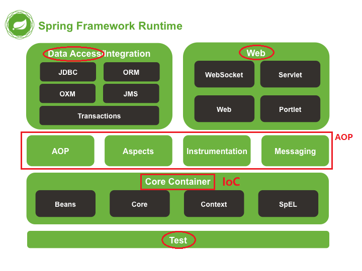

## Spring

##### Spring 的核心内容
* Spring IoC 配置 （Inversion of Control）
* Spring AOP （Aspect Oriented Programming）
* Spring JDBC Template
* Spring 事务控制

##### Spring 概述
官方网站 http://spring.io/ ，Spring 的定位是做一个 java 的 ``full-stack`` 轻量级开源框架，同时提供了视图层方案 SpringMVC，持久层方案 Spring JDBC，以及业务层方案-业务层事务管理等。 另外，还支持开源世界的第三方框架和类库，如 Mybatis 等。

##### Spring 的优势
* 方便解耦，简化开发
* AOP 编程
* 声明式事务控制
* 方便的测试模块开发

各种官方教程 http://spring.io/guides

各种Spring工程方案 http://spring.io/projects

##### Spring 体系结构
http://docs.spring.io/spring/docs/4.2.x/spring-framework-reference/html/overview.html
<div align="center">

</div>

* Core IoC (Inversion of Control)
* AOP
* DAO
* Web
* Test

doc 文档 http://docs.spring.io/spring/docs/

#### 1 IOC 详解
Inversion of Control 是一种编程/框架设计理念。 初衷是实现程序的解耦，程序编译时，不会由于依赖库的缺失而导致编译失败。（当然，运行是肯定会失败的。编码和编译却不会被影响。）
```java
// private IAccountDao accountDao = new AccountDaoImpl();
private IAcountDao accountDao = (IAccountDao)BeanFactory.getBean("accountDao");  // IoC 模式
```
因此 ，IoC 更应该被理解为 ``“IoC模式”``。

控制反转（Inversion of Control，缩写为IoC），是面向对象编程中的一种设计原则。 最常见的实现方式叫做依赖注入（Dependency Injection，简称DI），还有另一种实现方式，叫 “依赖查找”（Dependency Lookup）。

#### 2 AOP 概念
AOP 是 Aspect Oriented Programming 的缩写。 面向切面编程，通过预编译方式和运行期动态代理，实现程序功能的灵活性和可扩展性，AOP 实际是GoF 设计模式的延续。

AOP 的初衷是将日志记录，性能统计，安全控制，事务处理，异常处理等代码从业务逻辑代码中划分出来。

##### AOP 与 OOP 的比较
AOP 与 OOP 是两种不同关注点的设计思想。
* OOP 针对业务处理过程的实体及其属性和行为进行抽象封装。 （业务 -> 对象）
* AOP 针对业务处理过程中的 “切面（处理过程中的某个步骤或阶段）” 进行提取。 （切片 -> 对象）

AOP 是 OOP 的延续，终点都是对象，但是，将什么封装至对象是两者的重大差异。

##### AOP 的技术原理
动态代理技术

##### AOP 相关术语
* Joinpoint （连接点）
* Pointcut （切入点）
* Advice （通知/增强）
* Introduction （引介）
* Target （目标对象）
* Weaving （织入）
* Proxy （代理）
* Aspect （切面）

```java
/**
 * 获取 Service 代理对象
 * @return
 */
public IAccountService getAccountService() {
    return (IAccountService)Proxy.newProxyInstance(accountService.getClass().getClassLoader(),accountService.getClass().getInterfaces(),
    new InvocationHandler() {
        /**
         * 添加事务的支持
         *
         * @param proxy
         * @param method
         * @param args
         * @return
         * @throws Throwable
         */
        @Override
        public Object invoke(Object proxy, Method method, Object[] args) throws Trowable {
            if ("test".equals(method.getName())) {
                return method.invoke(accountService, args);
            }

            Object rtValue = null;
            try {
                //1. 开启事务
                txManager.beginTransaction();
                //2. 执行操作
                rtValue = method.invoke(accountService, args);
                //3. 提交事务
                txManager.commit();
                //4. 返回结果
                return rtValue;
            } catch (Exception e) {
                //5. 回滚操作
                txManager.rollback();
                throw new RuntimeException(e);
            } finally {
                //6. 释放连接
                txManager.release();
            }
        }
    });
}
```
仔细琢磨以上代码，感受业务代码和数据库事务代码的结合技巧。

#### 3 Spring AOP 开发的阶段
* 编写核心业务代码 （开发主线）
* 公用代码抽取，制作成通知。 （AOP 编程人员）
* 在配置文件中，声明切入点与通知的关系，即切面。 （AOP 编程人员）

##### 整个开发阶段，核心和难点是有一双慧眼，去抽取公共代码。

#### 4 Spring 的运行逻辑
Spring 框架监控切入点方法的执行。 一旦监测到切入点方法被执行，使用代理机制动态创建目标对象的代理对象，在代理对象的对应位置，将通知对应的功能织入，然后完成完整的代码逻辑运行。

<br>

# Spring 的 Maven 环境搭建

#### 1 需要的配置文件
* applicationContext.xml **（Spring 核心配置文件）**
    * 配置 dao 和 service 依赖
    * spring 整合 mybatis
    * 事务配置
* spring-mvc.xml **（SpringMVC 核心配置文件）**
    * 配置 web 依赖
* web.xml **（Maven webapp 核心配置文件）**

推荐将配置文件都放置于 maven webapp 项目下。

#### 2 创建配置文件
在 maven webapp 项目下的 src/main 目录下，右键，new -> directory，创建一个名为 java 的目录。
* 在 java 目录上，右键，Mark Directory as -> Source Root。
* 在 src/main 目录下，创建一个与 java 同级的目录 resources。然后将它标记为 Resources Root。
* 在 resources 目录中，创建 applicationContext.xml 文件。
* 在 resources 目录中，创建 spring-mvc.xml 文件。
* 注意，web.xml 文件在 src/main/webapp/WEB-INF 目录下。

#### 3 填写配置文件内容
##### 1. 在 pom.xml 中添加 spring-context 依赖
在 http://mvnrepository.com/ ，搜索 spring-context，点击进入，选择 5.0.2 release，点击，内容如下所示。 添加至 pom.xml dependencies 标签内。
```xml
<dependency>
    <groupId>org.springframework</groupId>
    <artifactId>spring-context</artifactId>
    <version>5.0.2.RELEASE</version>
</dependency>
```
注意，spring 的 context 依赖不是一个简单的依赖，导入之后，自动导入 beans、core、aop、expression、jcl 等核心组件。 （因此，添加这一个依赖就可以认为 spring 基础依赖已配置完成。）

##### 2. spring 配置文件模板
打开 spring 文档，进入 spring-framework-reference 的 Core Section 内容： http://docs.spring.io/spring/docs/5.0.10.RELEASE/spring-framework-reference/core.html ，Ctrl+F 搜索 “xmls”，就可以搜索各种配置文件的模板了。

spring 中文文档 http://www.docs4dev.com/docs/zh/spring-framework/5.1.3.RELEASE/reference

##### 3 applicatonContext.xml
```xml
<?xml version="1.0" encoding="UTF-8"?>
<beans xmlns="http://www.springframework.org/schema/beans"
    xmlns:xsi="http://www.w3.org/2001/XMLSchema-instance"
    xmlns:context="http://www.springframework.org/schema/context"
    xmlns:aop="http://www.springframework.org/schema/aop"
    xmlns:tx="http://www.springframework.org/schema/tx"
    xsi:schemaLocation="http://www.springframework.org/schema/beans
        http://www.springframework.org/schema/beans/spring-beans.xsd
        http://www.springframework.org/schema/context
        http://www.springframework.org/schema/context/spring-context.xsd
        http://www.springframework.org/schema/aop
        http://www.springframework.org/schema/aop/spring-aop.xsd
        http://www.springframework.org/schema/tx
        http://www.springframework.org/schema/tx/spring-tx.xsd">

    <!-- 开启注解扫描，管理自定义的 service 和 dao 依赖 -->
    <context:component-scan base-package="com.petersdemo.ssm.service">
    </context:component-scan>
    <context:component-scan base-package="com.petersdemo.ssm.dao">
    </context:component-scan>

    <!-- Spring 整合 MyBatis (MyBatis 学习内容) -->
    <context:property-placeholder location="classpath:db.properties"/>
    <bean id="dataSource" class="com.mchange.v2.c3p0.ComboPooledDataSource">
        <property name="driverClass" value="${jdbc.driver}"/>
        <property name="jdbcUrl" value="${jdbc.url}"/>
        <property name="user" value="${jdbc.username}"/>
        <property name="password" value="${jdbc.password}"/>
    </bean>
    <bean id="sqlSessionFactory" class="org.mybatis.spring.SqlSessionFactoryBean">
        <property name="dataSource" ref="dataSource" />
    </bean>

    <!-- Spring 的声明式事务管理 -->
    <bean id="transactionManager" class="org.springframework.jdbc.datasource.DataSourceTransactionManager">
        <property name="dataSource" ref="dataSource"/>
    </bean>
    <tx:annotation-driven transaction-manager="transactionManager"/>

</beans>
```
以上包含三部分内容： context（即ioc）、aop、tx（即事务transaction）。

``导入 spring-context 依赖的时候是不包含 spring-tx 的，请搜索并添加依赖``，如下。
```xml
<dependency>
    <groupId>org.springframework</groupId>
    <artifactId>spring-tx</artifactId>
    <version>5.0.2.RELEASE</version>
</dependency>
```

MyBatis 整合到 Spring 中需要四个依赖： MySQL、MyBatis、MyBatis-Spring，以及一个线程池（dataSource）c3p0。 还有一个 “声明式事务管理” 依赖的 jar 包 spring-jdbc。
```xml
<dependency>
    <groupId>org.mybatis</groupId>
    <artifactId>mybatis</artifactId>
    <version>3.5.0</version>
</dependency>

<dependency>
    <groupId>mysql</groupId>
    <artifactId>mysql-connector-java</artifactId>
    <version>8.0.15</version>
</dependency>

<dependency>
    <groupId>org.mybatis</groupId>
    <artifactId>mybatis-spring</artifactId>
    <version>2.0.3</version>
</dependency>

<dependency>
    <groupId>com.mchange</groupId>
    <artifactId>c3p0</artifactId>
    <version>0.9.5.2</version>
</dependency>

<dependency>
    <groupId>org.springframework</groupId>
    <artifactId>spring-jdbc</artifactId>
    <version>5.0.2.RELEASE</version>
</dependency>
```

注意，在 src/main/resources 目录下，常见一个文件 db.properties。
```
jdbc.driver=com.mysql.jdbc.Driver
jdbc.url=jdbc:mysql://localhost:3306/ssm?useUnicode=true&characterEncoding=utf8
jdbc.username=root
jdbc.password=root
```

Spring 与 MyBatis 聚合，参考 http://mybatis.org/spring/zh/getting-started.html ，以及 Spring 的 Data Access 部分。

Spring 事务管理（Transaction），参考 Spring 文档的 Data Access 部分。

##### 至此，applicationContext.xml 三大核心配置完成。

##### 4 spring-mvc.xml
```xml
<?xml version="1.0" encoding="UTF-8"?>
<beans xmlns="http://www.springframework.org/schema/beans"
    xmlns:xsi="http://www.w3.org/2001/XMLSchema-instance"
    xmlns:mvc="http://www.springframework.org/schema/mvc"
    xmlns:context="http://www.springframework.org/schema/context"
    xmlns:aop="http://www.springframework.org/schema/aop"
    xsi:schemaLocation="http://www.springframework.org/schema/beans
        http://www.springframework.org/schema/beans/spring-beans.xsd
        http://www.springframework.org/schema/mvc
        https://www.springframework.org/schema/mvc/spring-mvc.xsd
        http://www.springframework.org/schema/context
        http://www.springframework.org/schema/context/spring-context.xsd
        http://www.springframework.org/schema/aop
        http://www.springframework.org/schema/aop/spring-aop.xsd">

    <!-- 开启注解扫描，管理自定义的 controller 依赖 -->
    <context:component-scan base-package="com.petersdemo.ssm.controller">
    </context:component-scan>

    <!-- 配置视图解析器 -->
    <bean id="viewResolver" class="org.springframework.web.servlet.view.InternalResourceViewResolver">
        <!-- JSP 文件所在目录 -->
        <property name="prefix" value="/pages/"/>
        <!-- 文件的后缀名 -->
        <property name="suffix" value=".jsp"/>
    </bean>

    <!-- 设置静态资源不过滤 -->
    <mvc:resources mapping="/css/**" location="/css/"/>
    <mvc:resources mapping="/img/**" location="/img/"/>
    <mvc:resources mapping="/js/**" location="/js/"/>
    <mvc:resources mapping="/plugins/**" location="/plugins/"/>

    <!-- 开启对 SpringMVC 注解的支持 -->
    <mvc:annotation-driven/>

    <!--
        支持 AOP 的注解技术，AOP 底层使用代理技术。
        JDK 动态代理，要求必须有接口。
        cglib 代理，生成子类对象，proxy-target-class="true" 默认使用 cglib 的方式。
    -->
    <aop:aspectj-autoproxy proxy-target-class="true"/>

</beans>
```
Spring MVC 的文档，在 Spring 文档的 Web Servlet 部分。

Spring MVC 的依赖 jar 包有两个： ``spring-web``、``spring-webmvc``。
```xml
<dependency>
    <groupId>org.springframework</groupId>
    <artifactId>spring-web</artifactId>
    <version>5.0.2.RELEASE</version>
</dependency>

<dependency>
    <groupId>org.springframework</groupId>
    <artifactId>spring-webmvc</artifactId>
    <version>5.0.2.RELEASE</version>
</dependency>
```

##### 5 web.xml
```xml
<?xml version="1.0" encoding="UTF-8"?>
<web-app xmlns="http://java.sun.com/xml/ns/javaee"
         xmlns:xsi="http://www.w3.org/2001/XMLSchema-instance"
         xsi:schemaLocation="
        http://java.sun.com/xml/ns/javaee
        https://java.sun.com/xml/ns/javaee/web-app_3_0.xsd"
         version="3.0">

  <!-- 配置加载类路径的配置文件 -->
  <context-param>
    <param-name>contextConfigLocation</param-name>
    <param-value>classpath*:applicationContext.xml,classpath*:spring-security.xml</param-value>
  </context-param>

  <!-- 配置监听器 -->
  <listener>
    <listener-class>org.springframework.web.context.ContextLoaderListener</listener-class>
  </listener>
  <!-- 配置监听器，监听 request 域对象的创建和销毁 -->
  <listener>
    <listener-class>org.springframework.web.context.request.RequestContextListener</listener-class>
  </listener>

  <!-- 前端控制器，加载 classpath:spring-mvc.xml 服务器启动创建 servlet -->
  <servlet>
    <servlet-name>dispatcherServlet</servlet-name>
    <servlet-class>org.springframework.web.servlet.DispatcherServlet</servlet-class>
    <!-- 配置初始化参数，创建完 DispatcherServlet 对象，加载 spring-mvc.xml 配置文件 -->
    <init-param>
      <param-name>contextConfigLocation</param-name>
      <param-value>classpath:spring-mvc.xml</param-value>
    </init-param>
    <!-- 服务器启动的时候，让 DispatcherServlet 对象创建 -->
    <load-on-startup>1</load-on-startup>
  </servlet>
  <servlet-mapping>
    <servlet-name>dispatcherServlet</servlet-name>
    <url-pattern>*.do</url-pattern>
  </servlet-mapping>

  <!-- 解决中文乱码过滤器 -->
  <filter>
    <filter-name>characterEncodingFilter</filter-name>
    <filter-class>org.springframework.web.filter.CharacterEncodingFilter</filter-class>
    <init-param>
      <param-name>encoding</param-name>
      <param-value>UTF-8</param-value>
    </init-param>
  </filter>
  <filter-mapping>
    <filter-name>characterEncodingFilter</filter-name>
    <url-pattern>/*</url-pattern>
  </filter-mapping>

  <!-- 委派过滤器 -->
  <filter>
    <filter-name>springSecurityFilterChain</filter-name>
    <filter-class>org.springframework.web.filter.DelegatingFilterProxy</filter-class>
  </filter>
  <filter-mapping>
    <filter-name>springSecurityFilterChain</filter-name>
    <url-pattern>/*</url-pattern>
  </filter-mapping>

  <welcome-file-list>
    <welcome-file>index.html</welcome-file>
    <welcome-file>index.htm</welcome-file>
    <welcome-file>index.jsp</welcome-file>
    <welcome-file>default.html</welcome-file>
    <welcome-file>default.htm</welcome-file>
    <welcome-file>default.jsp</welcome-file>
  </welcome-file-list>

</web-app>
```
参考 Spring 文档的 Web Servlet 部分。

