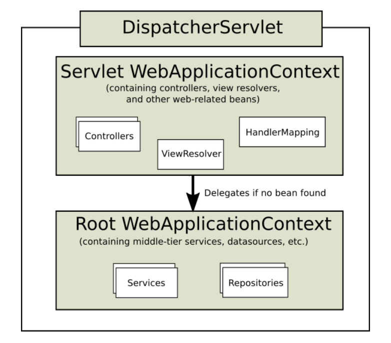

## Spring MVC

配置 Spring 环境的时候，导入依赖 spring-web 和 spring-webmv 即可完成 Spring MVC 的引入。
```xml
<dependency>
    <groupId>org.springframework</groupId>
    <artifactId>spring-web</artifactId>
    <version>5.0.2.RELEASE</version>
</dependency>

<dependency>
    <groupId>org.springframework</groupId>
    <artifactId>spring-webmvc</artifactId>
    <version>5.0.2.RELEASE</version>
</dependency>
```

#### SpringMVC 入门
参考 Spring 文档的 Web Servlet 部分 http://www.docs4dev.com/docs/zh/spring-framework/5.1.3.RELEASE/reference/web.html#web-servlet

Spring MVC 是在 Servlet API 的标准之上设计的，也可以部署到 Servlet Containers 中（如Tomcat）。``无论是 Servlet、Spring MVC 还是其他的框架，目的都是部署于 Servlet Container 中，服从的都是 Servlet API 规范和 Servlet Container 的约束。``

##### Spring MVC 也有一个核心的 Servlet，称作 “DispatcherServlet”。 这个 dispatcherServlet 和任何 Servlet 一样，在 web.xml 中声明和映射（mapping）。 当然，也可以使用注解方式，此时就不需要 web.xml 了。

不使用 web.xml 的方式定义 dispatcherServlet
```java
public class MyWebApplicationInitializer implements WebApplicationInitializer {

    @Override
    public void onStartup(ServletContext servletCxt) {

        // Load Spring web application configuration
        AnnotationConfigWebApplicationContext ac = new AnnotationConfigWebApplicationContext();
        ac.register(AppConfig.class);
        ac.refresh();

        // Create and register the DispatcherServlet
        DispatcherServlet servlet = new DispatcherServlet(ac);
        ServletRegistration.Dynamic registration = servletCxt.addServlet("app", servlet);
        registration.setLoadOnStartup(1);
        registration.addMapping("/app/*");
    }
}
```

使用原始的 web.xml 方式定义 dispatcherServlet
```xml
<web-app>

    <listener>
        <listener-class>org.springframework.web.context.ContextLoaderListener</listener-class>
    </listener>

    <context-param>
        <param-name>contextConfigLocation</param-name>
        <param-value>/WEB-INF/app-context.xml</param-value>
    </context-param>

    <servlet>
        <servlet-name>app</servlet-name>
        <servlet-class>org.springframework.web.servlet.DispatcherServlet</servlet-class>
        <init-param>
            <param-name>contextConfigLocation</param-name>
            <param-value></param-value>
        </init-param>
        <load-on-startup>1</load-on-startup>
    </servlet>

    <servlet-mapping>
        <servlet-name>app</servlet-name>
        <url-pattern>/app/*</url-pattern>
    </servlet-mapping>

</web-app>
```
使用 Spring Boot 的时候，Servlet 的初始化顺序将与此时的配置不同，详细信息参考 Spring Boot 的文档。

#### DispatcherServlet 的 Web 应用上下文
<div align="center">

</div>

基于上下文层次结构，可以进行深度配置，例如下面的 web.xml 配置。 ``对比 <servlet> 标签内的 init-param 内容。``
```xml
<web-app>

    <listener>
        <listener-class>org.springframework.web.context.ContextLoaderListener</listener-class>
    </listener>

    <context-param>
        <param-name>contextConfigLocation</param-name>
        <param-value>/WEB-INF/root-context.xml</param-value>
    </context-param>

    <servlet>
        <servlet-name>app1</servlet-name>
        <servlet-class>org.springframework.web.servlet.DispatcherServlet</servlet-class>
        <init-param>
            <param-name>contextConfigLocation</param-name>
            <param-value>/WEB-INF/app1-context.xml</param-value>
        </init-param>
        <load-on-startup>1</load-on-startup>
    </servlet>

    <servlet-mapping>
        <servlet-name>app1</servlet-name>
        <url-pattern>/app1/*</url-pattern>
    </servlet-mapping>

</web-app>
```

#### Special Bean Types
DispatcherServlet 是通过委托一些特殊的 Bean 对象来完成 request 对象处理，以及 response 的渲染。 **（基于 DispatcherServlet Context Hierarchy 的配置。）**
* HandlerMapping 将一个请求映射到一个处理程序以及一个拦截器列表，用于 pre- 和 post-processing。
* HandlerAdapter 无论实际调用处理程序如何，都帮助 DispatcherServlet 调用映射到请求的处理程序。例如，调用带注释的控制器需要解析 annotations。 HandlerAdapter 的主要目的是保护 DispatcherServlet 免受这些细节的影响。
* HandlerExceptionResolver 解决 exceptions 的策略，可能将它们映射到处理程序，HTML 错误视图或其他目标。
* ViewResolver 视图解析器，将文件渲染后呈现给响应。
* LocaleResolver, LocaleContextResolver 用于提供国际化的视图解析器，解决国际化问题。
* ThemeResolver 解析 web application 可以使用的主题 - 例如，提供个性化布局。
* MultipartResolver 解析 multi-part request (e.g. browser form file upload)，可以关联第三方的库来完成例如表单文件上传时的解析。
* FlashMapManager 将属性从一个请求传递到另一个请求，通常是通过重定向完成。

Special Bean Types 的具体配置细节，参阅 Spring Web MVC 的 DispatcherServlet 部分。

#### 其他内容 —— 在 Spring MVC 配置时针对性查询
* Filters （过滤器）
* Annotated Controllers （带注释的控制器）
* URI Links （URI 模式）
* Async Requests （异步请求）
* CORS （Cross-Origin 资源共享）
* Web Security （Web 安全）
* HTTP Caching （HTTP 缓存）
* View Technologies （可插拔的视图技术）
* MVC Config （MVC 配置） **重要内容**
* HTTP/2 （对 HTTP/2 的支持）

参考文档 https://docs.spring.io/spring/docs/5.0.2.RELEASE/spring-framework-reference/web.html#mvc
