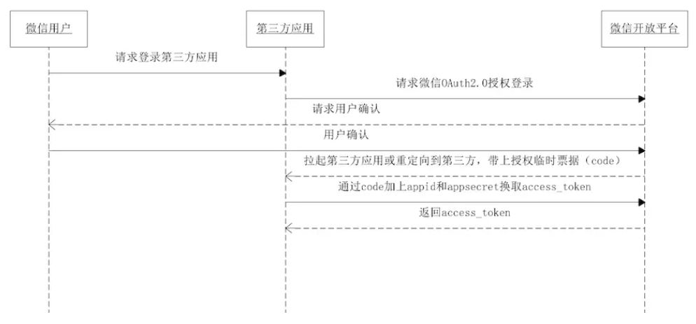

## 微信扫码登陆

##### 微信开放平台
主要面对移动应用/网站应用开发者，为其提供微信登录、分享、支付等相关权限和服务。

##### 微信公众平台
主要用于管理、开放微信公众号（包括订阅号、服务号、企业号），简单的说就是微信公众号的后台运营、管理系统。

<br>

#### 微信开放平台 —— 第三方扫码登陆（授权）
##### 1. 预备知识
网站应用微信登录，是基于 OAuth2.0 协议标准构建的微信 OAuth2.0 授权登录系统。

##### 2. OAuth2.0 —— 主流的授权机制
* OAuth（开放授权） 是一个开放标准，允许用户让第三方应用访问该用户在某一网站上存储的私密的资源（如照片，视频，联系人列表），而无需将用户名和密码提供给第三方应用。
* OAuth 允许用户提供一个令牌，而不是用户名和密码来访问他们存放在特定服务提供者的数据。 每一个令牌授权一个特定的网站（第三方应用）在特定的时段内访问特定的资源。

##### 3. token(令牌)
token(令牌) 就是类似密码的一串数字，只在短期内（比如七天）有效。

##### 为什么要用令牌？
* 被授权者在一定时间段内可能需要多次访问授权资源，避免用户频繁授权的麻烦。
* 另外，同一个令牌可以被授权访问多种不同的资源，为被授权者提供方便。

##### 注意
* 只要知道了令牌，就能进入系统。
* 系统一般不会再次确认身份，所以令牌必须保密，泄漏令牌与泄漏密码的后果是一样的。
* 这也是为什么令牌的有效期，一般都设置得很短的原因。

<br>

#### 4. 令牌颁发机制
—— OAuth2.0 对于如何颁发令牌的细节，规定得非常详细。

具体来说，一共分成四种授权类型（authorization grant），即四种颁发令牌的方式，适用于不同的互联网场景。
* 授权码（authorization-code） —— 先申请一个授权码，然后再用该码获取令牌。 （用于前后端分离，最安全。）
* 隐藏式（implicit） —— 
* 密码式（password）：
* 客户端凭证（client credentials）

##### 注意
* 不管哪一种授权方式，第三方应用申请令牌之前，都必须先到系统备案。
* 备案后会拿到两个身份识别码： 客户端 ID（client ID）、客户端密钥（client secret）。
* 没有备案的第三方应用，无法获得令牌颁发。

#### 4.1 授权码授权
###### 第一步：
```html
https://b.com/oauth/authorize?
  response_type=code&
  client_id=CLIENT_ID&
  redirect_uri=CALLBACK_URL&
  scope=read
```
上面 url 中，
* response_type 参数表示要求返回授权码(code)
* client_id 参数表示谁在请求令牌颁发
* redirect_uri 参数表示接受或拒绝请求后的跳转网址
* scope 参数表示要求的授权范围（这里是只读）
###### 第二步：
网站跳转后，认证服务器会要求用户登陆，询问是否同意授权。 如果同意授权，则跳回 redirect_uri 参数指定的网址，注意，此时会传回一个授权码，就像下面这样：
```html
https://a.com/callback?code=AUTHORIZATION_CODE
```
###### 第三步：
网站拿到授权码后，向认证服务器请求令牌。（此过程在后端完成，用于令牌保护。）
```html
https://b.com/oauth/token?
 client_id=CLIENT_ID&
 client_secret=CLIENT_SECRET&
 grant_type=authorization_code&
 code=AUTHORIZATION_CODE&
 redirect_uri=CALLBACK_URL
```
上面 url 中，
* client_id 和 client_secret 用于确认第三方应用的身份。 （注意，client_secret 参数是保密的，因此只能在后端发请求）
* grant_type 参数的值是 AUTHORIZATION_CODE，表示采用的是授权码方式
* code 参数是上一步拿到的授权码
* redirect_uri 参数是令牌颁发后的回调网址
###### 第四步：
收到请求以后，就会颁发令牌。 具体做法是向 redirect_uri 指定的网址，发送一段 JSON 数据。
```json
{    
  "access_token":"ACCESS_TOKEN",
  "token_type":"bearer",
  "expires_in":2592000,
  "refresh_token":"REFRESH_TOKEN",
  "scope":"read",
  "uid":100101,
  "info":{...}
}
```
#### 4.2 隐藏式 —— 针对纯前端应用，允许直接向前端颁发令牌。
###### 第一步：
```html
https://b.com/oauth/authorize?
  response_type=token&
  client_id=CLIENT_ID&
  redirect_uri=CALLBACK_URL&
  scope=read
```
###### 第二步：
跳转到授权确认页，后跳回 redirect_uri 参数指定的跳转网址，并且把令牌作为 URL 参数，如：
```html
https://a.com/callback#token=ACCESS_TOKEN
```
注意
* 令牌的位置是 URL 锚点（fragment），而不是查询字符串（querystring）。
* 锚点 #key=value
* 查询字符串 ？key=value
* 原因，浏览器 http 跳转时，锚点不会发到服务器，因此不会被拦截泄漏令牌。
###### 此种方式很不安全，只能用于一些安全要求不高的场景。 令牌通常就是会话期间（session）有效，浏览器关掉，令牌就失效了。
#### 4.3 密码式 —— 如果你高度信任某个应用，也允许用户把用户名和密码，直接告诉该应用。
###### 第一步：
```html
https://oauth.b.com/token?
  grant_type=password&
  username=USERNAME&
  password=PASSWORD&
  client_id=CLIENT_ID
```
###### 第二步：
网站验证身份通过后，直接给出令牌。 注意，这时不需要跳转，而是把令牌放在 JSON 数据里面，作为 HTTP 回应，A 因此拿到令牌。
#### 4.4 凭证式 —— 适用于没有前端的命令行应用，即在命令行下请求令牌。
###### 第一步：
```html
https://oauth.b.com/token?
  grant_type=client_credentials&
  client_id=CLIENT_ID&
  client_secret=CLIENT_SECRET
```
###### 第二步：
网站验证通过以后，直接返回令牌。
###### 注意，这种方式给出的令牌，是针对第三方应用的，而不是针对用户的，即有可能多个用户共享同一个令牌。

#### 5. 名词定义
1. 第三方应用(third-party application)，又称 “客户端(client)”。
2. http 服务提供商(http service)，例如：微信、QQ。
3. 资源所有者(resource owner)，即登陆用户。
4. 用户代理(user agent)，例如：浏览器。
5. 认证服务器(authorization server)，服务提供商专门用来处理认证的服务器。
6. 资源服务器(resource server)，服务提供商存放用户生成的资源的服务器。 (可与认证服务器为同一台服务器。)

<br>

#### Part 2 —— 令牌的使用
A 网站拿到令牌后，就可以向 B 网站的 API 请求数据了。

注意，
* 此时，每个发到 API 的请求，都必须带有令牌。
* 具体做法是在请求的头信息，加上一个 Authorization 字段，令牌就放在这个字段里面。

```html
curl -H "Authorization: Bearer ACCESS_TOKEN" \
"https://api.b.com"
```
上面命令中，ACCESS_TOKEN 就是拿到的令牌。

<br>

#### Part 3 —— 更新令牌
令牌的有效期到了，如果让用户重新走一遍上面的流程，再申请一个新的令牌，很可能体验不好，而且也没有必要。 OAuth2.0 允许用户自动更新令牌。

具体方法是，B 网站颁发令牌的时候，一次性颁发两个令牌，一个用于获取数据，另一个用于获取新的令牌（refresh token 字段）。 令牌到期前，使用 refresh token 发一个请求，去更新令牌。
```html
https://b.com/oauth/token?
  grant_type=refresh_token&
  client_id=CLIENT_ID&
  client_secret=CLIENT_SECRET&
  refresh_token=REFRESH_TOKEN
```
B 网站验证通过以后，就会颁发新的令牌。

<br>

##### Part 4 —— 实战： GitHub OAuth 第三方登录示例教程
refer: http://www.ruanyifeng.com/blog/2019/04/github-oauth.html

流程逻辑
```
1. A 网站让用户跳转到 GitHub。
2. GitHub 要求用户登录，然后询问"A 网站要求获得 xx 权限，你是否同意？"
3. 用户同意，GitHub 就会重定向回 A 网站，同时发回一个授权码。
4. A 网站使用授权码，向 GitHub 请求令牌。
5. GitHub 返回令牌.
6. A 网站使用令牌，向 GitHub 请求用户数据。
```

<br>

##### Part 5 —— 微信第三方扫码登录
refer: https://www.jianshu.com/p/89c43290d7f6

<div align="center"></div>

微信有两种方式认证:
* 一种是调转到微信域名下。
* 另一种是直接把二维码嵌套到自己网站中。
